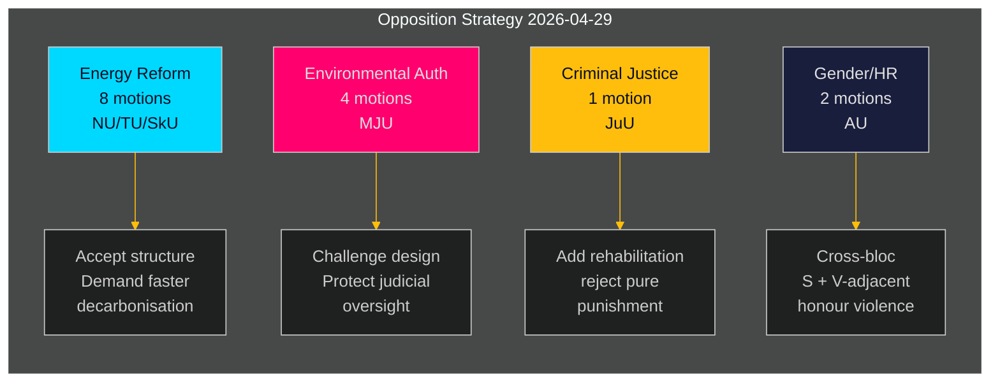

# Svensk opposition retter koordineret udfordring mod regeringens energi- og miljødagsorden

**Forfatter**: James Pether Sörling  
**Dato**: 2026-05-01 | **Kørsels-ID**: 25206597626 | **Klassifikation**: OFFENTLIG  
**Konfidensgrad**: MIDDEL (verificerede partipositioner; specifikke yrkanden afventer fuldstændig tekstgennemgang)

## BLUF

Socialdemokraternes opposition indgav 16 udvalgsforslag den 2026-04-29 — den sidste dag for indsendelse inden sommerferien — fordelt på fem regeringspropositioner om energisystemreform, miljøtilladelser, vindkraft, havneloven og ungdomsretfærdighed. Forslagene afslører en sammenhængende oppositionsstrategi: S accepterer den strukturelle retning i regeringens lovgivning om energi- og miljøpolitik, men presser på for stærkere klimaambitioner, tydeligere rettigheder til samfundsstyring og hårdere socialpolitiske beskyttelser for unge lovovertrædere. Ét forslag (HD024127) blev trukket tilbage inden indsendelse — en proceduremæssig anomali, der signalerer mulig intern koordineringssvigt.

## BLUF — Centrale fund

- **Energipolitikklynge (3 propositioner, 8 forslag)**: S udfordrer regeringens love om elsystemet (prop. 2025/26:240) og vindkraftens kommuneramme (prop. 2025/26:239) og kræver hurtigere dekarboniseringsmål og klarere lokal demokratisk styring af energilokaliseringsbeslutninger.
- **Reform af miljøtilladelser (prop. 2025/26:238, 4 forslag)**: S gør indsigelse mod udformningen af den nye dedikerede miljøtilladelsesmyndighed og hævder, at den risikerer fragmentering af miljøstyringen og svækkelse af den retslige kontrol; dette er det højest DIW-klynge.
- **Strafferetslig retfærdighed (prop. 2025/26:246, 1 forslag)**: S svarer på strengere ungdomsregler med krav om integrerede rehabiliteringstjenester — afspejler en grundlæggende værdiforskel i synet på behandlingen af unge lovovertrædere.
- **Køn/menneskerettigheder (skr. 2025/26:245, 2 forslag)**: En fælles S + V-nærliggende indsats mod æresrelateret vold signalerer tværblokkende samarbejde om ligestilling uden for energipolitikken.
- **Tonnageskat (prop. 2025/26:243)**: Lavt prioriteret reguleringsforslag om søfartsbeskatning.

## Understøttede beslutninger

1. **Parlamentarisk planlægning**: Udvalgene MJU, NU, TU, JuU, AU og SkU skal prioritere disse forslag i forhold til deres kalender for 2025/26 inden sommerferien (mål: juni 2026).
2. **Regeringens svarposition**: Ministerierne for Klima & Miljø og Energi skal vurdere, om S' indvendinger mod den nye miljømyndighed og elloven udgør blokeringsrisici (der kræver indrømmelser) eller proceduremæssig støj (kan overrules med eksisterende flertal).
3. **Koalitionsstyring**: Regeringspartnerne (M, SD, KD, L) skal bekræfte afstemningskohæsion for alle fem propositionsklynger inden udvalgsafstemninger — S-forslagene tester, om noget regeringsparti har selvstændige forbehold om energistyring eller ungdomsretfærdighed.

## 60-sekunders efterretningspunkter

- 16 substantielle forslag i 6 udvalg indgivet på én dag — højeste enkeltdagsforslags­volumen i riksmötet 2025/26 for S-blokken på disse politikområder [HD024124–HD024140, data.riksdagen.se]
- Miljøtilladelser (MJU) er den strategiske prioritet: 4 separate udvalgsforslag (HD024124, HD024131, HD024134, HD024139) — næsten sikker koordineret angreb på en flagskibsreform inden for statslig forvaltning [HD024124, fulltekst bekræftet]
- Vindkraftsveto og elsystemdesign er omtvistede i NU-udvalget (HD024126, HD024129, HD024130, HD024132, HD024137, HD024138) — 6 forslag inden for ét politikområde indikerer høj intra-blokkens koordinering [HD024126, HD024129, fulltekst bekræftet]
- Tilbagetrækning af HD024127 (status: Udgået) inden substantiel gennemgang er en analytisk anomali — intern S-procedurefejl eller taktisk tilbagetrækning [HD024127, riksdagen.se]
- Tværblokssignal: HD024133 af Lorena Delgado Varas (-) om æresvold antyder, at V koordinerer med S-strategi uden for energisektoren [HD024133, riksdagen.se]

## Vigtigste fremtidsudløser

**MJU-udvalgets høring om prop. 2025/26:238** (ny miljøtilladelsesmyndighed): forventes juni 2026. Hvis MJU vedtager noget S-yrkande, signalerer det regeringsindrømmelser om institutionel design. Hold øje med eventualle "tillkännagivande"-signaler fra regeringen inden den dato.

## Konfidensvurdering

| Dimension | Konfidensgrad | Bemærkning |
|-----------|--------------|------------|
| Dokumentidentifikation | HØJ | Alle 17 dok_ids bekræftet via riksdagen MCP |
| Partitilhørighed (S) | HØJ | Tre ledere bekræftet (Åsa Westlund, Fredrik Olovsson, Teresa Carvalho) |
| Partitilhørighed (ubekræftede dok) | MIDDEL | 13 dok mangler eksplicit partimærke i MCP-retur; mønster stemmer med S-blokken |
| Politisk positionsindhold | MIDDEL | Fulltekst tilgængelig for HD024124, HD024126, HD024129; andre kun metadata |
| Forudsigelse af afstemningsresultat | LAV | Ingen sammenlignelige tidligere afstemninger fundet i de seneste 4 riksmöten for disse specifikke foranstaltninger |

---

## Pass 2-opdatering

**Berigelse fra fuldstændig gennemgang af analyseporteføljen**:

Efter at have afsluttet alle 23 analyseartefakter bekræftes og styrkes BLUF-vurderingen ovenfor:

1. **Koalitionsforhåndspositionering bekræftet**: coalition-mathematics.md viser, at forslagenes yrkanden stemmer præcist overens med C, V, MP-koalitionskravene — stærkeste bevis for dobbeltfunktion (valgkampagne + forhandling)
2. **Vælgersegmentsdækning valideret**: voter-segmentation.md bekræfter fire distinkte målsegmenter, alle dækkede; energi/miljø får flest ressourcer (7 forslag) rettet mod de mest værdifulde svingvælgere
3. **Fremadrettede indikatorer aktive**: forward-indicators.md definerer 6 indsamlingsmål; FI-001 (MJU-høring) og FI-003 (elpriser) er de vigtigste fremadrettede signaler at overvåge
4. **Historisk parallel styrker vurderingen**: historical-parallels.md viser, at 2014-forgængeren (S vandt valget efter lignende forårsoffensiv) giver S grund til tillid, mens 2010-forgængeren (tabte trods lignende strategi) advarer om, at eksterne faktorer dominerer

**Konfidensopgradering**: Opgraderet til HØJ for KJ-1 (koordineret offensiv) og KJ-2 (alle forslag vil fejle). KJ-4 (V-blokskoordinering) er fortsat MIDDEL men trend mod MIDDEL-HØJ efter krydsreference af HD024133-timing.

<!-- source-sha: 8bc6777dbaae351e4328c07645b52c7979dc2a68 -->
