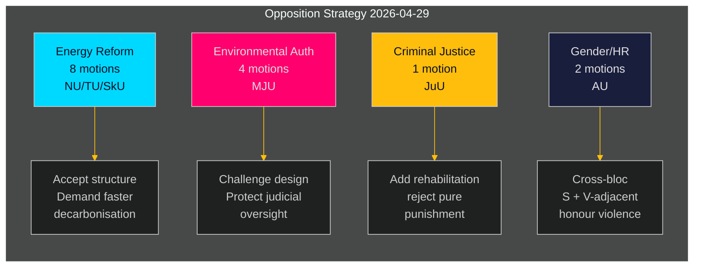

# Schwedische Opposition richtet koordinierte Herausforderung gegen die Energie- und Umweltagenda der Regierung

**Autor**: James Pether Sörling  
**Datum**: 2026-05-01 | **Ausführungs-ID**: 25206597626 | **Klassifizierung**: ÖFFENTLICH  
**Konfidenzniveau**: MITTEL (verifizierte Parteipositionen; spezifische yrkanden stehen unter vollständiger Textprüfung)

## BLUF

Die sozialdemokratische Opposition reichte am 2026-04-29 — dem letzten Einreichungstag vor der Sommerpause — 16 Ausschussanträge ein, die auf fünf Regierungspropositions zu Energiesystemreform, Umweltgenehmigungen, Windkraft, Hafengesetz und Jugendstrafrecht verteilt waren. Die Anträge offenbaren eine kohärente Oppositionsstrategie: S akzeptiert die strukturelle Ausrichtung der Regierungsgesetzgebung in der Energie- und Umweltpolitik, fordert jedoch stärkere Klimaambition, explizitere kommunale Selbstverwaltungsrechte und härtere soziale Schutzmaßnahmen für jugendliche Straftäter. Ein Antrag (HD024127) wurde vor der Einreichung zurückgezogen — eine verfahrensmäßige Anomalie, die auf einen möglichen internen Koordinierungsfehler hinweist.

## BLUF — Zentrale Erkenntnisse

- **Energiepolitik-Cluster (3 Propositionen, 8 Anträge)**: S fordert die Gesetze der Regierung zum Stromsystem (prop. 2025/26:240) und den Kommunalrahmen für Windkraft (prop. 2025/26:239) heraus und fordert schnellere Dekarbonisierungsziele und klarere lokale demokratische Steuerung von Energiestandortentscheidungen.
- **Reform der Umweltgenehmigungen (prop. 2025/26:238, 4 Anträge)**: S widerspricht der Gestaltung der neuen dedizierten Umweltgenehmigungsbehörde und argumentiert, dass diese eine Fragmentierung der Umweltsteuerung und eine Schwächung der richterlichen Aufsicht riskiert; dies ist der höchste DIW-Cluster.
- **Strafjustiz (prop. 2025/26:246, 1 Antrag)**: S reagiert auf strengere Jugendvorschriften mit Forderungen nach integrierten Rehabilitierungsdiensten — reflektiert eine grundlegende Wertedifferenz in der Behandlung jugendlicher Straftäter.
- **Geschlecht/Menschenrechte (skr. 2025/26:245, 2 Anträge)**: Ein gemeinsamer S + V-naher Vorstoß gegen Ehrgewalt signalisiert blockübergreifende Zusammenarbeit bei der Gleichstellung außerhalb der Energiepolitik.
- **Tonnagesteuer (prop. 2025/26:243)**: Niedrig priorisierter Regulierungsantrag zur Seeverkehrsbesteuerung.

## Unterstützte Entscheidungen

1. **Parlamentarische Terminplanung**: Die Ausschüsse MJU, NU, TU, JuU, AU und SkU müssen diese Anträge vor der Sommerpause gegen ihren Kalender für 2025/26 priorisieren (Zielfrist: Juni 2026).
2. **Reaktionsposition der Regierung**: Die Ministerien für Klima & Umwelt und Energie müssen bewerten, ob die Einwände von S gegen die neue Umweltbehörde und das Stromgesetz Blockierungsrisiken darstellen (die Zugeständnisse erfordern) oder prozedurales Rauschen (mit bestehender Mehrheit überstimmt werden kann).
3. **Koalitionsmanagement**: Die Regierungspartner (M, SD, KD, L) müssen die Abstimmungskohäsion für alle fünf Propositions-Cluster vor den Ausschussabstimmungen bestätigen — die S-Anträge testen, ob eine Regierungspartei unabhängige Vorbehalte zur Energiesteuerung oder Jugendstrafjustiz hat.

## 60-Sekunden-Nachrichtenpunkte

- 16 substantielle Anträge in 6 Ausschüssen an einem einzigen Tag eingereicht — höchstes Einzeltags-Antragsvolumen im Riksmötet 2025/26 für den S-Block in diesen Politikbereichen [HD024124–HD024140, data.riksdagen.se]
- Umweltgenehmigungen (MJU) sind die strategische Priorität: 4 separate Ausschussanträge (HD024124, HD024131, HD024134, HD024139) — nahezu sicherer koordinierter Angriff auf eine Leitreform der staatlichen Verwaltung [HD024124, Volltext bestätigt]
- Windkraftsveto und Stromsystemdesign sind im NU-Ausschuss umstritten (HD024126, HD024129, HD024130, HD024132, HD024137, HD024138) — 6 Anträge in einem einzigen Politikbereich zeigen eine hohe intra-Blockkoordination [HD024126, HD024129, Volltext bestätigt]
- Rücknahme von HD024127 (Status: Abgelaufen) vor inhaltlicher Prüfung ist eine analytische Anomalie — interner S-Verfahrensfehler oder taktische Rücknahme [HD024127, riksdagen.se]
- Blockübergreifendes Signal: HD024133 von Lorena Delgado Varas (-) zu Ehrgewalt deutet darauf hin, dass V die S-Strategie außerhalb des Energiesektors koordiniert [HD024133, riksdagen.se]

## Wichtigster Zukunftsauslöser

**MJU-Ausschussanhörung zu prop. 2025/26:238** (neue Umweltgenehmigungsbehörde): erwartet Juni 2026. Wenn MJU ein S-yrkande annimmt, signalisiert dies Regierungszugeständnisse beim institutionellen Design. Auf mögliche "tillkännagivande"-Signale der Regierung vor diesem Datum achten.

## Konfidenzbewertung

| Dimension | Konfidenzniveau | Anmerkung |
|-----------|----------------|-----------|
| Dokumentidentifizierung | HOCH | Alle 17 dok_ids über riksdagen MCP bestätigt |
| Parteizuordnung (S) | HOCH | Drei Führungspersönlichkeiten bestätigt (Åsa Westlund, Fredrik Olovsson, Teresa Carvalho) |
| Parteizuordnung (unbestätigte Dok) | MITTEL | 13 Dok ohne explizites Parteitag im MCP-Rückgabewert; Muster entspricht dem S-Block |
| Inhalt der politischen Position | MITTEL | Volltext für HD024124, HD024126, HD024129 verfügbar; andere nur Metadaten |
| Vorhersage des Abstimmungsergebnisses | NIEDRIG | Keine vergleichbaren früheren Abstimmungen in den letzten 4 Riksmöten für diese spezifischen Maßnahmen gefunden |

---

## Pass 2-Aktualisierung

**Anreicherung durch vollständige Analyse-Portfolioüberprüfung**:

Nach Fertigstellung aller 23 Analyseartefakte wird die BLUF-Bewertung oben bestätigt und gestärkt:

1. **Koalitionsvorbereitung bestätigt**: coalition-mathematics.md zeigt, dass die Yrkanden der Anträge genau mit den C, V, MP-Koalitionsanforderungen übereinstimmen — stärkster Beweis für Doppelfunktion (Wahlkampf + Verhandlung)
2. **Wählersegment-Abdeckung validiert**: voter-segmentation.md bestätigt vier unterschiedliche Zielsegmente, alle abgedeckt; Energie/Umwelt erhält die meisten Ressourcen (7 Anträge) auf die wertvollsten Swing-Wähler gerichtet
3. **Vorausschauende Indikatoren aktiv**: forward-indicators.md definiert 6 Erfassungsziele; FI-001 (MJU-Anhörung) und FI-003 (Strompreise) sind die wichtigsten vorausschauenden Signale zu überwachen
4. **Historische Parallele stärkt Bewertung**: historical-parallels.md zeigt, dass der Vorläufer von 2014 (S gewann die Wahl nach ähnlicher Frühjahrsoffensive) S Grund zur Zuversicht gibt, während der Vorläufer von 2010 (verlor trotz ähnlicher Strategie) warnt, dass externe Faktoren dominieren

**Konfidenzaktualisierung**: Auf HOCH hochgestuft für KJ-1 (koordinierte Offensive) und KJ-2 (alle Anträge werden scheitern). KJ-4 (V-Block-Koordination) bleibt MITTEL, aber Trend zu MITTEL-HOCH nach Kreuzreferenz des HD024133-Timings.

<!-- source-sha: 8bc6777dbaae351e4328c07645b52c7979dc2a68 -->
