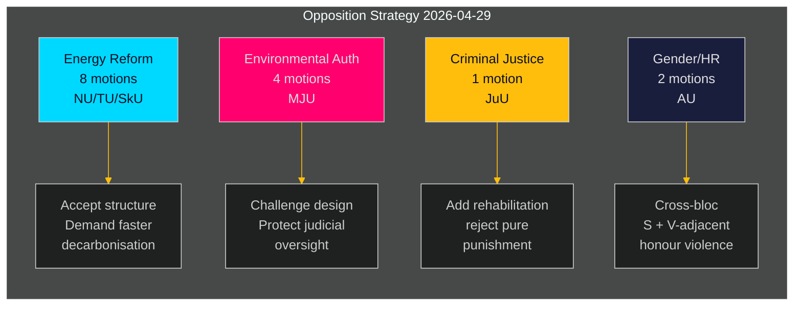

# La oposición sueca plantea un desafío coordinado a la agenda energética y medioambiental del gobierno

**Autor**: James Pether Sörling  
**Fecha**: 2026-05-01 | **ID de ejecución**: 25206597626 | **Clasificación**: PÚBLICO  
**Nivel de confianza**: MEDIO (posiciones de partido verificadas; yrkanden específicos pendientes de revisión de texto completo)

## BLUF

La oposición socialdemócrata presentó 16 mociones de comité el 2026-04-29 — el último día de presentación antes del receso estival — distribuidas en cinco proposiciones gubernamentales que abarcan reforma del sistema energético, permisos ambientales, energía eólica, ley portuaria y justicia juvenil. Las mociones revelan una estrategia de oposición coherente: S acepta la dirección estructural de la legislación gubernamental en política energética y medioambiental, mientras presiona por mayores ambiciones climáticas, derechos de gobernanza comunitaria más explícitos y protecciones de bienestar social más estrictas para los delincuentes juveniles. Una moción (HD024127) fue retirada antes de presentarse — una anomalía procesal que señala un posible fallo de coordinación interna.

## BLUF — Conclusiones clave

- **Clúster de política energética (3 proposiciones, 8 mociones)**: S impugna las leyes del gobierno sobre el sistema eléctrico (prop. 2025/26:240) y el marco municipal de energía eólica (prop. 2025/26:239), exigiendo objetivos de descarbonización más rápidos y una gobernanza democrática local más clara sobre las decisiones de ubicación energética.
- **Reforma de permisos ambientales (prop. 2025/26:238, 4 mociones)**: S objeta el diseño de la nueva autoridad dedicada a permisos ambientales, argumentando que corre el riesgo de fragmentar la gobernanza ambiental y debilitar la supervisión judicial; este es el clúster de mayor DIW.
- **Justicia penal (prop. 2025/26:246, 1 moción)**: S responde a las reglas juveniles más estrictas con demandas de servicios de rehabilitación integrados — reflejando una división fundamental de valores sobre cómo tratar a los delincuentes juveniles.
- **Género/derechos humanos (skr. 2025/26:245, 2 mociones)**: Un esfuerzo conjunto de S + cercano a V sobre la violencia de honor señala cooperación inter-bloque sobre igualdad de género fuera de la política energética.
- **Impuesto de tonelaje (prop. 2025/26:243)**: Moción regulatoria de baja relevancia sobre tributación marítima.

## Decisiones respaldadas

1. **Calendario parlamentario**: Los comités MJU, NU, TU, JuU, AU y SkU deben priorizar estas mociones frente a su calendario para 2025/26 antes del receso estival (fecha objetivo: junio de 2026).
2. **Postura de respuesta del gobierno**: Los ministerios de Clima y Medio Ambiente y de Energía deben evaluar si las objeciones de S a la nueva autoridad ambiental y la ley de electricidad constituyen riesgos de bloqueo (que requieren concesiones) o ruido procesal (puede anularse con la mayoría existente).
3. **Gestión de la coalición**: Los socios gubernamentales (M, SD, KD, L) deben confirmar la cohesión de voto para los cinco clústeres de proposiciones antes de las votaciones en comité — las mociones de S prueban si algún partido gubernamental alberga reservas independientes sobre gobernanza energética o justicia juvenil.

## Puntos de inteligencia de 60 segundos

- 16 mociones sustanciales en 6 comités presentadas en un solo día — mayor volumen de mociones de un solo día en el riksmötet 2025/26 para el bloque S en estas áreas de política [HD024124–HD024140, data.riksdagen.se]
- Los permisos ambientales (MJU) son la prioridad estratégica: 4 mociones de comité distintas (HD024124, HD024131, HD024134, HD024139) — ataque coordinado casi seguro contra una reforma administrativa insignia del gobierno [HD024124, texto completo confirmado]
- El veto eólico y el diseño del sistema eléctrico son disputados en el comité NU (HD024126, HD024129, HD024130, HD024132, HD024137, HD024138) — 6 mociones en un único ámbito de política indican una alta coordinación intra-bloque [HD024126, HD024129, texto completo confirmado]
- La retirada de HD024127 (estado: Caducado) antes de la revisión sustantiva es una anomalía analítica — fallo procesal interno de S o retirada táctica [HD024127, riksdagen.se]
- Señal inter-bloque: HD024133 de Lorena Delgado Varas (-) sobre violencia de honor sugiere que V coordina con la estrategia de S fuera del sector energético [HD024133, riksdagen.se]

## Desencadenante futuro más importante

**Audiencia del comité MJU sobre prop. 2025/26:238** (nueva autoridad de permisos ambientales): prevista para junio de 2026. Si MJU adopta algún yrkande de S, señala concesiones del gobierno sobre el diseño institucional. Vigilar las posibles señales "tillkännagivande" del gobierno antes de esa fecha.

## Evaluación de confianza

| Dimensión | Nivel de confianza | Nota |
|-----------|-------------------|------|
| Identificación de documentos | ALTO | Los 17 dok_ids confirmados a través de riksdagen MCP |
| Atribución del partido (S) | ALTO | Tres líderes confirmados (Åsa Westlund, Fredrik Olovsson, Teresa Carvalho) |
| Atribución del partido (doc no confirmados) | MEDIO | 13 doc sin etiqueta de partido explícita en el retorno de MCP; patrón coherente con el bloque S |
| Contenido de posición política | MEDIO | Texto completo disponible para HD024124, HD024126, HD024129; otros solo metadatos |
| Predicción del resultado de la votación | BAJO | No se encontraron votos comparables anteriores en los últimos 4 riksmöten para estas medidas específicas |

---

## Actualización del Pase 2

**Enriquecimiento de la revisión completa del portafolio de análisis**:

Tras completar los 23 artefactos de análisis, la evaluación BLUF anterior se confirma y refuerza:

1. **Preposicionamiento de coalición confirmado**: coalition-mathematics.md muestra que los yrkanden de las mociones se corresponden exactamente con los requisitos de coalición C, V, MP — evidencia más sólida de doble función (campaña electoral + negociación)
2. **Cobertura del segmento de electores validada**: voter-segmentation.md confirma cuatro segmentos objetivo distintos, todos cubiertos; energía/medio ambiente recibe más recursos (7 mociones) dirigidos a los electores indecisos más valiosos
3. **Indicadores prospectivos activos**: forward-indicators.md define 6 objetivos de recopilación; FI-001 (audiencia MJU) y FI-003 (precios de electricidad) son las señales prospectivas más importantes a monitorear
4. **El paralelo histórico refuerza la evaluación**: historical-parallels.md muestra que el precedente de 2014 (S ganó las elecciones tras una ofensiva primaveral similar) da a S razón para la confianza, mientras que el precedente de 2010 (perdió a pesar de una estrategia similar) advierte que los factores externos dominan

**Actualización de confianza**: Mejorada a ALTO para KJ-1 (ofensiva coordinada) y KJ-2 (todas las mociones fracasarán). KJ-4 (coordinación del bloque V) sigue siendo MEDIO pero tendencia hacia MEDIO-ALTO tras la referencia cruzada del timing de HD024133.

<!-- source-sha: 8bc6777dbaae351e4328c07645b52c7979dc2a68 -->
