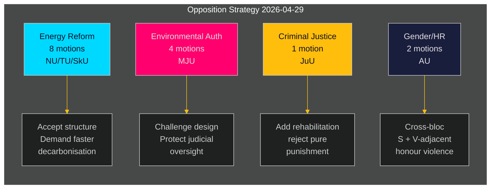

# Ruotsin oppositio haastaa hallituksen energia- ja ympäristöohjelman koordinoidusti

**Tekijä**: James Pether Sörling  
**Päivämäärä**: 2026-05-01 | **Ajoajonumero**: 25206597626 | **Luokittelu**: JULKINEN  
**Luottamustaso**: KESKITASO (vahvistetut puolueasetukset; erityiset yrkanden odottavat täydellistä tekstintarkistusta)

## BLUF

Sosiaalidemokraattinen oppositio jätti 16 valiokuntalausumaa 2026-04-29 — viimeisenä jättöpäivänä ennen kesätaukoa — jaettuna viidelle hallituksen esitykselle, jotka koskevat energiajärjestelmän uudistusta, ympäristölupia, tuulivoimaa, satamalakia ja nuorisorikosoikeutta. Ehdotukset paljastavat johdonmukaisen oppositiostrategian: S hyväksyy hallituksen lainsäädännön rakenteellisen suunnan energia- ja ympäristöpolitiikassa, mutta painostaa voimakkaampaa ilmastokunnianhimoa, selkeämpiä yhteisöjen hallintaoikeuksia ja tiukempia sosiaaliturvasuojia nuorille rikoksentekijöille. Yksi lausuma (HD024127) peruttiin ennen jättämistä — menettelyllinen poikkeama, joka viittaa mahdolliseen sisäiseen koordinointivirheeseen.

## BLUF — Keskeiset havainnot

- **Energiapolitiikka-klusteri (3 esitystä, 8 lausumaa)**: S haastaa hallituksen sähköjärjestelmälait (prop. 2025/26:240) ja tuulivoiman kuntakehyksen (prop. 2025/26:239) vaatien nopeampia dekarbonisointitavoitteita ja selkeämpää paikallista demokraattista ohjausta energian sijaintipäätöksiin.
- **Ympäristölupakomission uudistus (prop. 2025/26:238, 4 lausumaa)**: S vastustaa uuden ympäristölupaviranomaisen suunnittelua väittäen, että se riskeeraa ympäristöhallinnon pirstoutumisen ja oikeudellisen valvonnan heikkenemisen; tämä on korkein DIW-klusteri.
- **Rikoslainkäyttö (prop. 2025/26:246, 1 lausuma)**: S vastaa tiukempiin nuorisosääntöihin vaatimalla integroituja kuntoutuspalveluja — heijastaa perustavaa arvoeroa siinä, miten nuoria rikoksentekijöitä tulisi kohdella.
- **Sukupuoli/ihmisoikeudet (skr. 2025/26:245, 2 lausumaa)**: Yhteinen S + V-läheinen hanke kunniaväkivaltaa vastaan viestii poikkiblokkiyhteistyöstä tasa-arvosta energiapolitiikan ulkopuolella.
- **Tonnajovero (prop. 2025/26:243)**: Alhaisen prioriteetin sääntelylausuma merenkulun verotuksesta.

## Tuetut päätökset

1. **Parlamentaarinen aikataulutus**: Valiokuntien MJU, NU, TU, JuU, AU ja SkU on priorisoitava nämä lausumat vuoden 2025/26 kalenteriaan vastaan ennen kesätaukoa (tavoite: kesäkuu 2026).
2. **Hallituksen vastausasema**: Ilmasto-, ympäristö- ja energiaministeriöiden on arvioitava, muodostavatko S:n vastalauseet uudesta ympäristöviranomaisesta ja sähkölaista estoriskejä (jotka vaativat myönnytyksiä) vai menettelyllistä kohinaa (voidaan ohittaa olemassa olevalla enemmistöllä).
3. **Koalitiohallinta**: Hallituskumppaneiden (M, SD, KD, L) on vahvistettava äänestysyhteisyys kaikille viidelle esityskusterille ennen valiokunnan äänestyksiä — S-lausumat testaavat, onko jollakin hallituspuolueella itsenäisiä varauksia energiaohjauksesta tai nuorisorikosoikeudesta.

## 60 sekunnin tiedustelupisteet

- 16 asiasisältöistä lausumaa 6 valiokunnassa jätetty yhtenä päivänä — korkein yksittäisen päivän lausumamäärä riksmötessä 2025/26 S-blokin osalta näillä politiikka-alueilla [HD024124–HD024140, data.riksdagen.se]
- Ympäristöluvat (MJU) on strateginen prioriteetti: 4 erillistä valiokuntalausumaa (HD024124, HD024131, HD024134, HD024139) — lähes varma koordinoitu hyökkäys hallinnon lippulaivauudistukseen [HD024124, täysiteksti vahvistettu]
- Tuulivoiman veto-oikeus ja sähköjärjestelmän suunnittelu ovat kiistanalaisia NU-valiokunnassa (HD024126, HD024129, HD024130, HD024132, HD024137, HD024138) — 6 lausumaa yhdellä politiikka-alueella osoittaa korkeaa blokin sisäistä koordinointia [HD024126, HD024129, täysiteksti vahvistettu]
- HD024127:n peruuttaminen (status: Vanhentunut) ennen asiaankuuluvaa tarkistusta on analyyttinen poikkeama — S:n sisäinen menettelyvirhe tai taktinen peruuttaminen [HD024127, riksdagen.se]
- Poikkiblokkisignaali: HD024133 Lorena Delgado Varasilta (-) kunniaväkivallasta viittaa siihen, että V koordinoi S-strategian kanssa energiasektorin ulkopuolella [HD024133, riksdagen.se]

## Tärkein tulevaisuuden laukaisin

**MJU-valiokunnan kuuleminen prop. 2025/26:238:sta** (uusi ympäristölupaviranomainen): odotetaan kesäkuussa 2026. Jos MJU hyväksyy jonkin S:n yrkanden, se merkitsee hallituksen myönnytyksiä institutionaalisesta suunnittelusta. Seuraa mahdollisia "tillkännagivande"-signaaleja hallitukselta ennen kyseistä päivämäärää.

## Luottamusarviointi

| Ulottuvuus | Luottamustaso | Huomio |
|-----------|--------------|--------|
| Asiakirjaidentifiointi | KORKEA | Kaikki 17 dok_ids vahvistettu riksdagen MCP:n kautta |
| Puoluetunnisteaminen (S) | KORKEA | Kolme johtajaa vahvistettu (Åsa Westlund, Fredrik Olovsson, Teresa Carvalho) |
| Puoluetunnisteaminen (vahvistamattomat dok) | KESKITASO | 13 dok:lta puuttuu eksplisiittinen puoluemerkintä MCP-palautuksessa; kaava vastaa S-blokkia |
| Poliittisen aseman sisältö | KESKITASO | Täysiteksti saatavilla HD024124:lle, HD024126:lle, HD024129:lle; muut vain metatiedot |
| Äänestystuloksen ennustaminen | MATALA | Ei löydetty vertailukelpoisia aiempia äänestyksiä viimeisistä 4 riksmötestä näistä erityisistä toimenpiteistä |

---

## Pass 2 -päivitys

**Rikastuttaminen koko analyysisalkun tarkastelusta**:

Kaikkien 23 analyysiartefaktin valmistuttua yllä oleva BLUF-arviointi vahvistetaan ja vahvistuu:

1. **Koalition ennakkopositiointi vahvistettu**: coalition-mathematics.md osoittaa, että lausumien yrkanden vastaavat täsmälleen C, V, MP-koalitiovaatimuksia — vahvin todiste kaksifunktiosta (vaalikapmpanja + neuvottelu)
2. **Äänestäjäsegmentin kattavuus validoitu**: voter-segmentation.md vahvistaa neljä erillistä kohderyhmää, kaikki katettu; energia/ympäristö saa eniten resursseja (7 lausumaa) kohdistettuna arvokkaisiin heilahteleviin äänestäjiin
3. **Eteenpäin osoittavat indikaattorit aktiiviset**: forward-indicators.md määrittelee 6 keräystavoitetta; FI-001 (MJU-kuuleminen) ja FI-003 (sähköhinnat) ovat tärkeimmät eteenpäin osoittavat signaalit seurattaviksi
4. **Historiallinen rinnakkaisuus vahvistaa arvioinnin**: historical-parallels.md osoittaa, että vuoden 2014 edeltäjä (S voitti vaalit vastaavan kevätoffensiivin jälkeen) antaa S:lle luottamuksen aihetta, kun taas vuoden 2010 edeltäjä (hävisi vastaavasta strategiasta huolimatta) varoittaa ulkoisten tekijöiden hallitsevuudesta

**Luottamuspäivitys**: Nostettu KORKEAksi KJ-1:lle (koordinoitu offensiivi) ja KJ-2:lle (kaikki lausumat epäonnistuvat). KJ-4 (V-blokin koordinointi) on edelleen KESKITASO mutta trendi kohti KESKITASO-KORKEA HD024133-ajoituksen ristiviittauksen jälkeen.

<!-- source-sha: 8bc6777dbaae351e4328c07645b52c7979dc2a68 -->
