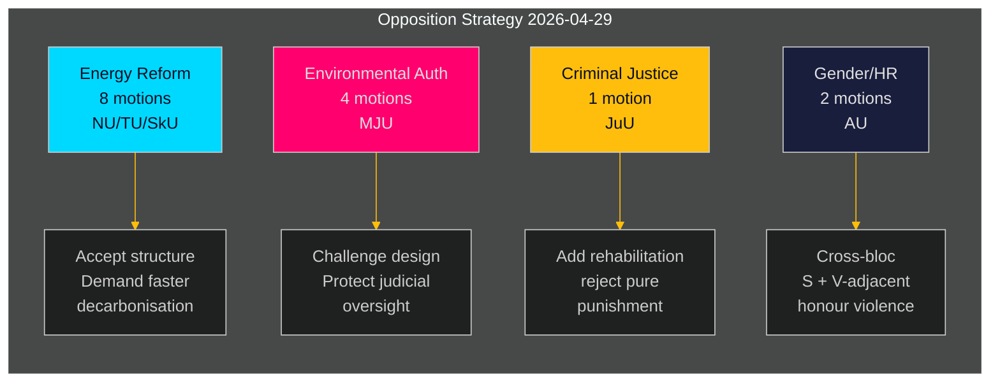

# L'opposition suédoise lance un défi coordonné à l'agenda énergétique et environnemental du gouvernement

**Auteur** : James Pether Sörling  
**Date** : 2026-05-01 | **ID d'exécution** : 25206597626 | **Classification** : PUBLIC  
**Niveau de confiance** : MOYEN (positions de parti vérifiées ; yrkanden spécifiques en attente d'examen complet du texte)

## BLUF

L'opposition social-démocrate a déposé 16 motions de commission le 2026-04-29 — dernier jour de dépôt avant la pause estivale — réparties sur cinq propositions gouvernementales couvrant la réforme du système énergétique, les permis environnementaux, l'énergie éolienne, la loi portuaire et la justice juvénile. Les motions révèlent une stratégie d'opposition cohérente : S accepte la direction structurelle de la législation gouvernementale en matière d'énergie et d'environnement, tout en réclamant des ambitions climatiques plus fortes, des droits de gouvernance communautaire plus explicites et des protections sociales plus strictes pour les jeunes délinquants. Une motion (HD024127) a été retirée avant dépôt — une anomalie procédurale signalant un possible échec de coordination interne.

## BLUF — Conclusions clés

- **Cluster de politique énergétique (3 propositions, 8 motions)** : S conteste les lois de la gouvernement sur le système électrique (prop. 2025/26:240) et le cadre communal de l'éolien (prop. 2025/26:239), exigeant des objectifs de décarbonation plus rapides et une gouvernance démocratique locale plus claire sur les décisions de localisation énergétique.
- **Réforme des permis environnementaux (prop. 2025/26:238, 4 motions)** : S s'oppose au design de la nouvelle autorité dédiée aux permis environnementaux, arguant qu'elle risque de fragmenter la gouvernance environnementale et d'affaiblir le contrôle judiciaire ; il s'agit du cluster DIW le plus élevé.
- **Justice pénale (prop. 2025/26:246, 1 motion)** : S répond aux règles juvéniles plus strictes par des demandes de services de réhabilitation intégrés — reflétant une division fondamentale de valeurs sur le traitement des jeunes délinquants.
- **Genre/droits humains (skr. 2025/26:245, 2 motions)** : Un effort conjoint S + proche de V sur les violences d'honneur signale une coopération inter-blocs sur l'égalité des genres hors de la politique énergétique.
- **Taxe de tonnage (prop. 2025/26:243)** : Motion réglementaire à faible saillance sur la fiscalité maritime.

## Décisions soutenues

1. **Calendrier parlementaire** : Les commissions MJU, NU, TU, JuU, AU et SkU doivent prioriser ces motions dans leur calendrier 2025/26 avant la pause estivale (date cible : juin 2026).
2. **Position de réponse du gouvernement** : Les ministères du Climat & Environnement et de l'Énergie doivent évaluer si les objections de S à la nouvelle autorité environnementale et à la loi sur l'électricité constituent des risques de blocage (nécessitant des concessions) ou du bruit procédural (pouvant être mis en minorité avec la majorité existante).
3. **Gestion de la coalition** : Les partenaires gouvernementaux (M, SD, KD, L) doivent confirmer la cohésion de vote pour les cinq clusters de propositions avant les votes en commission — les motions de S testent si une quelconque partie du gouvernement nourrit des réserves indépendantes sur la gouvernance énergétique ou la justice juvénile.

## Points de renseignement en 60 secondes

- 16 motions substantielles dans 6 commissions déposées en une seule journée — volume le plus élevé de motions sur une seule journée du riksmötet 2025/26 pour le bloc S dans ces domaines politiques [HD024124–HD024140, data.riksdagen.se]
- Les permis environnementaux (MJU) sont la priorité stratégique : 4 motions de commission distinctes (HD024124, HD024131, HD024134, HD024139) — attaque coordonnée quasi certaine contre une réforme administrative phare du gouvernement [HD024124, texte intégral confirmé]
- Le veto sur l'éolien et le design du système électrique sont contestés à la commission NU (HD024126, HD024129, HD024130, HD024132, HD024137, HD024138) — 6 motions dans un seul domaine politique indiquent une forte coordination intra-bloc [HD024126, HD024129, texte intégral confirmé]
- Le retrait de HD024127 (statut : Expiré) avant examen substantiel est une anomalie analytique — défaillance procédurale interne de S ou retrait tactique [HD024127, riksdagen.se]
- Signal inter-blocs : HD024133 de Lorena Delgado Varas (-) sur les violences d'honneur suggère que V coordonne avec la stratégie de S hors du secteur énergétique [HD024133, riksdagen.se]

## Déclencheur le plus important

**Audition de la commission MJU sur la prop. 2025/26:238** (nouvelle autorité de permis environnementaux) : prévue en juin 2026. Si MJU adopte un yrkande de S, cela signale des concessions du gouvernement sur le design institutionnel. Surveiller les signaux "tillkännagivande" de la gouvernement avant cette date.

## Évaluation de confiance

| Dimension | Niveau de confiance | Note |
|-----------|-------------------|------|
| Identification des documents | ÉLEVÉ | Tous les 17 dok_ids confirmés via riksdagen MCP |
| Attribution du parti (S) | ÉLEVÉ | Trois responsables confirmés (Åsa Westlund, Fredrik Olovsson, Teresa Carvalho) |
| Attribution du parti (dok non confirmés) | MOYEN | 13 dok sans marqueur de parti explicite dans le retour MCP ; schéma cohérent avec le bloc S |
| Contenu de position politique | MOYEN | Texte intégral disponible pour HD024124, HD024126, HD024129 ; autres en métadonnées seulement |
| Prédiction du résultat du vote | FAIBLE | Aucun vote comparable trouvé dans les 4 derniers riksmöten pour ces mesures spécifiques |

---

## Mise à jour Pass 2

**Enrichissement de la revue complète du portefeuille d'analyse** :

Après avoir complété les 23 artefacts d'analyse, l'évaluation BLUF ci-dessus est confirmée et renforcée :

1. **Prépositionnement de coalition confirmé** : coalition-mathematics.md montre que les yrkanden des motions correspondent précisément aux exigences de la coalition C, V, MP — preuve la plus solide de la double fonction (campagne électorale + négociation)
2. **Couverture des segments d'électeurs validée** : voter-segmentation.md confirme quatre segments cibles distincts, tous couverts ; énergie/environnement reçoit le plus de ressources (7 motions) ciblant les électeurs flottants les plus précieux
3. **Indicateurs prospectifs actifs** : forward-indicators.md définit 6 cibles de collecte ; FI-001 (audition MJU) et FI-003 (prix de l'électricité) sont les signaux prospectifs les plus importants à surveiller
4. **Parallèle historique renforce l'évaluation** : historical-parallels.md montre que le précédent de 2014 (S a remporté les élections après une offensive printanière similaire) donne à S des raisons de confiance, tandis que le précédent de 2010 (perdu malgré une stratégie similaire) avertit que les facteurs externes dominent

**Mise à jour de confiance** : Amélioré à ÉLEVÉ pour KJ-1 (offensive coordonnée) et KJ-2 (toutes les motions échoueront). KJ-4 (coordination du bloc V) reste MOYEN mais tendance vers MOYEN-ÉLEVÉ après le recoupement du timing de HD024133.

<!-- source-sha: 8bc6777dbaae351e4328c07645b52c7979dc2a68 -->
