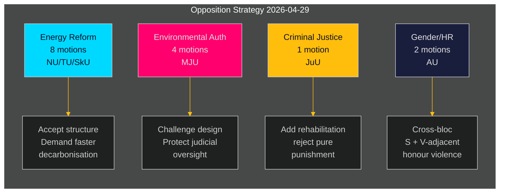

‏# האופוזיציה השוודית מציבה אתגר מתואם כנגד סדר היום האנרגטי והסביבתי של הממשלה

**מחבר**: James Pether Sörling  
**תאריך**: 2026-05-01 | **מזהה ריצה**: 25206597626 | **סיווג**: ציבורי  
**רמת ביטחון**: בינונית (עמדות מפלגה מאומתות; yrkanden ספציפיים ממתינים לבדיקת טקסט מלאה)

## BLUF

האופוזיציה הסוציאל-דמוקרטית הגישה 16 הצעות ועדה ב-2026-04-29 — יום ההגשה האחרון לפני פגרת הקיץ — המחולקות על פני חמש הצעות ממשלתיות הכוללות רפורמת מערכת אנרגיה, היתרים סביבתיים, אנרגיית רוח, חוק נמלים ואשמות נוער. ההצעות חושפות אסטרטגיית אופוזיציה קוהרנטית: S מקבלת את הכיוון המבני של חקיקת הממשלה במדיניות אנרגיה וסביבה, תוך לחץ לשאיפות אקלים חזקות יותר, זכויות ממשל קהילתי מפורשות יותר והגנות רווחה חברתית קשות יותר לעבריינים צעירים. הצעה אחת (HD024127) נמשכה לפני ההגשה — חריגות פרוצדורלית המאותתת על כשל אפשרי בתיאום הפנימי.

## BLUF — ממצאים מרכזיים

- **אשכול מדיניות אנרגיה (3 הצעות, 8 הצעות ועדה)**: S מאתגרת את חוקי הממשלה בנוגע למערכת החשמל (prop. 2025/26:240) ומסגרת הרשויות המקומיות לאנרגיית רוח (prop. 2025/26:239), ודורשת יעדי דה-קרבוניזציה מהירים יותר וממשל דמוקרטי מקומי ברור יותר על החלטות מיקום אנרגיה.
- **רפורמת היתרים סביבתיים (prop. 2025/26:238, 4 הצעות ועדה)**: S מתנגדת לעיצוב הרשות החדשה המוקדשת להיתרים סביבתיים, בטענה שהיא מסכנת פיצול הממשל הסביבתי והחלשת הפיקוח השיפוטי; זהו האשכול עם מדד DIW הגבוה ביותר.
- **צדק פלילי (prop. 2025/26:246, הצעת ועדה אחת)**: S משיבה לכללי נוער מחמירים יותר עם דרישות לשירותי שיקום משולבים — משקפת פילוג ערכי יסודי בנוגע לטיפול בעבריינים צעירים.
- **מגדר/זכויות אדם (skr. 2025/26:245, 2 הצעות ועדה)**: מאמץ משותף של S + קרוב לV נגד אלימות כבוד מאותת על שיתוף פעולה חוצה-בלוקים על שוויון מגדרי מחוץ למדיניות האנרגיה.
- **מס טונאז' (prop. 2025/26:243)**: הצעת ועדה רגולטורית בעדיפות נמוכה בנושא מיסוי ימי.

## החלטות נתמכות

1. **לוח זמנים פרלמנטרי**: ועדות MJU, NU, TU, JuU, AU ו-SkU חייבות לסדר עדיפויות בין הצעות אלה לפי לוח שנתן לשנת 2025/26 לפני פגרת הקיץ (מועד יעד: יוני 2026).
2. **עמדת תגובה ממשלתית**: משרדי האקלים והסביבה והאנרגיה חייבים להעריך האם התנגדויות S לרשות הסביבה החדשה וחוק החשמל מהוות סיכוני חסימה (הדורשים ויתורים) או רעש פרוצדורלי (ניתן לדחיה עם הרוב הקיים).
3. **ניהול קואליציה**: שותפי הממשלה (M, SD, KD, L) חייבים לאשר לכידות הצבעה לכל חמשת אשכולות ההצעות לפני הצבעות הועדה — הצעות S בוחנות האם מפלגה ממשלתית כלשהי חרתה הסתייגויות עצמאיות לגבי ממשל אנרגיה או שיפוט נוער.

## נקודות מודיעין של 60 שניות

- 16 הצעות מהותיות ב-6 ועדות הוגשו ביום אחד — נפח הגשות ביום אחד הגבוה ביותר ב-riksmötet 2025/26 לגוש S בתחומי מדיניות אלה [HD024124–HD024140, data.riksdagen.se]
- היתרים סביבתיים (MJU) הם העדיפות האסטרטגית: 4 הצעות ועדה נפרדות (HD024124, HD024131, HD024134, HD024139) — מתקפה מתואמת כמעט ודאית על רפורמת ניהול ממשלה מרכזית [HD024124, אישור טקסט מלא]
- ווטו אנרגיית הרוח ועיצוב מערכת החשמל שנויים במחלוקת בועדת NU (HD024126, HD024129, HD024130, HD024132, HD024137, HD024138) — 6 הצעות בתחום מדיניות אחד מעידות על תיאום תוך-גושי גבוה [HD024126, HD024129, אישור טקסט מלא]
- משיכת HD024127 (סטטוס: פג תוקף) לפני בדיקה מהותית היא חריגות אנליטית — כשל פרוצדורלי פנימי של S או משיכה טקטית [HD024127, riksdagen.se]
- אות חוצה-גושי: HD024133 מאת Lorena Delgado Varas (-) בנושא אלימות כבוד מרמזת שV מתאמת עם אסטרטגיית S מחוץ לסקטור האנרגיה [HD024133, riksdagen.se]

## הטריגר העתידי החשוב ביותר

**דיון ועדת MJU בנוגע ל-prop. 2025/26:238** (רשות היתרים סביבתיים חדשה): צפוי יוני 2026. אם MJU תאמץ yrkande כלשהו של S, זה מאותת על ויתורי ממשלה בנוגע לעיצוב מוסדי. לעקוב אחר אותות "tillkännagivande" אפשריים מהממשלה לפני אותו תאריך.

## הערכת ביטחון

| ממד | רמת ביטחון | הערה |
|-----|-----------|------|
| זיהוי מסמכים | גבוהה | כל 17 ה-dok_ids אושרו דרך riksdagen MCP |
| ייחוס מפלגה (S) | גבוהה | שלושה מנהיגים אושרו (Åsa Westlund, Fredrik Olovsson, Teresa Carvalho) |
| ייחוס מפלגה (מסמכים לא מאושרים) | בינונית | 13 מסמכים ללא תג מפלגה מפורש בתגובת MCP; דפוס עקבי עם גוש S |
| תוכן עמדה פוליטית | בינונית | טקסט מלא זמין ל-HD024124, HD024126, HD024129; שאר מטה-דאטה בלבד |
| חיזוי תוצאת הצבעה | נמוכה | לא נמצאו הצבעות דומות קודמות ב-4 riksmöten האחרונים למדדים ספציפיים אלה |

---

## עדכון שלב 2

**העשרה מסקירת תיק הניתוח המלאה**:

לאחר השלמת כל 23 ממצאי הניתוח, הערכת BLUF לעיל מאושרת ומתחזקת:

1. **מיצוב מוקדם של קואליציה אושר**: coalition-mathematics.md מראה שה-yrkanden של ההצעות תואמים בדיוק את דרישות קואליציית C, V, MP — ראיה חזקה ביותר לפונקציה כפולה (קמפיין בחירות + משא ומתן)
2. **כיסוי פלח מצביעים אומת**: voter-segmentation.md מאשר ארבעה פלחי יעד נפרדים, כולם מכוסים; אנרגיה/סביבה מקבלת משאבים הרבה ביותר (7 הצעות) המכוונות למצביעים מתנדנדים בעלי הערך הגבוה ביותר
3. **מדדים צופים פני עתיד פעילים**: forward-indicators.md מגדיר 6 יעדי איסוף; FI-001 (דיון MJU) ו-FI-003 (מחירי חשמל) הם האותות הצופים פני עתיד החשובים ביותר למעקב
4. **מקבילה היסטורית מחזקת הערכה**: historical-parallels.md מראה שהתקדים מ-2014 (S ניצחה בבחירות לאחר מתקפת אביב דומה) נותן ל-S סיבה לביטחון, בעוד התקדים מ-2010 (הפסידה למרות אסטרטגיה דומה) מזהיר שגורמים חיצוניים שולטים

**עדכון ביטחון**: הוחלף לגבוה עבור KJ-1 (מתקפה מתואמת) ו-KJ-2 (כל ההצעות ייכשלו). KJ-4 (תיאום גוש V) נשאר בינוני אך עם מגמה לבינוני-גבוה לאחר הצלבה עם תזמון HD024133.

<!-- source-sha: 8bc6777dbaae351e4328c07645b52c7979dc2a68 -->
