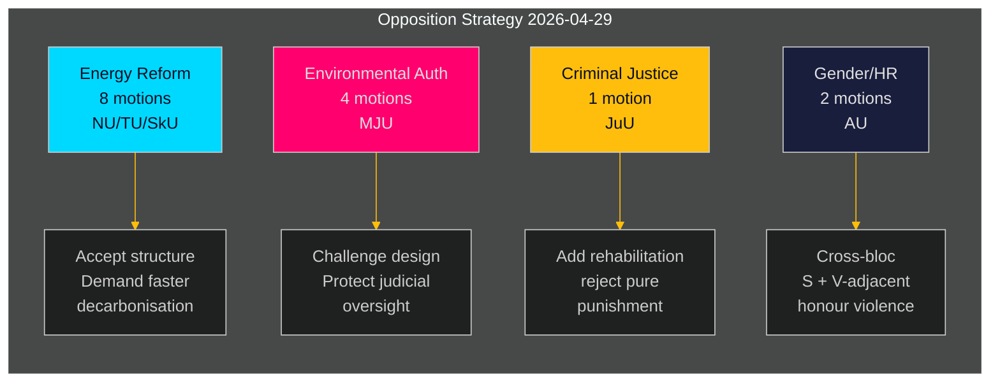

# スウェーデン野党、政府のエネルギー・環境政策に対して組織的な異議申し立て

**著者**: James Pether Sörling  
**日付**: 2026-05-01 | **実行ID**: 25206597626 | **分類**: 公開  
**信頼度**: 中程度（政党の立場は確認済み；特定のyrkanden は全文審査待ち）

## BLUF

社会民主党の野党は2026-04-29に16件の委員会動議を提出した。これは夏季休会前の最後の提出日であり、エネルギーシステム改革、環境許可、風力発電、港湾法、少年司法をカバーする5つの政府提案にわたる。これらの動議は一貫した野党戦略を明らかにする：SはエネルギーおよびEnvironmental政策における政府立法の構造的方向性を受け入れつつ、より強い気候目標、より明確なコミュニティ自治権、少年犯罪者に対する厳しい社会的保護を求めて圧力をかけている。1件の動議（HD024127）は提出前に撤回された — 内部調整の失敗を示す可能性のある手続き上の異常。

## BLUF — 主要な調査結果

- **エネルギー政策クラスター（3つの提案、8つの動議）**: Sは電力システムに関する法律（prop. 2025/26:240）および風力発電の自治体フレームワーク（prop. 2025/26:239）に異議を唱え、より速い脱炭素化目標とエネルギー立地決定に関するより明確な地方民主的ガバナンスを要求している。
- **環境許可改革（prop. 2025/26:238、4つの動議）**: Sは新しい専用環境許可当局の設計に反対し、環境ガバナンスの分断化と司法監督の弱体化のリスクがあると主張；これは最高DIWクラスター。
- **刑事司法（prop. 2025/26:246、1つの動議）**: Sは少年に対するより厳しいルールに対して、統合的リハビリサービスの要求で応答 — 少年犯罪者の扱いに関する根本的な価値観の相違を反映。
- **ジェンダー/人権（skr. 2025/26:245、2つの動議）**: 名誉暴力に関するS + V系のグループの共同努力は、エネルギー政治の外でのジェンダー平等に関するブロック横断的な協力を示している。
- **トン数税（prop. 2025/26:243）**: 海上輸送課税に関する重要度の低い規制動議。

## 支持される決定

1. **議会スケジュール**: MJU、NU、TU、JuU、AU、SkU委員会は夏季休会前に2025/26年の暦に対してこれらの動議を優先付けなければならない（目標期限：2026年6月）。
2. **政府の対応姿勢**: 気候・環境省とエネルギー省は、新環境当局と電力法に対するSの異議申し立てが阻止リスク（譲歩が必要）なのか手続き上のノイズ（既存多数派で覆せる）なのかを評価しなければならない。
3. **連立管理**: 政府パートナー（M、SD、KD、L）は委員会投票前に5つの提案クラスター全てについて投票の一致を確認しなければならない — Sの動議は政府党がエネルギーガバナンスまたは少年司法について独立した留保を持っているかどうかをテストする。

## 60秒インテリジェンスポイント

- 16件の実質的な動議が6つの委員会に1日で提出 — riksmötet 2025/26でこれらの政策分野においてSブロックの1日最高動議量 [HD024124–HD024140, data.riksdagen.se]
- 環境許可（MJU）が戦略的優先事項：4件の独立した委員会動議（HD024124、HD024131、HD024134、HD024139）— 政府の主要行政改革に対するほぼ確実な組織的攻撃 [HD024124、全文確認済み]
- 風力発電拒否権と電力システム設計はNU委員会で争われている（HD024126、HD024129、HD024130、HD024132、HD024137、HD024138）— 1つの政策分野での6件の動議はブロック内の高い調整を示す [HD024126、HD024129、全文確認済み]
- HD024127の撤回（状態：失効）は実質的な審査前の分析上の異常 — S内部の手続きエラーまたは戦術的撤回 [HD024127, riksdagen.se]
- ブロック横断シグナル：Lorena Delgado Varas（-）によるHD024133の名誉暴力はVがエネルギーセクター外でS戦略と調整していることを示唆 [HD024133, riksdagen.se]

## 最重要将来のトリガー

**MJU委員会のprop. 2025/26:238に関する公聴会**（新環境許可当局）：2026年6月に予定。MJUがSのyrkande を採択すれば、制度設計に関する政府の譲歩を示す。その日付前に政府から"tillkännagivande"シグナルがないか注視すること。

## 信頼度評価

| 次元 | 信頼度 | 注記 |
|------|--------|------|
| 文書識別 | 高 | 17件全てのdok_idsがriksdagen MCPで確認 |
| 政党帰属（S） | 高 | 3人のリーダーが確認（Åsa Westlund、Fredrik Olovsson、Teresa Carvalho） |
| 政党帰属（未確認文書） | 中 | 13文書にMCPの返答で明示的な政党タグなし；パターンはSブロックに一致 |
| 政治的立場の内容 | 中 | HD024124、HD024126、HD024129の全文あり；その他はメタデータのみ |
| 投票結果予測 | 低 | これらの特定措置について過去4回のriksmötenで比較可能な投票なし |

---

## パス2更新

**完全な分析ポートフォリオレビューからの強化**：

23の分析成果物全て完了後、上記のBLUF評価が確認され強化された：

1. **連立事前ポジショニング確認**: coalition-mathematics.mdは動議のyrkanden がC、V、MPの連立要件と正確に一致していることを示す — 二重機能（選挙キャンペーン + 交渉）の最強の証拠
2. **有権者セグメント範囲検証済み**: voter-segmentation.mdは4つの異なるターゲットセグメントを確認、全て対応済み；エネルギー/環境は最も価値の高い浮動票を対象とした最多リソース（7動議）を受ける
3. **先行指標アクティブ**: forward-indicators.mdは6つの収集目標を定義；FI-001（MJU公聴会）とFI-003（電力価格）は監視すべき最も重要な先行シグナル
4. **歴史的並行が評価を強化**: historical-parallels.mdは2014年の前例（S が同様の春攻勢の後に選挙で勝利）がSに自信の理由を与えることを示し、一方2010年の前例（同様の戦略にもかかわらず敗北）は外部要因が支配的であることを警告

**信頼度更新**: KJ-1（組織的攻勢）とKJ-2（全動議失敗）についてHIGHにアップグレード。KJ-4（Vブロック調整）はMEDIUMのまま、しかしHD024133タイミングの相互参照後にMEDIUM-HIGHへのトレンド。

<!-- source-sha: 8bc6777dbaae351e4328c07645b52c7979dc2a68 -->
