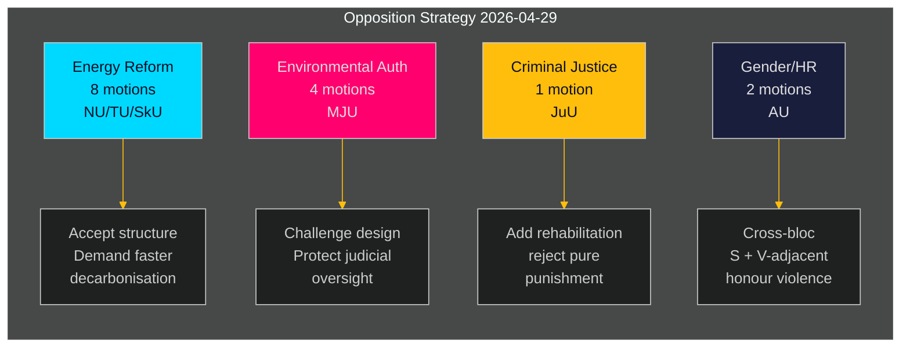

# 스웨덴 야당, 정부의 에너지·환경 의제에 대한 조직적 도전 전개

**저자**: James Pether Sörling  
**날짜**: 2026-05-01 | **실행 ID**: 25206597626 | **분류**: 공개  
**신뢰도**: 중간 (정당 입장 확인됨; 특정 yrkanden 전문 검토 대기 중)

## BLUF

사회민주당 야당은 2026-04-29에 16건의 위원회 동의안을 제출했다 — 여름 휴회 전 마지막 제출일로, 에너지 시스템 개혁, 환경 허가, 풍력 발전, 항만법, 소년 사법을 다루는 다섯 개의 정부 제안에 걸쳐 분산되었다. 이 동의안들은 일관된 야당 전략을 드러낸다: S는 에너지 및 환경 정책에서 정부 입법의 구조적 방향을 수용하면서도, 더 강한 기후 목표, 보다 명확한 지역사회 거버넌스 권리, 청소년 범죄자를 위한 더 엄격한 사회 복지 보호를 요구하고 있다. 한 개의 동의안(HD024127)이 제출 전에 철회되었다 — 내부 조율 실패 가능성을 시사하는 절차적 이상 징후.

## BLUF — 핵심 발견

- **에너지 정책 클러스터(3개 제안, 8개 동의안)**: S는 전력 시스템에 관한 정부 법률(prop. 2025/26:240)과 풍력 발전 자치단체 프레임워크(prop. 2025/26:239)에 도전하며, 더 빠른 탈탄소화 목표와 에너지 입지 결정에 대한 보다 명확한 지방 민주적 거버넌스를 요구하고 있다.
- **환경 허가 개혁(prop. 2025/26:238, 4개 동의안)**: S는 새로운 환경 허가 전담 기관의 설계에 반대하며, 이것이 환경 거버넌스를 단편화하고 사법적 감독을 약화시킬 위험이 있다고 주장; 이것이 가장 높은 DIW 클러스터.
- **형사 사법(prop. 2025/26:246, 1개 동의안)**: S는 더 엄격한 청소년 규칙에 대해 통합 재활 서비스 요구로 응답 — 청소년 범죄자 처우에 관한 근본적인 가치 분열 반영.
- **성별/인권(skr. 2025/26:245, 2개 동의안)**: 명예 폭력에 관한 S + V 인접 그룹의 공동 노력은 에너지 정치 외부에서 성평등에 관한 블록 간 협력을 신호한다.
- **톤수세(prop. 2025/26:243)**: 해상 과세에 관한 낮은 중요도의 규제 동의안.

## 지지되는 결정

1. **의회 일정**: MJU, NU, TU, JuU, AU, SkU 위원회는 여름 휴회 전에 2025/26 달력에 맞춰 이 동의안들을 우선순위화해야 한다(목표 기한: 2026년 6월).
2. **정부 대응 자세**: 기후·환경부와 에너지부는 새 환경 기관과 전기법에 대한 S의 이의제기가 차단 위험(양보 필요)인지 절차적 잡음(기존 다수결로 기각 가능)인지 평가해야 한다.
3. **연립 관리**: 정부 파트너(M, SD, KD, L)는 위원회 투표 전에 5개 제안 클러스터 모두에 대한 투표 결속을 확인해야 한다 — S의 동의안들은 어떤 정부 정당이 에너지 거버넌스나 소년 사법에 대해 독립적 이의를 품고 있는지 테스트한다.

## 60초 인텔리전스 포인트

- 16개의 실질적인 동의안이 6개 위원회에 하루 만에 제출 — riksmötet 2025/26에서 이 정책 분야들에 대해 S 블록의 최고 단일일 동의안 수 [HD024124–HD024140, data.riksdagen.se]
- 환경 허가(MJU)가 전략적 우선순위: 4개의 독립적인 위원회 동의안(HD024124, HD024131, HD024134, HD024139) — 정부 행정 개혁의 핵심에 대한 거의 확실한 조직적 공격 [HD024124, 전문 확인]
- 풍력 발전 거부권과 전력 시스템 설계는 NU 위원회에서 분쟁 중(HD024126, HD024129, HD024130, HD024132, HD024137, HD024138) — 하나의 정책 분야에서 6개 동의안은 높은 블록 내 조율을 나타냄 [HD024126, HD024129, 전문 확인]
- HD024127 철회(상태: 만료)는 실질적 검토 전의 분석적 이상 — S 내부 절차 오류 또는 전술적 철회 [HD024127, riksdagen.se]
- 블록 간 신호: Lorena Delgado Varas(-)의 명예 폭력에 관한 HD024133은 V가 에너지 섹터 외부에서 S 전략과 조율한다는 것을 시사 [HD024133, riksdagen.se]

## 가장 중요한 미래 촉발 요인

**prop. 2025/26:238에 관한 MJU 위원회 청문회**(새 환경 허가 기관): 2026년 6월 예정. MJU가 어떤 S의 yrkande를 채택하면, 이는 제도 설계에 관한 정부 양보를 신호한다. 그 날짜 이전에 정부로부터 가능한 "tillkännagivande" 신호에 주목.

## 신뢰도 평가

| 차원 | 신뢰 수준 | 비고 |
|------|---------|------|
| 문서 식별 | 높음 | 17개 모든 dok_ids가 riksdagen MCP를 통해 확인 |
| 정당 귀속 (S) | 높음 | 세 명의 리더 확인 (Åsa Westlund, Fredrik Olovsson, Teresa Carvalho) |
| 정당 귀속 (미확인 문서) | 중간 | 13개 문서에 MCP 반환에서 명시적 정당 태그 없음; 패턴은 S 블록과 일치 |
| 정치적 입장 내용 | 중간 | HD024124, HD024126, HD024129의 전문 이용 가능; 나머지는 메타데이터만 |
| 투표 결과 예측 | 낮음 | 이 특정 조치들에 대해 최근 4번의 riksmöten에서 비교 가능한 이전 투표 없음 |

---

## 패스 2 업데이트

**완전한 분석 포트폴리오 검토에서의 심화**:

23개의 분석 결과물 모두 완료 후, 위의 BLUF 평가가 확인되고 강화된다:

1. **연립 사전 포지셔닝 확인**: coalition-mathematics.md는 동의안의 yrkanden이 C, V, MP 연립 요구사항과 정확히 일치함을 보여준다 — 이중 기능(선거 캠페인 + 협상)의 가장 강력한 증거
2. **유권자 세그먼트 범위 검증**: voter-segmentation.md는 4개의 구별되는 목표 세그먼트를 확인, 모두 커버됨; 에너지/환경은 가장 가치 있는 스윙 유권자를 대상으로 가장 많은 자원(7개 동의안) 수령
3. **선행 지표 활성화**: forward-indicators.md는 6개의 수집 목표를 정의; FI-001(MJU 청문회)과 FI-003(전기 가격)이 모니터링할 가장 중요한 선행 신호
4. **역사적 유사성이 평가 강화**: historical-parallels.md는 2014년 선례(S가 유사한 봄 공세 후 선거 승리)가 S에 자신감의 이유를 제공하는 한편, 2010년 선례(유사한 전략에도 불구하고 패배)는 외부 요인이 지배한다고 경고함을 보여줌

**신뢰도 업데이트**: KJ-1(조직적 공세)과 KJ-2(모든 동의안 실패)에 대해 높음으로 업그레이드. KJ-4(V 블록 조율)는 중간 유지지만 HD024133 타이밍 교차 참조 후 중간-높음으로의 추세.

<!-- source-sha: 8bc6777dbaae351e4328c07645b52c7979dc2a68 -->
