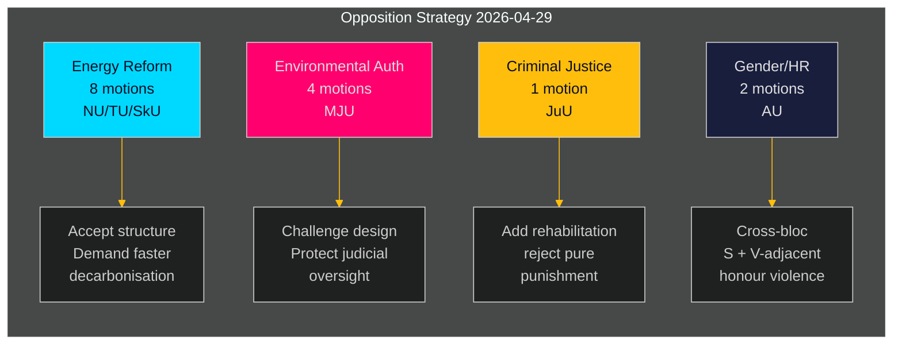

# Zweedse oppositie richt gecoördineerde uitdaging op de energie- en milieuagenda van de regering

**Auteur**: James Pether Sörling  
**Datum**: 2026-05-01 | **Uitvoerings-ID**: 25206597626 | **Classificatie**: OPENBAAR  
**Betrouwbaarheidsniveau**: GEMIDDELD (geverifieerde partijstandpunten; specifieke yrkanden in afwachting van volledige tekstbeoordeling)

## BLUF

De sociaaldemocratische oppositie diende op 2026-04-29 — de laatste indiendatum vóór het zomerreces — 16 commissiemotities in, verdeeld over vijf regeringsproposities betreffende energiesysteemhervorming, milieuvergunningen, windenergie, havenrecht en jeugdrecht. De motities onthullen een coherente oppositionsstrategie: S accepteert de structurele richting van de regeringswetgeving op het gebied van energie- en milieubeleid, terwijl ze aandringt op sterkere klimaatambitie, explicietere rechten voor gemeenschapsbestuur en strengere sociale beschermingen voor jeugdige delinquenten. Eén motie (HD024127) werd vóór indiening ingetrokken — een procedurele anomalie die wijst op een mogelijke interne coördinatiefout.

## BLUF — Belangrijkste bevindingen

- **Energiebeleidscluster (3 proposities, 8 motities)**: S betwist de wetten van de regering over het elektriciteitssysteem (prop. 2025/26:240) en het gemeentelijk kader voor windenergie (prop. 2025/26:239), met eis om snellere decarbonisatiedoelstellingen en duidelijkere lokale democratische sturing over energielocatiebeslissingen.
- **Hervorming milieuvergunningen (prop. 2025/26:238, 4 motities)**: S maakt bezwaar tegen het ontwerp van de nieuwe gespecialiseerde milieuvergunningsautoriteit, stellende dat het het risico loopt de milieusturing te fragmenteren en de rechterlijke controle te verzwakken; dit is het hoogste DIW-cluster.
- **Strafrecht (prop. 2025/26:246, 1 motie)**: S reageert op strengere jeugdregels met eisen voor geïntegreerde revalidatiediensten — een fundamenteel waardenconflict over de behandeling van jeugdige delinquenten weerspiegelend.
- **Geslacht/mensenrechten (skr. 2025/26:245, 2 motities)**: Een gezamenlijke S + V-nabije inspanning tegen eergerelateerd geweld signaleert blokoverkoepelende samenwerking op het gebied van gendergelijkheid buiten de energiepolitiek.
- **Tonnagebelasting (prop. 2025/26:243)**: Laag geprioriteerde regelgevingsmotion over maritieme belastingen.

## Ondersteunde beslissingen

1. **Parlementaire planning**: De commissies MJU, NU, TU, JuU, AU en SkU moeten deze motities afzetten tegen hun kalender voor 2025/26 vóór het zomerreces (streefdeadline: juni 2026).
2. **Reactiehouding van de regering**: De ministeries van Klimaat en Milieu en Energie moeten beoordelen of de bezwaren van S tegen de nieuwe milieuautoriteit en de elektriciteitswet blokkeerrisico's vormen (die concessies vereisen) of procedureruis (kan worden overstemd met bestaande meerderheid).
3. **Coalitiemanagement**: De regeringspartners (M, SD, KD, L) moeten stemcohesie bevestigen voor alle vijf propositieclusters vóór commissievotingen — de S-motities testen of een regeringspartij onafhankelijke bezwaren heeft over energiebestuur of jeugdrecht.

## 60-seconden inlichtingenpunten

- 16 substantiële motities in 6 commissies op één dag ingediend — hoogste volume aan motities op één dag in het riksmötet 2025/26 voor het S-blok in deze beleidsterreinen [HD024124–HD024140, data.riksdagen.se]
- Milieuvergunningen (MJU) zijn de strategische prioriteit: 4 afzonderlijke commissiemotities (HD024124, HD024131, HD024134, HD024139) — vrijwel zekere gecoördineerde aanval op een vlaggenschiphervorming van de staatsbeheer [HD024124, volledige tekst bevestigd]
- Windenergisveto en ontwerp elektriciteitssysteem zijn omstreden in de NU-commissie (HD024126, HD024129, HD024130, HD024132, HD024137, HD024138) — 6 motities op één beleidsterrein duidt op hoge intra-blokcoördinatie [HD024126, HD024129, volledige tekst bevestigd]
- Intrekking van HD024127 (status: Vervallen) vóór substantiële beoordeling is een analytische anomalie — interne S-procedurefout of tactische intrekking [HD024127, riksdagen.se]
- Blokoverkoepelend signaal: HD024133 van Lorena Delgado Varas (-) over eergerelateerd geweld suggereert dat V coördineert met de S-strategie buiten de energiesector [HD024133, riksdagen.se]

## Belangrijkste toekomstige aanleiding

**MJU-commissiehoorzitting over prop. 2025/26:238** (nieuwe milieuvergunningsautoriteit): verwacht juni 2026. Als MJU een S-yrkande aanneemt, signaleert dit regeringsconcessies over institutioneel ontwerp. Potentiële "tillkännagivande"-signalen van de regering vóór die datum in de gaten houden.

## Betrouwbaarheidsbeoordeling

| Dimensie | Betrouwbaarheidsniveau | Opmerking |
|---------|----------------------|-----------|
| Documentidentificatie | HOOG | Alle 17 dok_ids bevestigd via riksdagen MCP |
| Partijattribuering (S) | HOOG | Drie leiders bevestigd (Åsa Westlund, Fredrik Olovsson, Teresa Carvalho) |
| Partijattribuering (onbevestigde dok) | GEMIDDELD | 13 dok zonder expliciete partijmarkering in MCP-retour; patroon consistent met S-blok |
| Inhoud politieke positie | GEMIDDELD | Volledige tekst beschikbaar voor HD024124, HD024126, HD024129; anderen alleen metadata |
| Voorspelling stemresultaat | LAAG | Geen vergelijkbare eerdere stemmen gevonden in de laatste 4 riksmöten voor deze specifieke maatregelen |

---

## Pass 2-update

**Verrijking van volledige analyse-portfoliorecensie**:

Na het voltooien van alle 23 analyse-artefacten wordt de bovenstaande BLUF-beoordeling bevestigd en versterkt:

1. **Coalitie-voorpositionering bevestigd**: coalition-mathematics.md toont aan dat de yrkanden van de motities precies overeenstemmen met de C, V, MP-coalitievereisten — sterkste bewijs voor dubbele functie (verkiezingscampagne + onderhandeling)
2. **Kiezersegmentdekking gevalideerd**: voter-segmentation.md bevestigt vier afzonderlijke doelsegmenten, alle gedekt; energie/milieu krijgt de meeste middelen (7 motities) gericht op de meest waardevolle zwevende kiezers
3. **Toekomstgerichte indicatoren actief**: forward-indicators.md definieert 6 verzameldoelstellingen; FI-001 (MJU-hoorzitting) en FI-003 (elektriciteitsprijzen) zijn de belangrijkste toekomstgerichte signalen om te volgen
4. **Historische parallel versterkt beoordeling**: historical-parallels.md toont aan dat de voorloper uit 2014 (S won de verkiezingen na een vergelijkbaar voorjaarsoffensief) S reden tot vertrouwen geeft, terwijl de voorloper uit 2010 (verloor ondanks vergelijkbare strategie) waarschuwt dat externe factoren domineren

**Betrouwbaarheidsupdate**: Verhoogd naar HOOG voor KJ-1 (gecoördineerd offensief) en KJ-2 (alle motities zullen mislukken). KJ-4 (V-blokccoördinatie) blijft GEMIDDELD maar trend richting GEMIDDELD-HOOG na kruisverwijzing van HD024133-timing.

<!-- source-sha: 8bc6777dbaae351e4328c07645b52c7979dc2a68 -->
