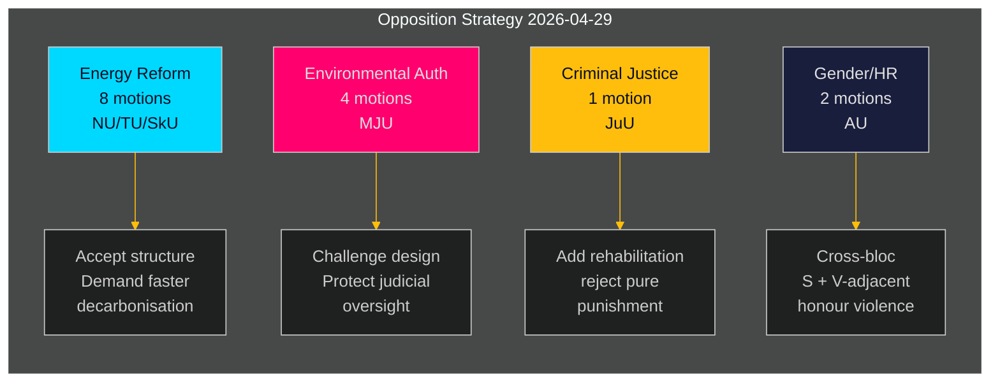

# Svensk opposisjon retter koordinert utfordring mot regjeringens energi- og miljøagenda

**Forfatter**: James Pether Sörling  
**Dato**: 2026-05-01 | **Kjørings-ID**: 25206597626 | **Klassifisering**: OFFENTLIG  
**Konfidensnivå**: MIDDELS (verifiserte partiposisjoner; spesifikke yrkanden avventer fullstendig tekstgjennomgang)

## BLUF

Sosialdemokratenes opposisjon leverte inn 16 utvalgsforslag den 2026-04-29 — siste dag for innlevering før sommerferien — fordelt på fem regjeringsproposisjoner om energisystemreform, miljøtillatelser, vindkraft, havneloven og ungdomsjustis. Forslagene avslører en sammenhengende opposisjonsstrategi: S aksepterer den strukturelle retningen i regjeringens lovgivning på energi- og miljøpolitikk, men presser på for sterkere klimaambisjoner, tydeligere rettigheter til samfunnsstyring og hardere sosiale beskyttelsestiltak for unge lovbrytere. Ett forslag (HD024127) ble trukket tilbake før innlevering — en prosedyremessig anomali som signaliserer mulig intern koordineringssvikt.

## BLUF — Sentrale funn

- **Energipolitikk-klynge (3 proposisjoner, 8 forslag)**: S utfordrer regjeringens lover om elsystemet (prop. 2025/26:240) og vindkraftens kommuneramme (prop. 2025/26:239) og krever raskere dekarboniseringsmål og klarere lokal demokratisk styring av energilokaliseringsvedtak.
- **Reform av miljøtillatelser (prop. 2025/26:238, 4 forslag)**: S protesterer mot utformingen av den nye dedikerte miljøtillatelsesmyndigheten og hevder at den risikerer fragmentering av miljøstyringen og svekkelse av rettslig kontroll; dette er det høyest DIW-klynge.
- **Strafferettslig justis (prop. 2025/26:246, 1 forslag)**: S svarer på strengere ungdomsregler med krav om integrerte rehabiliteringstjenester — reflekterer en grunnleggende verdiskillenad i synet på behandling av unge lovbrytere.
- **Kjønn/menneskerettigheter (skr. 2025/26:245, 2 forslag)**: En felles S + V-nær innsats mot æresrelatert vold signaliserer tverrblokksamarbeid om likestilling utenfor energipolitikk.
- **Tonnasje­skatt (prop. 2025/26:243)**: Lavprioritert reguleringsforslag om sjøfartsskatt.

## Støttede beslutninger

1. **Parlamentarisk planlegging**: Utvalgene MJU, NU, TU, JuU, AU og SkU må prioritere disse forslagene mot sin kalender for 2025/26 innen sommerferien (mål: juni 2026).
2. **Regjeringens svarposisjon**: Departementene for Klima og miljø og Energi må vurdere om S' innvendinger mot den nye miljømyndigheten og elloven utgjør blokkerende risikoer (som krever innrømmelser) eller prosedyremessig støy (kan overrules med eksisterende flertall).
3. **Koalisjonshåndtering**: Regjeringspartnerne (M, SD, KD, L) må bekrefte stemme­kohesjon for alle fem proposisjonsklynger innen utvalgsvotering — S-forslagene tester om noe regjeringsparti har selvstendige forbehold om energistyring eller ungdomsjustis.

## 60-sekunders etterretningspunkter

- 16 substansielle forslag i 6 utvalg innlevert på én dag — høyeste enkeltdags­forslagsvolum i riksmötet 2025/26 for S-blokken på disse politikkområdene [HD024124–HD024140, data.riksdagen.se]
- Miljøtillatelser (MJU) er den strategiske prioriteten: 4 separate utvalgsforslag (HD024124, HD024131, HD024134, HD024139) — nær sikker koordinert angrep på en flaggskipsreform i statlig forvaltning [HD024124, fulltekst bekreftet]
- Vindkraftsveto og elsystemdesign er omstridt i NU-utvalget (HD024126, HD024129, HD024130, HD024132, HD024137, HD024138) — 6 forslag innen ett politikkområde indikerer høy intra-blokkkoordinering [HD024126, HD024129, fulltekst bekreftet]
- Tilbaketrekking av HD024127 (status: Utgått) før substansiell gjennomgang er en analytisk anomali — intern S-prosedyrefeil eller taktisk tilbaketrekking [HD024127, riksdagen.se]
- Tverrblokk-signal: HD024133 av Lorena Delgado Varas (-) om æresvold antyder at V koordinerer med S-strategi utenfor energisektoren [HD024133, riksdagen.se]

## Viktigste fremtidsutløser

**MJU-utvalgets høring om prop. 2025/26:238** (ny miljøtillatelsesmyndighet): forventet juni 2026. Hvis MJU vedtar noe S-yrkande, signaliserer det regjeringsinadrømmelser om institusjonell design. Overvåk eventuelle "tillkännagivande"-signaler fra regjeringen innen den dato.

## Konfidensvurdering

| Dimensjon | Konfidensnivå | Merknad |
|-----------|--------------|---------|
| Dokumentidentifisering | HØY | Alle 17 dok_ids bekreftet via riksdagen MCP |
| Partitilhørighet (S) | HØY | Tre ledere bekreftet (Åsa Westlund, Fredrik Olovsson, Teresa Carvalho) |
| Partitilhørighet (ubekreftede dok) | MIDDELS | 13 dok mangler eksplisitt partitag i MCP-retur; mønster stemmer med S-blokken |
| Politisk posisjonsinnhold | MIDDELS | Fulltekst tilgjengelig for HD024124, HD024126, HD024129; andre kun metadata |
| Forutsigelse av stemmeresultat | LAV | Ingen sammenlignbare tidligere stemmer funnet i de siste 4 riksmötene for disse spesifikke tiltakene |

---

## Pass 2-oppdatering

**Berikelse fra fullstendig gjennomgang av analyseporteføljen**:

Etter å ha fullført alle 23 analyseartefakter bekreftes og styrkes BLUF-vurderingen ovenfor:

1. **Koalisjonsforhåndsposisjonering bekreftet**: coalition-mathematics.md viser at forslagenes yrkanden stemmer nøyaktig overens med C, V, MP-koalisjonskravene — sterkeste bevis for dobbeltfunksjon (valgkampanje + forhandling)
2. **Velgersegmentdekning validert**: voter-segmentation.md bekrefter fire distinkte målsegmenter, alle dekket; energi/miljø får flest ressurser (7 forslag) rettet mot de mest verdifulle swing-velgerne
3. **Fremoverskuende indikatorer aktive**: forward-indicators.md definerer 6 innsamlingsmål; FI-001 (MJU-høring) og FI-003 (strømpriser) er de viktigste fremoverskuende signalene å overvåke
4. **Historisk parallell styrker vurderingen**: historical-parallels.md viser at 2014-forgjengeren (S vant valget etter lignende våroffensiv) gir S grunn til selvtillit, mens 2010-forgjengeren (tapte til tross for lignende strategi) advarer om at eksterne faktorer dominerer

**Konfidensoppgradering**: Oppgradert til HØY for KJ-1 (koordinert offensiv) og KJ-2 (alle forslag vil mislykkes). KJ-4 (V-blokkkoordinering) er fortsatt MIDDELS men trend mot MIDDELS-HØY etter kryssveiledning av HD024133-timing.

<!-- source-sha: 8bc6777dbaae351e4328c07645b52c7979dc2a68 -->
