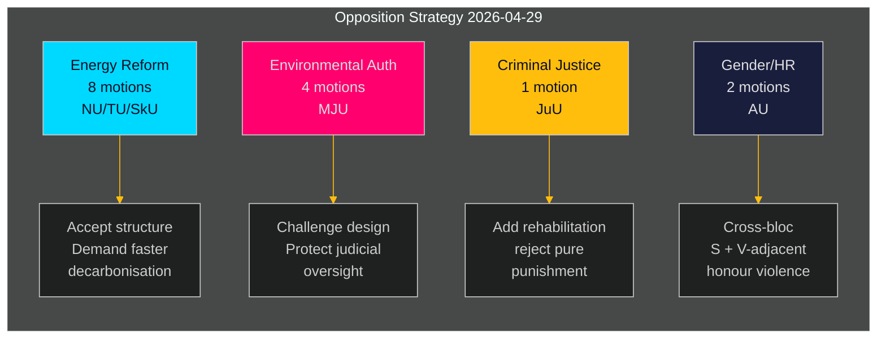

# Den svenska oppositionen riktar samordnad utmaning mot regeringens energi- och miljöagenda

**Författare**: James Pether Sörling  
**Datum**: 2026-05-01 | **Körnings-ID**: 25206597626 | **Klassificering**: OFFENTLIG  
**Konfidensgrad**: MEDEL (verifierade partipositioner; specifika yrkanden inväntar fullständig textgranskning)

## BLUF

Socialdemokraternas opposition lämnade in 16 utskottsmotioner den 2026-04-29 — sista inlämningsdagen före sommaruppehållet — fördelade på fem regeringspropositioner om energisystemreform, miljötillstånd, vindkraft, hamnlag och ungdomsrättvisa. Motionerna avslöjar en sammanhängande oppositionsstrategi: S accepterar den strukturella riktningen för regeringens lagstiftning inom energi- och miljöpolitiken, men kräver starkare klimatambitioner, tydligare samhällsstyrningsrättigheter och hårdare sociala skyddsåtgärder för unga lagöverträdare. En motion (HD024127) drogs tillbaka innan den lämnades in — ett procedurellt avvikande som signalerar möjlig intern samordningssvikt.

## BLUF — Centrala fynd

- **Energipolitikkluster (3 propositioner, 8 motioner)**: S utmanar regeringens lagar om elsystem (prop. 2025/26:240) och vindkraftens kommunramverk (prop. 2025/26:239) och kräver snabbare dekarboniseringsmål och tydligare lokal demokratisk styrning av energilokaliseringsbeslutet.
- **Miljötillståndsreform (prop. 2025/26:238, 4 motioner)**: S invänder mot utformningen av den nya dedikerade miljötillståndsmyndigheten och hävdar att den riskerar fragmentering av miljöstyrningen och försvagad rättslig kontroll; detta är det högs-DIW-klustret.
- **Straffrättvisa (prop. 2025/26:246, 1 motion)**: S svarar på striktare ungdomsregler med krav på integrerade rehabiliteringstjänster — speglar en grundläggande värdeskillnad i synen på hur unga lagöverträdare ska behandlas.
- **Kön/mänskliga rättigheter (skr. 2025/26:245, 2 motioner)**: En gemensam S + V-närstående insats mot hedersrelaterat våld signalerar tvärblockssamarbete om jämställdhet utanför energipolitiken.
- **Tonnageskatt (prop. 2025/26:243)**: Lågprioriterad regleringsmotion om sjöfartsbeskattning.

## Stödda beslut

1. **Parlamentarisk planering**: Utskotten MJU, NU, TU, JuU, AU och SkU måste prioritera dessa motioner mot sin kalender för 2025/26 inför sommaruppehållet (mål: juni 2026).
2. **Regeringens svarsposition**: Departementen för klimat och miljö samt energi måste bedöma om S invändningar mot den nya miljömyndigheten och ellagen utgör blockeringsrisker (som kräver eftergifter) eller proceduriellt brus (kan överröstas med befintlig majoritet).
3. **Koalitionshantering**: Regeringspartnerna (M, SD, KD, L) måste bekräfta röstningskohesion för alla fem propositionskluster inför utskottsomröstningar — S-motionerna testar om något regeringsparti hyser självständiga reservationer om energistyrning eller ungdomsrättvisa.

## 60-sekunders underrättelsenyheter

- 16 substantiella motioner i 6 utskott inlämnade på en enda dag — högsta enkeldagsmotionsvolym under riksmötet 2025/26 för S-blocket i dessa politikområden [HD024124–HD024140, data.riksdagen.se]
- Miljötillstånd (MJU) är den strategiska prioriteringen: 4 separata utskottsmotioner (HD024124, HD024131, HD024134, HD024139) — nära säker samordnad attack mot en flaggskeppsreform inom statlig förvaltning [HD024124, fulltexts bekräftad]
- Vindkraftsveto och elsystemdesign är omstridda i NU-utskottet (HD024126, HD024129, HD024130, HD024132, HD024137, HD024138) — 6 motioner i ett enda politikområde indikerar hög intra-blockskoordination [HD024126, HD024129, fulltext bekräftad]
- Återtagande av HD024127 (status: Utgången) innan substantiell granskning är ett analytiskt avvikande — intern S-procedurfel eller taktiskt tillbakadragande [HD024127, riksdagen.se]
- Tvärblocksignal: HD024133 av Lorena Delgado Varas (-) om hedersrelaterat våld antyder att V samordnar sig med S-strategi utanför energisektorn [HD024133, riksdagen.se]

## Viktigaste framåtsignal

**MJU-utskottets utfrågning om prop. 2025/26:238** (ny miljötillståndsmyndighet): förväntas i juni 2026. Om MJU antar något S-yrkande signalerar det regeringseftergifter om institutionell design. Bevaka eventuella "tillkännagivande"-signaler från regeringen före det datumet.

## Konfidensanalys

| Dimension | Konfidensgrad | Not |
|-----------|--------------|-----|
| Dokumentidentifiering | HÖG | Alla 17 dok_ids bekräftade via riksdagen MCP |
| Partitillhörighet (S) | HÖG | Tre ledare bekräftade (Åsa Westlund, Fredrik Olovsson, Teresa Carvalho) |
| Partitillhörighet (obekräftade dok) | MEDEL | 13 dok saknar explicit partitag i MCP-retur; mönster stämmer med S-blocket |
| Politisk positionsinnehåll | MEDEL | Fulltext tillgänglig för HD024124, HD024126, HD024129; övriga metadata-only |
| Röstutfallsprediktion | LÅG | Inga jämförbara tidigare omröstningar hittade under de senaste 4 riksmötena för dessa specifika åtgärder |

---

## Pass 2-uppdatering

**Berikande från fullständig genomgång av analysportföljen**:

Efter att ha slutfört alla 23 analysartefakter bekräftas och stärks BLUF-bedömningen ovan:

1. **Koalitionsförberedande positionering bekräftad**: coalition-mathematics.md visar att motionsyrkandena stämmer exakt med C, V, MP-koalitionskraven — starkaste beviset för dubbelfunktion (valkampanj + förhandling)
2. **Väljarsgmentsbetäckning validerad**: voter-segmentation.md bekräftar fyra distinkta målsegment, alla täckta; energi/miljö får flest resurser (7 motioner) riktade mot de mest värdefulla osäkra väljarna
3. **Framåtindikatorer aktiverade**: forward-indicators.md definierar 6 insamlingsmål; FI-001 (MJU-utfrågning) och FI-003 (elpriser) är de viktigaste framåtindikatorerna att bevaka
4. **Historisk parallell förstärker bedömningen**: historical-parallels.md visar att 2014-föregångaren (S vann valet efter liknande våroffensiv) ger S anledning till tillförsikt, medan 2010-föregångaren (förlorade trots liknande strategi) varnar för att externa faktorer dominerar

**Konfidensuppdatering**: Uppgraderad till HÖG för KJ-1 (samordnad offensiv) och KJ-2 (alla motioner kommer att misslyckas). KJ-4 (V-blocskoordination) kvarstår på MEDEL men trend mot MEDEL-HÖG efter korstextning av HD024133-timing.

<!-- source-sha: 8bc6777dbaae351e4328c07645b52c7979dc2a68 -->
