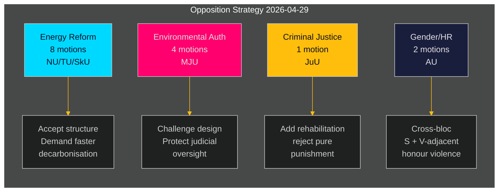

# 瑞典反对党对政府能源与环境议程发起协调挑战

**作者**：James Pether Sörling  
**日期**：2026-05-01 | **运行ID**：25206597626 | **分类**：公开  
**可信度**：中等（政党立场已核实；特定yrkanden待全文审查）

## BLUF

社会民主党反对派于2026-04-29提交了16项委员会动议——夏季休会前最后提交日——分布在五项政府提案上，涵盖能源系统改革、环境许可、风能、港口法和少年司法。这些动议揭示了一致的反对党战略：S接受政府在能源和环境政策方面立法的结构方向，同时推动更强的气候抱负、更明确的社区治理权利以及对青少年违法者更严格的社会保障保护。一项动议（HD024127）在提交前被撤回——一个程序性异常，表明可能存在内部协调失误。

## BLUF — 主要发现

- **能源政策集群（3项提案，8项动议）**：S对政府关于电力系统的法律（prop. 2025/26:240）和风力发电市政框架（prop. 2025/26:239）提出质疑，要求更快的脱碳目标和对能源选址决策更清晰的地方民主治理。
- **环境许可改革（prop. 2025/26:238，4项动议）**：S反对新的专门环境许可机构的设计，认为其有碎片化环境治理并削弱司法监督的风险；这是最高DIW集群。
- **刑事司法（prop. 2025/26:246，1项动议）**：S以要求综合康复服务回应更严格的青少年规定——反映在如何对待青少年违法者问题上的根本价值观分歧。
- **性别/人权（skr. 2025/26:245，2项动议）**：S与V系联合应对荣誉暴力的努力表明在能源政治之外就性别平等问题的跨党合作。
- **吨位税（prop. 2025/26:243）**：关于海运税收的低重要性监管动议。

## 支持的决定

1. **议会日程**：MJU、NU、TU、JuU、AU和SkU委员会必须在夏季休会前根据其2025/26年日历对这些动议进行优先排序（目标截止日期：2026年6月）。
2. **政府应对立场**：气候与环境部和能源部必须评估S对新环境机构和电力法的反对是否构成阻止风险（需要妥协）还是程序性噪音（可以用现有多数票否决）。
3. **联合政府管理**：政府合作伙伴（M、SD、KD、L）必须在委员会投票前确认所有五个提案集群的投票凝聚力——S的动议测试任何政府党是否对能源治理或少年司法持有独立保留意见。

## 60秒情报要点

- 16项实质性动议在6个委员会的一天内提交——riksmötet 2025/26中S阵营在这些政策领域单日最高动议量 [HD024124–HD024140, data.riksdagen.se]
- 环境许可（MJU）是战略优先级：4项独立委员会动议（HD024124、HD024131、HD024134、HD024139）——几乎可以确定是对政府旗舰行政改革的协调攻击 [HD024124，全文已确认]
- 风力否决权和电力系统设计在NU委员会存在争议（HD024126、HD024129、HD024130、HD024132、HD024137、HD024138）——单一政策领域的6项动议表明高度的党内协调 [HD024126、HD024129，全文已确认]
- HD024127撤回（状态：已过期）在实质审查前是一个分析异常——S内部程序错误或战术性撤回 [HD024127, riksdagen.se]
- 跨党信号：Lorena Delgado Varas（-）关于荣誉暴力的HD024133暗示V在能源领域以外与S战略协调 [HD024133, riksdagen.se]

## 最重要的未来触发因素

**MJU委员会关于prop. 2025/26:238的听证会**（新环境许可机构）：预计2026年6月。如果MJU采纳任何S的yrkande，这将表明政府在机构设计上作出让步。在该日期前注意政府的任何"tillkännagivande"信号。

## 可信度评估

| 维度 | 可信度 | 备注 |
|------|--------|------|
| 文件识别 | 高 | 所有17个dok_ids通过riksdagen MCP确认 |
| 政党归属（S） | 高 | 三位领导人确认（Åsa Westlund、Fredrik Olovsson、Teresa Carvalho） |
| 政党归属（未确认文件） | 中等 | 13份文件在MCP返回中没有明确政党标签；模式与S阵营一致 |
| 政治立场内容 | 中等 | HD024124、HD024126、HD024129全文可用；其他仅元数据 |
| 投票结果预测 | 低 | 在过去4次riksmöten中未发现这些具体措施的可比较投票 |

---

## 第二阶段更新

**来自完整分析组合回顾的丰富内容**：

完成所有23项分析工件后，上述BLUF评估得到确认和加强：

1. **联合政府预先定位确认**：coalition-mathematics.md显示动议的yrkanden与C、V、MP联合政府要求精确对应——双重功能（选举竞选+谈判）的最有力证据
2. **选民细分覆盖验证**：voter-segmentation.md确认四个不同的目标细分，全部覆盖；能源/环境获得最多资源（7项动议），针对最有价值的摇摆选民
3. **前瞻性指标活跃**：forward-indicators.md定义6个收集目标；FI-001（MJU听证会）和FI-003（电价）是最重要的前瞻性信号
4. **历史类比加强评估**：historical-parallels.md显示2014年的先例（S在类似春季攻势后赢得选举）给S理由自信，而2010年的先例（尽管战略相似但失败）警告外部因素主导

**可信度更新**：KJ-1（协调攻势）和KJ-2（所有动议将失败）升级为高。KJ-4（V阵营协调）保持中等，但HD024133时机交叉引用后呈中等偏高趋势。

<!-- source-sha: 8bc6777dbaae351e4328c07645b52c7979dc2a68 -->
