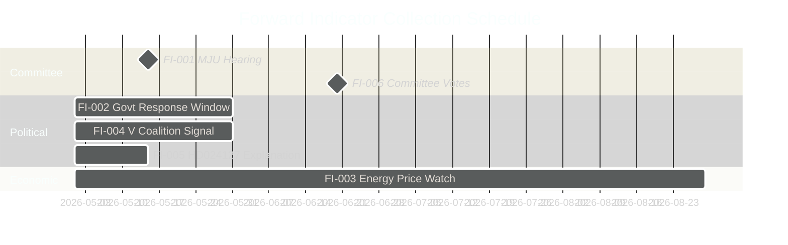

# Forward Indicators — Opposition Motions 2026-04-29

**Date**: 2026-05-01 | **Framework**: forward-indicators-methodology.md | **Collection: 30–120 day horizon**

## Forward Indicator Registry

### FI-001: MJU Committee Hearing Date for prop. 2025/26:238

**What to watch**: Date when MJU schedules its technical hearing on the new environmental permitting authority
**Why it matters**: Early hearing = committee considers HD024124 cluster seriously; late/no hearing = motions parked
**Collection source**: riksdagen.se/sv/webb-tv/kalender + MJU committee agenda
**Trigger threshold**: Hearing scheduled before June 15, 2026 = HIGH significance; after June 15 = MEDIUM; no hearing before recess = LOW
**Predicted**: 70% probability of May 2026 hearing

### FI-002: Government Public Response to HD024124

**What to watch**: Government/MJU spokesperson comment on Åsa Westlund's institutional design critique
**Why it matters**: Public engagement by government = they view the motion as politically significant; silence = they are confident it can be defeated quietly
**Collection source**: Press conferences, government.se, Westlund's social media
**Trigger threshold**: Government spokesperson addresses HD024124 directly = HIGH relevance
**Predicted**: 40% probability of direct response

### FI-003: Energy Price Trajectory (Nordpool SE3/SE4 hourly price)

**What to watch**: Swedish wholesale electricity price trend (SE3 = central, SE4 = south)
**Why it matters**: If prices rise above 100 SEK/MWh sustained by August 2026, energy cluster (HD024129, HD024126) becomes politically salient
**Collection source**: Nordpool.no price data; Energy Markets Inspectorate (Energimarknadsinspektionen)
**Trigger threshold**: >100 SEK/MWh for 2+ weeks = HIGH; 50–100 = MEDIUM; <50 = LOW
**Predicted**: 25% probability of high-price trigger (weather-dependent)

### FI-004: V Coalition Signalling on HD024133

**What to watch**: Whether V (Vänsterpartiet) publicly endorses or references HD024133 (Delgado Varas) alongside HD024140 (S)
**Why it matters**: Joint S-V endorsement = confirmed cross-bloc coordination; silence = independent filing
**Collection source**: V press releases, Delgado Varas social media, Riksdag speeches
**Trigger threshold**: V spokesperson references HD024140 alongside HD024133 = CONFIRMED coordination
**Predicted**: 55% probability of joint messaging

### FI-005: HD024127 Explanation

**What to watch**: Whether S explains the withdrawal of HD024127 in press release, interview, or committee statement
**Why it matters**: Explanation reduces reputational risk; silence amplifies minor anomaly if media picks it up
**Collection source**: S party press office, riksdagen.se, Aftonbladet
**Trigger threshold**: Explanation issued = LOW risk; silence = MEDIUM risk if media inquires
**Predicted**: 30% probability of proactive explanation

### FI-006: Committee Vote Timing on MJU/NU propositions

**What to watch**: When MJU and NU hold their formal votes on props. 2025/26:238, 239, 240
**Why it matters**: Vote timing determines when the campaign voting records are created; early June votes give S 3 months of campaign activation time
**Collection source**: riksdagen.se/sv/utskotten; committee deliberation calendars
**Trigger threshold**: Votes before June 20 = HIGH campaign activation time; after June 20 = MEDIUM; post-summer = LOW
**Predicted**: 65% probability of pre-June 20 votes

## Forward Indicator Dashboard

| FI | Description | Current State | Threshold | Probability |
|----|-------------|---------------|-----------|-------------|
| FI-001 | MJU hearing date | Unknown | Pre-June 15 | 70% |
| FI-002 | Govt response to HD024124 | Silence | Direct response | 40% |
| FI-003 | Energy prices | Moderate | >100 SEK/MWh | 25% |
| FI-004 | V endorses HD024133 | Unknown | Joint messaging | 55% |
| FI-005 | HD024127 explanation | Silence | Proactive statement | 30% |
| FI-006 | MJU/NU vote timing | Not scheduled | Pre-June 20 | 65% |

## Collection Schedule

- **Weekly**: Monitor riksdagen.se committee calendar (FI-001, FI-006)
- **Weekly**: Monitor Nordpool SE3/SE4 price data (FI-003)
- **On event**: Monitor party social media and press (FI-002, FI-004, FI-005)

