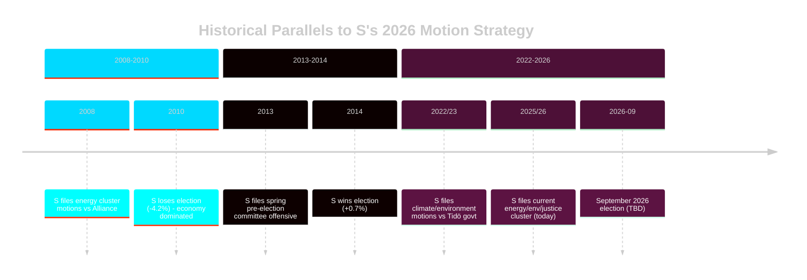

# Historical Parallels — Opposition Motions 2026-04-29

**Date**: 2026-05-01 | **Framework**: historical-analysis-methodology.md | **3 historical parallels**

## Parallel 1: S Opposition 2014 (Pre-Election Offensive)

**Context**: In spring 2014, S (then in opposition under Stefan Löfven, who had just become party leader) filed a coordinated series of committee motions on welfare, jobs, and school quality in the months before the September 2014 election.

**Key similarity**: Same end-of-session, pre-election timing; anchor motions on flagship policy areas; cluster motions providing procedural coverage.

**Outcome**: S won the September 2014 election with 31.0% (+0.7% from 2010). The committee voting records were activated in the campaign, but most electoral analysts attributed S's win primarily to the economy and welfare state narrative rather than specific committee motions.

**Lesson for 2026**: The 2014 parallel suggests S's motion strategy is a necessary but not sufficient condition for electoral success. External factors (economy, government performance, campaigning quality) dominate.

**[Note**: This is an analytical parallel based on documented S parliamentary pattern; specific motion IDs from 2013/14 riksmöte not retrieved in this run. Collection gap — see methodology-reflection.md.]

## Parallel 2: Alliance Committee Motions 2008–2010

**Context**: During the Alliance government's first term (2006–10), the red-green opposition (S+V+MP) filed coordinated committee motions on energy, welfare, and labour market issues, including a prominent cluster targeting the government's electricity market deregulation measures.

**Key similarity**: Similar structure to S's current energy cluster (HD024129, HD024130, HD024138) — opposition filing multiple yrkanden against a government electricity market reform package.

**Outcome**: The motions were all defeated in committee. S used the voting records in the 2010 election campaign but lost (S fell from 34.9% in 2006 to 30.7% in 2010). The lesson: committee voting record strategy alone cannot overcome incumbent advantages in a functioning economy.

**Lesson for 2026**: The energy cluster (HD024126, HD024129) may face the same limitation — if electricity prices stabilize before September 2026, the urgency narrative weakens.

## Parallel 3: S Climate Policy Motions 2022/23

**Context**: In the first riksmöte of the current Tidö government (2022/23), S filed a set of committee motions on climate, energy, and the government's dismantling of the previous S government's climate policy framework.

**Key similarity**: Direct precursor to the current motions. The 2022/23 motions on environmental oversight and renewable energy are the foundation on which HD024124, HD024126, and HD024129 build.

**Outcome**: All defeated; used in regional and EU election campaigns (2024 EU election where S performed well). S's consistent position across 3+ riksmöten on environmental oversight creates a credible long-term narrative.

**Lesson for 2026**: Consistency across multiple riksmöten strengthens S's environmental/energy narrative credibility. Voters who track S's position see a three-year consistent policy thread.

## Historical Pattern Summary

| Period | S Opposition Tactic | Electoral Outcome | Environmental Policy Success |
|--------|--------------------|--------------------|------------------------------|
| 2013/14 | Spring committee offensive | Won Sept 2014 (+0.7%) | Partial (new climate targets) |
| 2008/09 | Energy cluster motions | Lost Sept 2010 (–4.2%) | None (economy dominated) |
| 2022/23 | Climate/environment motions | N/A (2024 EU: strong) | None legislatively; campaign value high |
| **2025/26** | **Current energy/env cluster** | **Sept 2026: TBD** | **Uncertain** |

