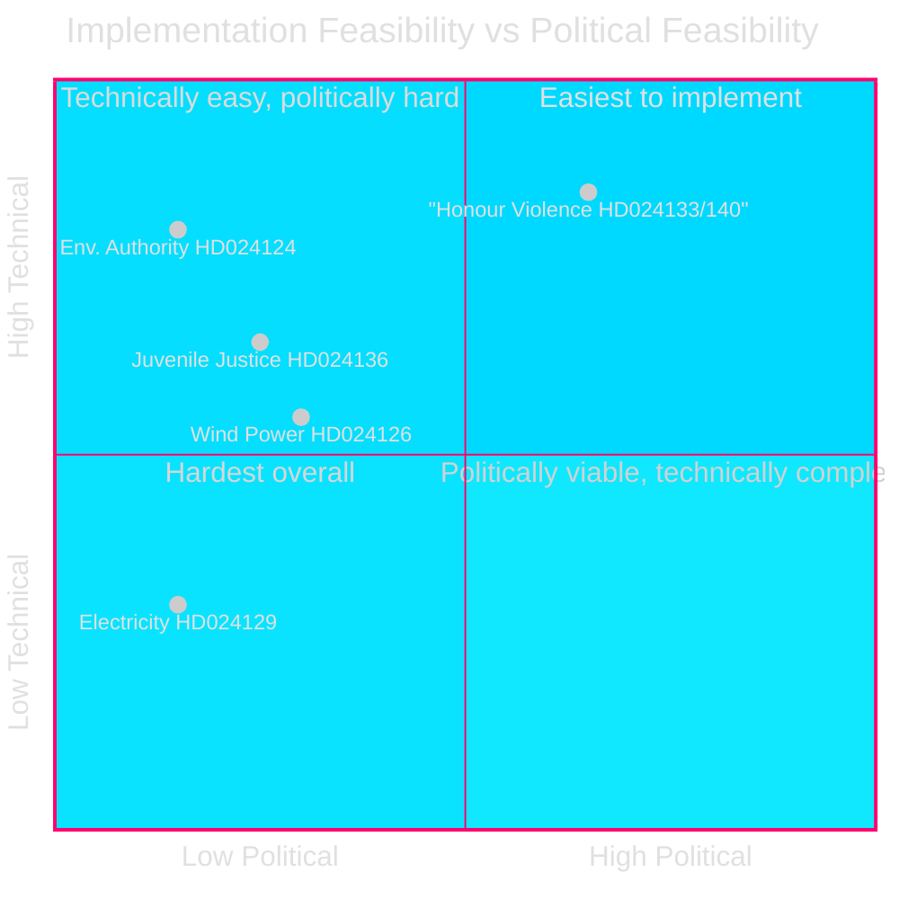

# Implementation Feasibility Analysis — Opposition Motions 2026-04-29

**Date**: 2026-05-01 | **Framework**: implementation-feasibility-methodology.md | **Focus**: What would happen if S's yrkanden were adopted?

## Feasibility Assessment by Motion Cluster

### Cluster 1: Environmental Permitting Authority Redesign (HD024124 + 3 supporting)

**What S wants**: Stronger judicial oversight of the new environmental permitting authority; modifications to the institutional design of prop. 2025/26:238.

**Implementation feasibility if adopted**: MEDIUM-HIGH
- The authority has not yet been established; design changes at this stage are procedurally straightforward
- Adding judicial review mechanisms to an administrative body is standard Swedish administrative law practice
- Main obstacle: Government has already invested political capital in the prop. 2025/26:238 design; backtracking would create political costs
- **Timeline if adopted**: Changes could be incorporated into the authority's founding documents within 6–12 months

**Technical feasibility**: HIGH — Swedish administrative law has multiple precedents for judicial oversight mechanisms

### Cluster 2: Wind Power Municipal Framework (HD024126 + 2 supporting)

**What S wants**: Stronger municipal voice in wind power siting; modifications to prop. 2025/26:239's municipal veto provisions.

**Implementation feasibility if adopted**: MEDIUM
- Municipal planning law integration is complex; changes affect PBL (Plan- och bygglagen) and MB (Miljöbalken) interaction
- Giving municipalities more authority may delay national renewable targets
- **Timeline if adopted**: 12–24 months (requires regulatory coordination with municipal sector)
- **Tension**: S wants both faster rollout AND more municipal control — these can conflict

**Technical feasibility**: MEDIUM — achievable but requires careful legal drafting

### Cluster 3: Electricity System Laws (HD024129 + 2 supporting)

**What S wants**: Faster electricity transition; different market structure provisions in prop. 2025/26:240.

**Implementation feasibility if adopted**: MEDIUM-LOW
- Electricity market design changes require coordination with EU electricity market regulations (ENTSO-E, Nordpool)
- Network governance changes affect Vattenfall and private network operators (contractual obligations)
- **Timeline if adopted**: 24–36 months minimum; EU coordination required
- **Technical complexity**: HIGH — electricity market reform is technically complex; S's yrkanden must be specific enough to implement

**Technical feasibility**: LOW-MEDIUM — the most technically challenging cluster

### Cluster 4: Honour Violence (HD024133 + HD024140)

**Implementation feasibility if adopted**: HIGH
- Legal definitions and prosecutorial tools (adding honour violence as aggravating circumstance) are procedurally straightforward
- Similar legal reforms have been implemented in Norway (2010), Denmark (2014) without major implementation difficulties
- **Timeline if adopted**: 6–12 months

**Technical feasibility**: HIGH

### Cluster 5: Juvenile Justice (HD024136)

**Implementation feasibility if adopted**: MEDIUM-HIGH
- Redirecting juvenile crime cases toward rehabilitative programmes requires: new resource allocation for social services + modified prosecutorial guidelines + court procedure changes
- Sweden has existing rehabilitative infrastructure (Kriminalvård, social services) that can be expanded
- **Timeline if adopted**: 12–18 months

**Technical feasibility**: MEDIUM-HIGH

## Implementation Feasibility Summary

| Cluster | Technical Feasibility | Political Feasibility | Implementation Timeline |
|---------|-----------------------|-----------------------|------------------------|
| Env. Authority (HD024124) | HIGH | LOW (govt. invested in design) | 6–12 months |
| Wind Power (HD024126) | MEDIUM | LOW-MEDIUM | 12–24 months |
| Electricity (HD024129) | LOW-MEDIUM | LOW (EU coordination req.) | 24–36 months |
| Honour Violence (HD024133/140) | HIGH | MEDIUM-HIGH (cross-party) | 6–12 months |
| Juvenile Justice (HD024136) | MEDIUM-HIGH | LOW (criminal justice contested) | 12–18 months |

