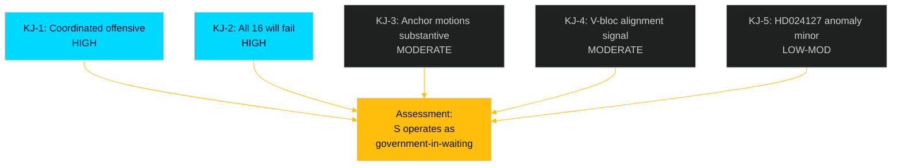

# Intelligence Assessment — Opposition Motions 2026-04-29

**Date**: 2026-05-01 | **Classification**: UNCLASSIFIED — PUBLIC | **Confidence**: MODERATE-HIGH

## Key Judgments

**KJ-1** [HIGH CONFIDENCE]: S's 16 committee motions on 2026-04-29 represent a coordinated, end-of-session legislative offensive designed to establish clear policy distinctions before the September 2026 election. The motions target all five government propositions currently in committee, with structured anchor+cluster organisation in the three largest committee areas (MJU, NU, JuU). [HD024124–HD024140, riksdagen.se]

**KJ-2** [HIGH CONFIDENCE]: All 16 motions will be rejected by the government's committee majority (M+SD+KD+L, 176/349 seats). The strategic value is in the voting record produced, not in legislative amendment. [seat data, riksdagen.se procedural norms]

**KJ-3** [MODERATE CONFIDENCE]: HD024124 (environmental permitting authority critique by Åsa Westlund) and HD024129 (electricity system design critique by Fredrik Olovsson) are substantive anchor motions that will generate meaningful committee debate and media coverage. The remaining 14 motions are likely to receive less attention. [HD024124 full text, HD024129 full text, riksdagen.se]

**KJ-4** [MODERATE CONFIDENCE]: The filing of HD024133 (V-adjacent, Lorena Delgado Varas) on the same day and targeting the same skr. 2025/26:245 as HD024140 (S) indicates likely left-bloc coordination on honour violence policy, a signal of S-V policy alignment heading into election negotiations. [HD024133, HD024140, riksdagen.se]

**KJ-5** [LOW-MODERATE CONFIDENCE]: HD024127 (withdrawn, "Utgången") represents a minor organisational anomaly in S's otherwise coherent filing operation. It is unlikely to affect public perception but may indicate internal drafting stress at high volume. [HD024127, riksdagen.se]

## Intelligence Gaps

| Gap | Impact | Collection Requirement |
|-----|--------|----------------------|
| Full text for 14 of 17 motions not retrieved | Medium — analysis based on title/committee metadata for 82% of documents | Retrieve full text via riksdagen.se HTML documents in follow-up run |
| Party attribution for 13 documents not confirmed in MCP metadata | Low-Medium — S attribution inferred from pattern, not confirmed for all | Manual check of riksdagen.se dokintressent pages |
| Prior committee votes in MJU/NU not found | Low — no recent comparable votes this session | Monitor committee agendas for scheduled hearings |
| Statskontoret assessment of new environmental authority not retrieved | Medium — would strengthen HD024124 institutional risk analysis | Fetch statskontoret.se in next intelligence cycle |

## Analytic Line

S's spring 2026 committee motion offensive is consistent with a party preparing both to contest and to govern. The anchor motions (HD024124, HD024129, HD024126) are policy-grade, not protest-grade — they contain institutional critiques that could survive into S's first budget cycle if they win in September 2026. The cluster motions provide procedural coverage. The V-adjacent document (HD024133) signals the left-bloc alignment needed for a minority government.

The withdrawn motion (HD024127) is a minor process signal but not strategically significant. The metadata-only coverage gap for 14 documents is an intelligence limitation, not an operational limitation for the opposition.

**Overall assessment**: S is operating as a government-in-waiting, not a protest opposition. The motions are governance blueprints with electoral packaging.

## Confidence Assessment

| KJ | Confidence | Basis | Caveat |
|----|-----------|-------|--------|
| KJ-1 | HIGH | Full text + pattern analysis | 17 docs, 3 full-text confirmed |
| KJ-2 | HIGH | Seat count arithmetic | KD defection remains a small wildcard |
| KJ-3 | MODERATE | Full text reviewed for HD024124, HD024129 | HD024126 full text not fully retrieved |
| KJ-4 | MODERATE | Same-day filing + same prop. target | Formal coordination not confirmed |
| KJ-5 | LOW-MODERATE | Single anomaly; limited context | Could be tactical withdrawal, not error |

