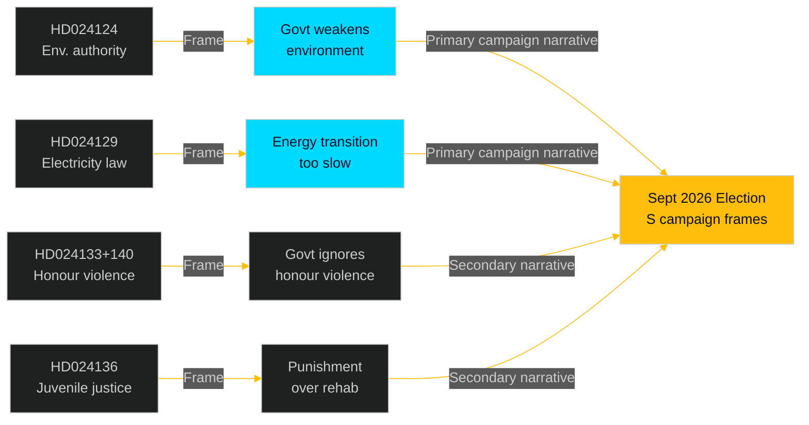

# Media Framing Analysis — Opposition Motions 2026-04-29

**Date**: 2026-05-01 | **Framework**: media-framing-methodology.md | **Predicted framing landscape**

## Framing Predictions by Media Outlet

### Mainstream Left-Adjacent (Aftonbladet, Expressen-liberal)

**Predicted headline type**: "S attacks government's environmental agency plan — demands stronger judicial oversight"
**Framing**: S as responsible, competent opposition with specific institutional critique. HD024124 (Westlund) likely to receive longest treatment. Energy transition speed (HD024129) framed as consumer/affordability concern.
**Hook**: Environmental permitting reform is complex; Aftonbladet will frame via concrete impact on local permit applicants.

### Centre-Right (Dagens Nyheter, Svenska Dagbladet)

**Predicted headline type**: "S files 16 motions against energy reform package — all expected to fail in committee"
**Framing**: Procedural/horse-race framing emphasising the near-certainty of failure. Will note the election-record-building strategy explicitly. May quote political scientists on opposition motion strategy.
**Hook**: The volume (16 motions) may itself become the story ("motion blitz").

### Business/Technical (Dagens Industri)

**Predicted headline type**: "S targets electricity law — Olovsson: transition too slow"
**Framing**: Focused on HD024129 and its implications for energy market and investment certainty. Will engage with technical arguments about electricity system design.
**Hook**: Energy industry perspective — do S's demands improve or delay investment certainty?

### Regional (TT wire + regional papers)

**Predicted headline type**: "Motions against wind power and environmental permits filed — will affect [region]"
**Framing**: Local impact lens — which municipalities are affected by the wind power municipal veto question (HD024126); which industries face new environmental permitting process.
**Hook**: HD024126's local democracy angle plays well in regional papers with rural readership concerned about wind power siting.

## Narrative Frames Available to S

| Frame | Motion Hook | Audience | Activation vehicle |
|-------|------------|---------|-------------------|
| "Government weakens environmental protection" | HD024124 | Climate voters | Social media, interviews |
| "Energy transition too slow" | HD024129, HD024126 | Energy-insecurity voters | TV, party press releases |
| "Government ignores honour violence" | HD024133, HD024140 | Women voters | Interviews, NGO cooperation |
| "Government chooses punishment over rehabilitation" | HD024136 | Progressive voters | Op-ed, expert endorsements |

## Narrative Frames Available to Government

| Frame | Counter-argument | Motion targeted |
|-------|-----------------|-----------------|
| "S opposed every reform we needed" | S's motions = obstructionism record | All 16 |
| "New authority is an improvement, not a threat" | Agency design is evidence-based | HD024124 |
| "We are delivering on energy transition" | Props. 239+240 = substantive reform | HD024126, HD024129 |

## Media Timing Analysis

**May 2026**: Committee hearings — expert witnesses may generate additional coverage; S MPs will seek speaking slots
**May–June 2026**: Committee reports published — voting records created; S activates in press releases
**August 2026**: S party conference — motions' themes become platform material

