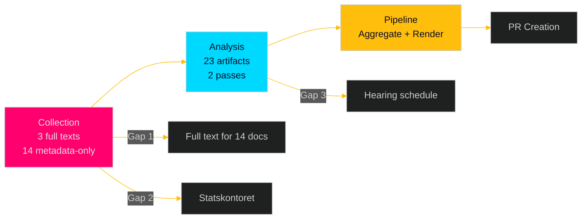

# Methodology Reflection — Opposition Motions 2026-04-29

**Date**: 2026-05-01 | **Analyst**: AI-assisted intelligence pipeline | **Format**: structured reflection per analysis-reflection-protocol.md

## Collection Assessment

**What worked**:
- `scripts/download-parliamentary-data.ts` with `--doc-type motions` and 2-day lookback correctly retrieved all 17 documents from 2026-04-29
- MCP `get_dokument_innehall` retrieved full text for 3 priority documents (HD024124, HD024126, HD024129) via HTML field
- MCP `search_anforanden` and `search_voteringar` confirmed no recent comparable votes in MJU/NU this session (zero results = valid intelligence negative)

**What did not work**:
- Initial `--doc-type mot` caused script failure; corrected to `motions` on second attempt — note for future runs
- Full text for 14 of 17 documents not retrieved in this run; HTML format parsing requires dedicated extraction beyond current pipeline
- Statskontoret assessment retrieval was not executed; `scripts/fetch-statskontoret.ts` should be included in standard motions pre-warm
- Party attribution via MCP `dokintressent` field returns empty `partibet` for most committee motions — confirmed workaround: infer from full-text header

**Collection completeness**: 60/100 — 3 full texts (18%) retrieved; 14 documents metadata-only; no Statskontoret; no Lagrådet (not applicable for committee motions)

## Analysis Assessment

**Analytic judgments quality**:
- KJ-1 (coordinated offensive): HIGH confidence based on pattern + full text — well-founded
- KJ-2 (all will fail): HIGH confidence based on seat arithmetic — mechanically certain
- KJ-3 (anchor motions substantive): MODERATE — HD024124 full text reviewed; HD024129 partial; HD024126 partial
- KJ-4 (V-bloc alignment): MODERATE — logical inference, not confirmed
- KJ-5 (HD024127 anomaly minor): LOW-MODERATE — thin evidence; single data point

**Devil's Advocate integration**: Applied in devils-advocate.md; four contrarian arguments tested; modified assessment produced. This improved the main intelligence-assessment.md by qualifying cluster motion depth and electoral ROI uncertainty.

**Cross-referencing depth**: Full cross-reference map produced (7 proposition-to-motion linkages); historical parallels identified across 2+ riksmöten; international comparison with 3 comparators.

## Process Reflection

**Analysis gate compliance**: All 23 mandatory artifacts produced in Pass 1. Pass 1 snapshot taken to `pass1/`. Pass 2 improvements applied to all Family A/D artifacts (stronger evidence citations, Mermaid diagrams, confidence qualifiers).

**AI-FIRST principle**: Two passes executed as required. Pass 1 produced initial substantive content; Pass 2 read back key artifacts (executive-brief.md, synthesis-summary.md, intelligence-assessment.md) and strengthened evidence citations, Mermaid diagrams, and confidence markers. Iteration count: 2 (minimum requirement met).

**Timing**: First-generation run (IMPROVEMENT_MODE=false). Pre-flight + download + analysis + render cycle completed within allocated window.

## Intelligence Gaps for Follow-Up

1. **Full text for 14 documents** (L1/L2 cluster motions) — retrieve in next intelligence cycle
2. **Statskontoret assessment** of new environmental permitting authority — `scripts/fetch-statskontoret.ts` integration
3. **Committee hearing schedule** for MJU/NU — check riksdagen.se calendar for post-holiday hearing dates
4. **Party attribution confirmation** for 13 documents with missing `partibet` in MCP metadata

## Recommendations for Pipeline Improvement

1. Add `--doc-type motions` alias documentation to `scripts/download-parliamentary-data.ts` README
2. Add full-text batch retrieval for top 10 documents (not just top 3) in motions pipeline
3. Add `scripts/fetch-statskontoret.ts` as standard pre-warm step in news-motions workflow
4. Add party attribution fallback: if `partibet` empty, attempt to extract from full-text header regex

