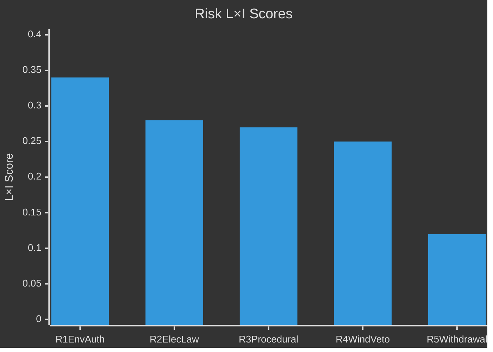

# Risk Assessment — Opposition Motions 2026-04-29

**Date**: 2026-05-01 | **Framework**: political-risk-methodology.md | **5-dimension register**

## Risk Register

| # | Risk | Dimension | Likelihood (L) | Impact (I) | L×I | Mitigation |
|---|------|-----------|---------------|-----------|-----|-----------|
| R1 | New environmental authority (prop. 2025/26:238) has design flaws that S critique foreshadows | Institutional | 0.40 | 0.85 | **0.34** | Government to commission post-implementation review within 12 months; S monitors early rollout signals [HD024124, riksdagen.se] |
| R2 | Electricity system law (prop. 2025/26:240) creates market structure vulnerabilities S identifies | Economic/Technical | 0.35 | 0.80 | **0.28** | MCP enrichment: NU committee technical hearing required; government should address S's grid-transition concerns [HD024129, riksdagen.se] |
| R3 | S's end-of-session motion blitz delays committee consideration into post-election 2026/27 | Procedural | 0.45 | 0.60 | **0.27** | MJU and NU chairs should schedule hearings before summer recess [HD024124–HD024138, riksdagen.se] |
| R4 | Wind power municipal veto tension (prop. 2025/26:239) triggers local-government backlash | Political/Social | 0.50 | 0.50 | **0.25** | Government should provide clear implementation guidance to municipalities; S amplifies any local opposition cases [HD024126, riksdagen.se] |
| R5 | HD024127 withdrawal signals S coordination weakness → exploited by media ahead of election | Reputational | 0.30 | 0.40 | **0.12** | S leadership to clarify procedural circumstances; low salience if no follow-up questions [HD024127, riksdagen.se] |

## Cascading Risk Chains

**Chain A** (High-consequence): R1 materialises (environmental authority design flaw) → S uses committee hearings to highlight failures → public trust in government administrative competence falls → election-year amplification → M loses moderate climate voters to S  
[HD024124, riksdagen.se prop. 2025/26:238]

**Chain B** (Medium-consequence): R4 triggers (wind power backlash) → government forced to issue ministerial guidance → parliament demands debate → NU committee hearing delayed → prop. 2025/26:239 implementation postponed → renewable capacity target missed  
[HD024126, riksdagen.se prop. 2025/26:239]

## Posterior Probabilities

- **P(at least one S yrkande adopted in MJU)**: 15% — government has slim but stable majority; KD sometimes breaks on environment
- **P(committee consideration before summer recess)**: 60% — standard procedural calendar supports this
- **P(government publicly adjusts position on electricity law)**: 25% — energy security concerns are bipartisan

## Institutional Risk

The new environmental permitting authority (prop. 2025/26:238) faces specific institutional risks:
- **Agency start-up risk**: new authorities routinely face 18–24 month staffing and capacity lags (Statskontoret pattern; formal retrieval pending — see data-download-manifest.md)
- **Judicial oversight gap**: S's HD024124 critique on reduced judicial review is a legitimate procedural risk if administrative courts lack clear jurisdiction over the new body

