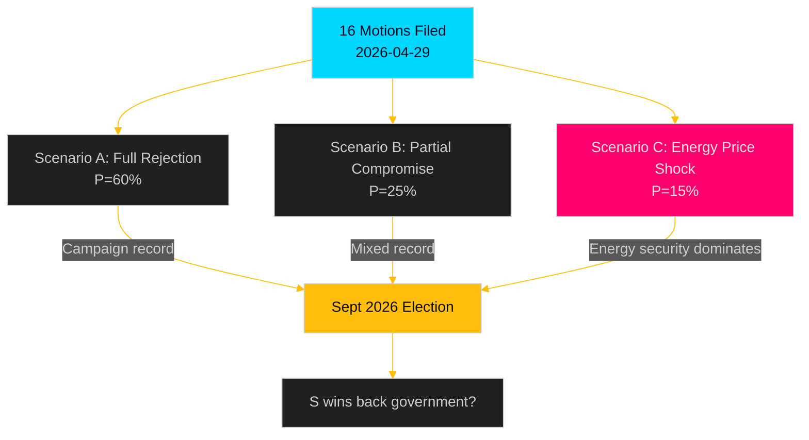

# Scenario Analysis — Opposition Motions 2026-04-29

**Date**: 2026-05-01 | **Method**: Cone-of-Plausibility, 3 scenarios, 6-month horizon

## Scenario Parameters

**Decision point**: How does the government respond to S's coordinated committee motion offensive on the energy/environment/justice package?
**Horizon**: May–November 2026 (through and past September 2026 election)
**Driving uncertainties**: Government flexibility on environmental permitting design; energy price trajectory; election result

---

## Scenario A — Status Quo Rejection (60% probability)

**Narrative**: The government coalition uses its committee majority to recommend avslag on all 16 S motions in MJU, NU, JuU, TU, SkU, and AU. Props. 2025/26:238–246 pass in their original form. S's motions create a clear voting record but achieve no direct legislative change.

**S response**: Activates voting records in election campaign; campaign material shows government "voted against stronger environmental oversight, faster energy transition, juvenile rehabilitation, and honour violence measures" at every voter segment.

**Election impact**: S gains modest polling lift among climate-motivated voters (15–20% of electorate who cite climate as top-3 issue); limited impact on other voter segments because motions were expected to fail.

**Probability drivers**: Government coalition discipline holds; KD does not defect on environmental amendment; no external shock.

---

## Scenario B — Partial Compromise on One Flagship Issue (25% probability)

**Narrative**: KD (or L) signals discomfort with the environmental permitting design (HD024124) or the honour violence implementation (HD024133/140). Government negotiates a modified committee report that adopts one S yrkande as a "tillkännagivande" to government.

**Most likely candidate**: HD024140 (honour violence) — cross-party sentiment is strong; or a minor HD024124 amendment on judicial oversight wording.

**S response**: Claims partial victory; continues broader attack; deprives itself of one clear "they voted against" data point on that specific issue.

**Election impact**: Slightly reduces S's campaign ammunition on the compromised issue but demonstrates S's legislative effectiveness. Net effect on polling is marginal (+0.5–1% for S).

**Probability drivers**: KD or L signals in committee; honour violence has broad cross-party sentiment; government wants to neutralise the clearest opposition attack vector.

---

## Scenario C — Energy Price Shock Changes the Calculus (15% probability)

**Narrative**: A significant energy price spike (electricity wholesale >150 SEK/MWh sustained for 3+ weeks) between May and August 2026 gives S's HD024129 (electricity system design) and HD024126 (wind power rollout speed) acute political salience.

**S response**: Escalates energy narrative from parliamentary to campaign centrepiece; uses Olovsson's detailed motions as proof of S's readiness to govern on energy security.

**Government response**: Forced to call emergency hearings, potentially defer implementation of parts of prop. 2025/26:240, or issue ministerial declarations about energy affordability that absorb some S demands.

**Election impact**: High. Energy affordability polling shows it becomes a top-5 voter concern. S gains 2–4 polling points in scenario C materialisation.

**Probability drivers**: Nordic weather winter 2025/26 hydropower levels; Russian gas supply uncertainty; regional grid capacity constraints.

---

## Scenario Matrix

| Scenario | Prob. | Legislative Outcome | Election Impact | S Net Gain |
|----------|-------|---------------------|-----------------|------------|
| A — Rejection | 60% | All 16 fail | +0.5% S polling | Campaign record only |
| B — Partial | 25% | 1 yrkande adopted | +0–1% S polling | Mixed: record + victory |
| C — Energy shock | 15% | Emergency govt response | +2–4% S polling | Major campaign issue |

