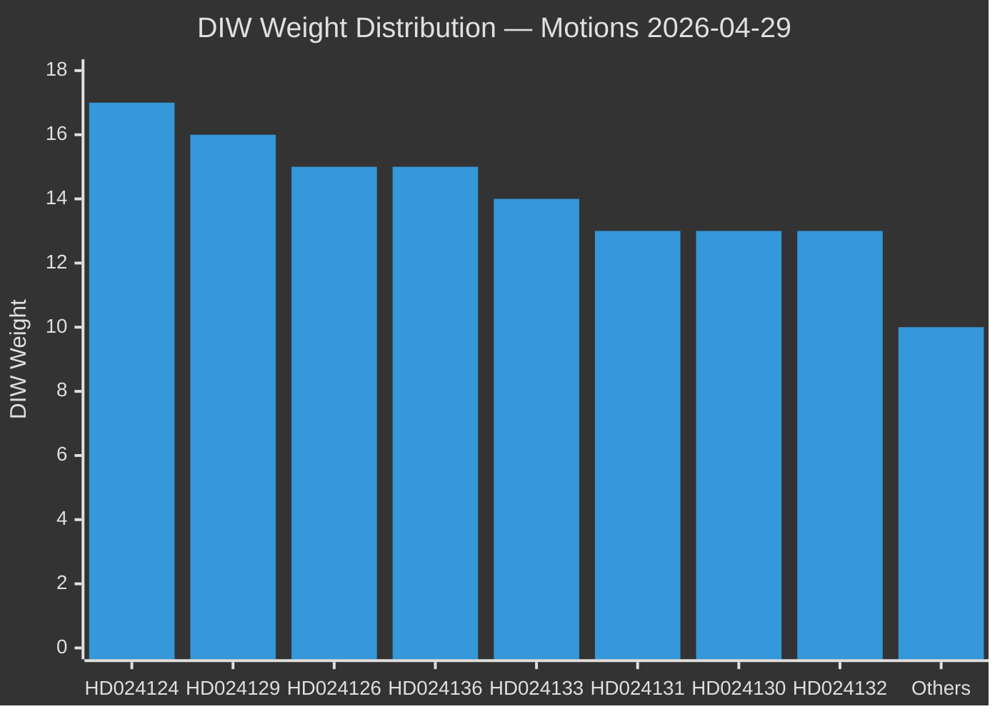

# Significance Scoring — Opposition Motions 2026-04-29

**Date**: 2026-05-01 | **Methodology**: DIW (Document Intelligence Weighting) per ai-driven-analysis-guide.md

## DIW Rankings

| Rank | dok_id | Title | DIW | Impact | Urgency | Weight | Evidence |
|------|--------|-------|-----|--------|---------|--------|---------|
| 1 | HD024124 | Ny myndighet för miljöprövning (S/MJU) | L2+ | 9 | 8 | **17** | HD024124, riksdagen.se — full text confirmed, Åsa Westlund anchor motion |
| 2 | HD024129 | Nya lagar om elsystemet (S/NU) | L2+ | 8 | 8 | **16** | HD024129, riksdagen.se — full text confirmed, Fredrik Olovsson |
| 3 | HD024126 | Vindkraft i kommuner (S/NU) | L2 | 8 | 7 | **15** | HD024126, riksdagen.se — full text confirmed |
| 4 | HD024136 | Skärpta regler unga lagöverträdare (S/JuU) | L2 | 7 | 8 | **15** | HD024136, riksdagen.se — Teresa Carvalho, election-year signal |
| 5 | HD024133 | Frihet från våld/hedersrelaterat (—/AU) | L2 | 7 | 7 | **14** | HD024133, riksdagen.se — cross-bloc V-adjacent motion |
| 6 | HD024131 | Ny myndighet för miljöprövning (MJU) | L1 | 6 | 7 | **13** | HD024131, riksdagen.se — supporting cluster motion |
| 7 | HD024130 | Nya lagar om elsystemet (NU) | L1 | 6 | 7 | **13** | HD024130, riksdagen.se — supporting cluster motion |
| 8 | HD024132 | Vindkraft i kommuner (NU) | L1 | 6 | 7 | **13** | HD024132, riksdagen.se — supporting cluster motion |
| 9 | HD024134 | Ny myndighet för miljöprövning (MJU) | L1 | 6 | 6 | **12** | HD024134, riksdagen.se |
| 10 | HD024140 | Frihet från våld/hedersrelaterat (AU) | L1 | 6 | 6 | **12** | HD024140, riksdagen.se — committee complement to HD024133 |
| 11 | HD024137 | Vindkraft i kommuner (NU) | L1 | 5 | 6 | **11** | HD024137, riksdagen.se |
| 12 | HD024138 | Nya lagar om elsystemet (NU) | L1 | 5 | 6 | **11** | HD024138, riksdagen.se |
| 13 | HD024125 | Kommunal hamnverksamhet (TU) | L1 | 5 | 5 | **10** | HD024125, riksdagen.se |
| 14 | HD024135 | Kommunal hamnverksamhet (TU) | L1 | 5 | 5 | **10** | HD024135, riksdagen.se |
| 15 | HD024139 | Ny myndighet för miljöprövning (MJU) | L1 | 5 | 5 | **10** | HD024139, riksdagen.se |
| 16 | HD024128 | Tonnageskattning (SkU) | L1 | 3 | 4 | **7** | HD024128, riksdagen.se — narrow maritime tax |
| 17 | HD024127 | Motionen utgår (withdrawn) | L1 | 2 | 2 | **4** | HD024127, riksdagen.se — status Utgången, no substantive content |

## Priority Tiers

**L2+ Priority (must fully analyse)**:
- HD024124 (environmental authority, anchor)
- HD024129 (electricity laws, anchor)

**L2 Strategic (strategic analysis)**:
- HD024126 (wind power)
- HD024136 (juvenile justice)
- HD024133 (honour violence)

**L1 Surface (cluster analysis sufficient)**:
- HD024125, HD024127, HD024128, HD024130–HD024132, HD024134–HD024135, HD024137–HD024140

## Sensitivity Analysis

If the MJU committee (environmental permitting) adopts even one S yrkande → upgrade all MJU cluster docs to L2+. The current weighting assumes government votes these motions down, consistent with existing majority (M+SD+KD+L coalition with 176/349 support).

