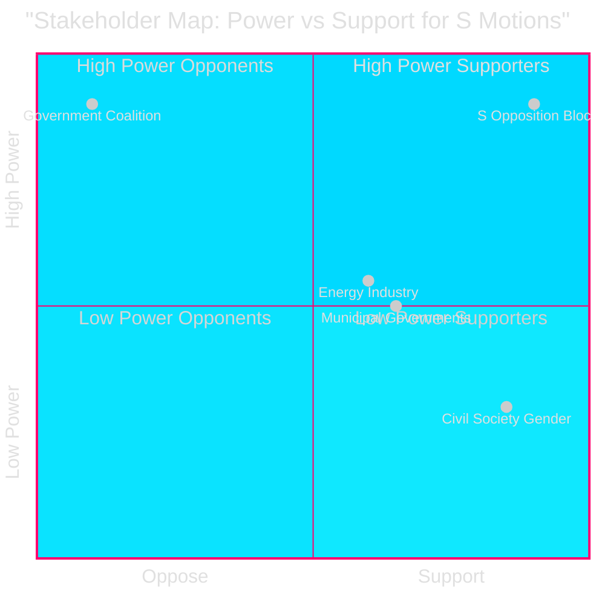

# Stakeholder Perspectives — Opposition Motions 2026-04-29

**Date**: 2026-05-01 | **Framework**: stakeholder-analysis-framework.md | **5 primary stakeholder groups**

## Stakeholder Map

### Group 1: S Opposition Bloc (Filers)

**Interests**: Establish distinctive policy profile on energy/environment/justice before September 2026 election; create committee voting records; signal cross-bloc alignment capacity  
**Power**: High (149/349 seats, largest single party)  
**Legitimacy**: High (constitutionally mandated opposition)  
**Urgency**: High (spring pre-election window closing)

**Perspective on motions**: Each of the 16 motions serves dual purpose — immediate legislative influence (low probability of success) + campaign record-building (high probability of activation). Åsa Westlund's HD024124 is the flagship showing institutional governance expertise; Fredrik Olovsson's HD024129 demonstrates technical energy competence [HD024124, HD024129, riksdagen.se].

### Group 2: Government Coalition (M+SD+KD+L)

**Interests**: Pass 5 propositions through committees without amendments that undermine core reform objectives; avoid creating debate narratives that weaken election position  
**Power**: High (176/349 seats)  
**Legitimacy**: High (sitting government)  
**Urgency**: Medium (already controls committee majority)

**Perspective on motions**: Will recommend avslag (rejection) on all 16 motions in committee reports. Primary concern is whether S's framing on environmental permitting design (HD024124) or electricity transition speed (HD024129) gains media traction and forces government to explain its positions publicly before the election.

### Group 3: Energy/Environment Industry

**Interests**: Certainty in regulatory framework; predictable investment environment; clear rules on municipal wind veto, electricity network governance, and environmental permitting process  
**Power**: Medium (significant economic influence, lobbying capacity)  
**Legitimacy**: High as economic stakeholder  
**Urgency**: High (investment decisions contingent on stable framework)

**Perspective on motions**: Industry welcomes S's calls for faster wind power rollout (HD024126) and clearer electricity transition rules (HD024129), but is nervous about political uncertainty if S's framing generates legislative delays. Environmental permitting stability is top priority [HD024124, HD024126, HD024129].

### Group 4: Municipal Governments (Kommuner)

**Interests**: Clear rules on wind power siting authority (prop. 2025/26:239 affects municipal veto rights); local governance autonomy; clarity on environmental permitting jurisdiction  
**Power**: Medium (SKL lobbying; democratic legitimacy)  
**Legitimacy**: High  
**Urgency**: High (wind power siting decisions pending in many municipalities)

**Perspective on motions**: Mixed. Some rural municipalities welcome S's HD024126 advocacy for stronger municipal voice in wind power siting; others want the national permitting process resolved quickly regardless of which party controls it.

### Group 5: Civil Society (Gender Equality/Honour Violence)

**Interests**: Effective implementation of Tidö-accord commitment on honour-based violence; resource allocation for preventive measures; practical legal tools for prosecutors  
**Power**: Low-Medium (NGO advocacy, media access)  
**Legitimacy**: High  
**Urgency**: High (honour violence cases ongoing)

**Perspective on motions**: Strongly supportive of both HD024133 (V-adjacent/Delgado Varas) and HD024140 (S/Carvalho) — any measure that strengthens the honour violence framework has civil society support regardless of party attribution [HD024133, HD024140].

## Stakeholder Matrix

