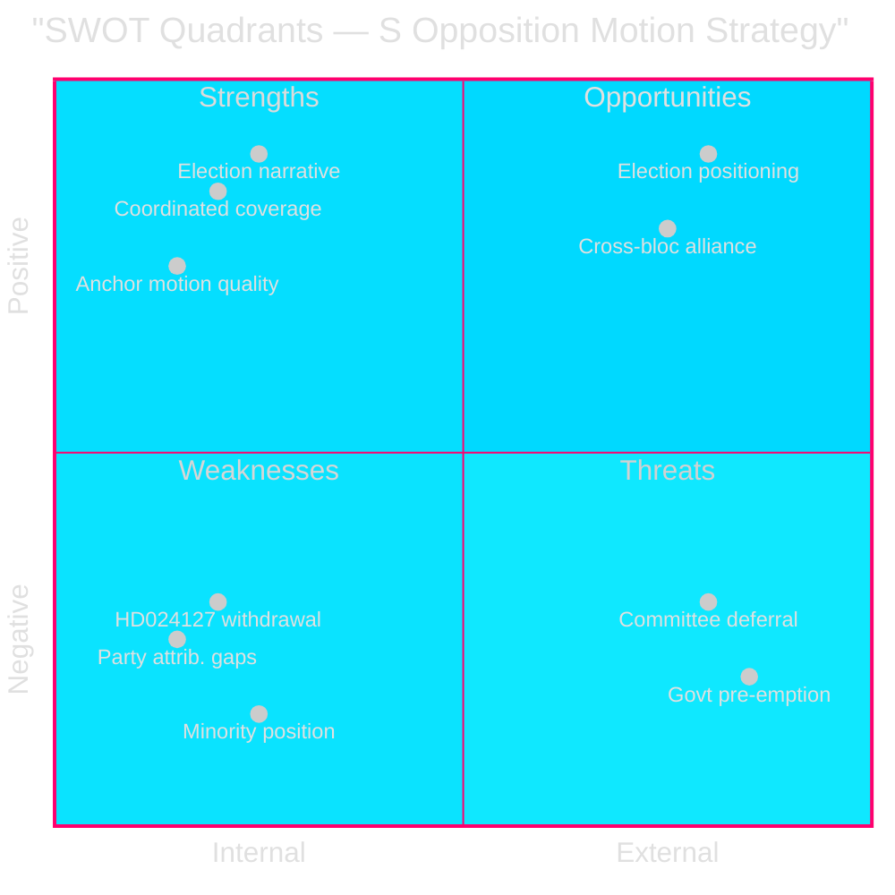

# SWOT Analysis — Swedish Opposition Motions 2026-04-29

**Date**: 2026-05-01 | **Level**: S opposition bloc's legislative strategy | **Framework**: political-swot-framework.md

## Strengths

### Opposition (S) Strengths

- **Coordinated multi-committee coverage**: 16 motions across 6 committees filed simultaneously, demonstrating organisational capacity and cross-portfolio coordination among Åsa Westlund (MJU), Fredrik Olovsson (NU), Teresa Carvalho (JuU) [HD024124, HD024126, HD024129, HD024136, riksdagen.se]
- **Election-year narrative construction**: each cluster targets a distinct voter segment — climate voters (HD024124, HD024126), energy-security voters (HD024129), crime-concerned voters (HD024136), women's rights voters (HD024133, HD024140), ensuring broad message coverage [HD024124–HD024140, riksdagen.se]
- **Anchor motion quality**: HD024124 (Åsa Westlund, full text confirmed) is a substantive committee-motion — not a single-yrkande protest but a detailed institutional critique of the new environmental permitting authority design [HD024124, riksdagen.se full-text retrieved]
- **Energy expertise depth**: Fredrik Olovsson leads on both electricity system (HD024129) and wind power (HD024126), concentrating expertise on the government's most technically complex legislative package [HD024126, HD024129, riksdagen.se]

## Weaknesses

### Opposition Weaknesses

- **Procedural anomaly (HD024127 withdrawn)**: one motion slot was registered and voided ("Motionen utgår"), signalling possible internal drafting failure or tactical confusion; undermines coordination narrative [HD024127, riksdagen.se — status Utgången]
- **Party attribution gap**: 13 of 17 documents lack confirmed party tags in MCP metadata, creating intelligence uncertainty about the full opposition bloc composition beyond confirmed S authors [HD024124–HD024140, riksdagen.se MCP metadata]
- **Minority position**: with the government coalition controlling 176/349 seats (M+SD+KD+L), all 16 motions face near-certain defeat in committee votes absent defections [data.riksdagen.se seat data]
- **Full-text coverage gap**: 14 of 17 motions retrieved as metadata-only in this run, limiting the depth of yrkanden analysis [data-download-manifest.md]

## Opportunities

### Strategic Opportunities for S

- **Election positioning (September 2026)**: each rejected yrkande creates a voting record that S can reference in the campaign — "the government voted against stricter environmental oversight / faster energy transition / juvenile rehabilitation" [HD024124, HD024129, HD024136, riksdagen.se]
- **Cross-bloc alliance building**: HD024133 by V-adjacent Lorena Delgado Varas signals potential for S-V cooperation on gender/social issues, broadening the left bloc's legislative coalition [HD024133, riksdagen.se]
- **Environmental permitting design flaws**: if the new myndighet (prop. 2025/26:238) encounters implementation problems post-launch, S's pre-emptive HD024124 critique becomes vindicated opposition intelligence [HD024124, riksdagen.se]
- **Energy transition speed**: growing public concern about energy prices and grid capacity creates space for S to position as the faster-transition party against a government perceived as compromising on renewables [HD024126, HD024129, riksdagen.se]

## Threats

### Threats to S Strategy

- **Committee triage**: if MJU, NU, or JuU defer consideration to autumn 2026 (post-election), S's end-of-session filing strategy loses its legislative leverage [HD024124–HD024140, riksdagen.se procedural calendar]
- **Government "tillkännagivande" pre-emption**: government could announce implementation guidelines that absorb the most visible S concerns on environmental permitting or electricity laws, reducing the contrast narrative [HD024124, HD024129, riksdagen.se prop. context]
- **Internal coherence risk**: HD024127 withdrawal and party attribution gaps for 13 documents suggest the coordination machinery has stress points [HD024127, riksdagen.se metadata]
- **Opposing-party counter-motions**: if SD or M file competing motions making sharper populist or market-liberal arguments on the same propositions, they dilute S's message in committee hearings [riksdagen.se procedural norm]

## TOWS Matrix

| | Strengths (S) | Weaknesses (W) |
|--|--------------|----------------|
| **Opportunities (O)** | **SO**: Use coordinated multi-committee presence to establish S as the complete governance alternative ahead of September 2026 election [HD024124, HD024129, HD024136] | **WO**: Close party attribution gaps for 13 unconfirmed docs to sharpen cross-bloc coalition messaging [HD024124–HD024140 metadata gap] |
| **Threats (T)** | **ST**: Leverage energy expertise depth (Olovsson) to pre-empt government's technical counter-arguments on electricity laws and wind power [HD024126, HD024129] | **WT**: Fix procedural anomaly (HD024127 withdrawal) before next filing cycle to prevent narrative of organisational weakness [HD024127, riksdagen.se] |

