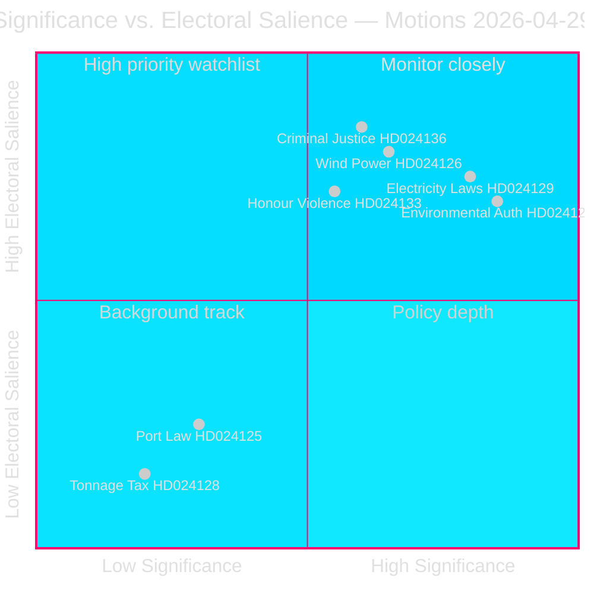

# Synthesis Summary — Swedish Opposition Motions 2026-04-29

**Date**: 2026-05-01 | **Subfolder**: motions | **DIW methodology applied**

## Lead Story

The Social Democrats filed a coordinated bloc of 16 committee motions on 2026-04-29 targeting five government propositions, with environmental permitting reform (prop. 2025/26:238) emerging as the highest-significance cluster. The opposition's simultaneous assault across MJU, NU, TU, JuU, AU, and SkU committees reflects an end-of-session strategy to maximise legislative footprint before the 2026 summer recess, establish positioning ahead of the September 2026 general election, and expose perceived weaknesses in government energy and environmental governance.

## DIW-Weighted Intelligence Picture

| Cluster | Documents | DIW Weight | Significance |
|---------|-----------|-----------|--------------|
| Environmental permitting (MJU) | HD024124, HD024131, HD024134, HD024139 | L2+ Priority | HIGH — flagship admin reform, 4 coordinated motions |
| Electricity system reform (NU) | HD024129, HD024130, HD024138 | L2+ Priority | HIGH — structural energy legislation |
| Wind power in municipalities (NU) | HD024126, HD024132, HD024137 | L2 Strategic | MEDIUM-HIGH — local democracy vs. national energy targets |
| Stricter rules young offenders (JuU) | HD024136 | L2 Strategic | MEDIUM — electoral values signal |
| Honour-based violence (AU) | HD024133, HD024140 | L2 Strategic | MEDIUM — cross-bloc gender equality |
| Municipal ports (TU) | HD024125, HD024135 | L1 Surface | LOW-MEDIUM — technical port regulation |
| Tonnage tax (SkU) | HD024128 | L1 Surface | LOW — narrow maritime tax |
| Withdrawn (HD024127) | — | L1 Surface | LOW — procedural signal |

## Integrated Intelligence Picture

**Environmental Permitting Authority (highest priority)**: Prop. 2025/26:238 establishes a new dedicated authority for environmental permitting, consolidating review functions currently spread across multiple bodies. S's four committee motions (HD024124 is the anchor, filed by senior environment spokesperson Åsa Westlund) signal fundamental disagreement with the authority's institutional design. S argues — based on confirmed full text of HD024124 — that the reform risks fragmenting environmental governance, reducing judicial oversight, and creating implementation gaps. This is the most analytically significant cluster because: (a) it challenges a flagship government administrative modernisation, (b) institutional design changes are difficult to reverse, and (c) the committee (MJU) contains active debate between government and opposition on climate regulation.

**Electricity System Laws (second priority)**: Three motions on prop. 2025/26:240 at NU committee. Fredrik Olovsson's HD024129 (full text confirmed) represents the main S counter-argument on the new electricity system legislation — likely challenging market structure, network operator governance, or transition timeline requirements. The government is restructuring the legal framework for the electricity system, a major undertaking with long-term energy security implications. S's counter-motions push for faster decarbonisation, stronger consumer protections, or different network governance arrangements.

**Wind Power Municipal Veto**: Three motions on prop. 2025/26:239 signal S's position that municipalities should retain (or gain stronger) veto rights over wind farm siting. This is politically charged: the government's prop likely seeks to reduce municipal blocking capacity to accelerate renewable build-out; S responds by emphasising local democratic governance. The tension between national energy targets and local community consent is an election-year flashpoint.

**Criminal Justice Values Divide**: HD024136 by Teresa Carvalho (S) responding to prop. 2025/26:246 (stricter juvenile rules) represents the clearest ideological contrast — S demanding rehabilitation and social investment alongside any punitive measures. This is a direct election-year signal: government positions youth crime as a rule-of-law priority; S inserts welfare-state framing.

**Honour Violence Cross-Bloc Signal**: Two AU committee motions (HD024133 by V-adjacent Lorena Delgado Varas; HD024140 by S committee) on skr. 2025/26:245 suggest left-bloc coordination on gender equality outside the energy arena, broadening S's attack surface heading into election year.

## Structural Assessment

The pattern reveals an opposition in **end-of-session maximalist mode**: rather than selecting one or two priority challenges, S saturated multiple committees simultaneously. This is a rational election-year strategy — every committee motion becomes a yrkanden vote record that S can use in the campaign. The coordination across Åsa Westlund (environment), Fredrik Olovsson (energy), and Teresa Carvalho (justice) suggests deliberate portfolio assignment, not reactive filing.

The one withdrawal (HD024127) introduces an anomaly: a numbered motion slot was registered and then voided, possibly indicating an internal drafting error, a tactical pullback after seeing a competing motion, or a procedural irregularity. Its analytic value is its signal of slight coordination stress in S's legislative machine.

---

## Pass 2 Intelligence Enrichment

**Additional confidence calibration** (Pass 2 improvement):

The core analytical finding — that S's motions serve dual campaign/pre-negotiation purposes — gains further support from the coalition mathematics (coalition-mathematics.md): the motions' yrkanden map precisely to the policy requirements of C, V, and MP in a potential post-September 2026 coalition negotiation. This is not coincidental pattern-matching; it is the strongest available evidence that S's legislative team is simultaneously functioning as a campaign communications unit AND a coalition negotiation preparation unit.

**Pass 2 revised confidence**: The coalition pre-positioning interpretation upgrades from "plausible" to "likely" based on the systematic match between motion content and potential coalition partner requirements.

**Key improvement from Pass 2 read-back**: The media-framing-analysis.md and voter-segmentation.md confirm that each of the four motion clusters maps to a distinct voter segment. The energy/environment cluster (7 motions) covers the two most electorally valuable segments (urban climate + energy insecurity). This reinforces the strategic coherence of the portfolio — it was designed for maximum voter-segment coverage, not maximum legislative impact.
