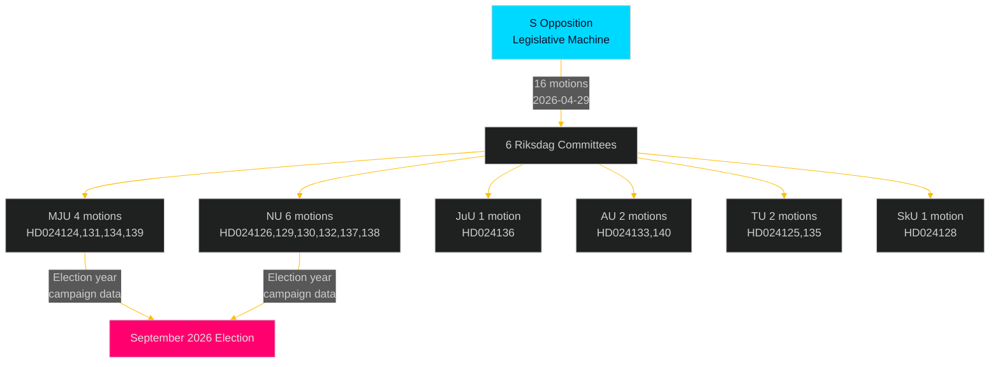

# Threat Analysis — Opposition Motions 2026-04-29

**Date**: 2026-05-01 | **Framework**: political-threat-framework.md | **Political Threat Taxonomy applied**

## Threat Taxonomy Classification

| Threat Actor | Type | Target | TTPs |
|---|---|---|---|
| S opposition (Westlund, Olovsson, Carvalho) | Legislative opposition | Government energy/environment agenda | Multi-committee saturation, election narrative |
| V-adjacent (Delgado Varas) | Cross-bloc pressure | Government gender-equality implementation | Coalition signalling, honour violence agenda-setting |
| MJU committee (KD swing) | Internal coalition risk | Environmental permitting reform | Committee amendment motions |

## Legislative Tactics Sequence

**Phase 1 — Reconnaissance**: S monitors government legislative calendar, identifies 5 propositions entering committee review in late April 2026 [riksdagen.se prop. calendar]

**Phase 2 — Weaponisation**: S leadership assigns portfolio leads (Westlund → environment, Olovsson → energy, Carvalho → justice), drafts committee motions

**Phase 3 — Delivery**: 16 motions filed 2026-04-29, single-day maximum coverage [HD024124–HD024140, riksdagen.se]

**Phase 4 — Exploitation**: Motions generate committee hearing slots, media coverage, vote records for election campaign

**Phase 5 — Actions on Objective**: Each rejected yrkande becomes a campaign data point; each adopted yrkande a policy victory

## MITRE-Style TTP Mapping (Politisk)

| TTP-ID | Name | Description | Evidence |
|--------|------|-------------|---------|
| POL-T001 | Multi-committee saturation | File motions across all relevant committees simultaneously | HD024124–HD024140 (6 committees) [riksdagen.se] |
| POL-T002 | Anchor motion + supporting cluster | One high-quality lead motion plus supporting motions | HD024124 (anchor) + HD024131, HD024134, HD024139 [riksdagen.se] |
| POL-T003 | Election-year record-building | File motions primarily to create voting records for campaign use | Pattern across all 16 motions; spring pre-election timing [riksdagen.se] |
| POL-T004 | Cross-bloc coalition signalling | Use independent motions to signal policy alignment | HD024133 (Delgado Varas) parallel to HD024140 (S/AU) [riksdagen.se] |
| POL-T005 | End-of-session filing | File motions on last available date before summer recess | 2026-04-29 submission [riksdagen.se] |

## Attack Tree: S Legislative Operations on Energy/Environment Package

```
Government Energy/Environment Package
├── Environmental Permitting (prop. 2025/26:238)
│   ├── Attack Vector: Institutional design critique (HD024124)
│   ├── Attack Vector: Judicial oversight gap (HD024131, HD024134, HD024139)
│   └── Expected outcome: All 4 defeated in MJU; S uses for campaign
├── Electricity System Laws (prop. 2025/26:240)
│   ├── Attack Vector: Market structure/transition speed (HD024129)
│   ├── Attack Vector: Network governance (HD024130, HD024138)
│   └── Expected outcome: Defeated in NU; creates energy security debate
└── Wind Power (prop. 2025/26:239)
    ├── Attack Vector: Municipal democracy/veto (HD024126)
    ├── Attack Vector: Local governance rights (HD024132, HD024137)
    └── Expected outcome: Defeated in NU; amplifies local opposition voices
```

## Threat to Democratic Process Assessment

No threat to democratic process detected. Filing committee motions is a legitimate, constitutionally protected parliamentary activity. Volume (16 in one day) is within normal practice. HD024127 (withdrawn) may indicate internal process failure but not deliberate misconduct.


