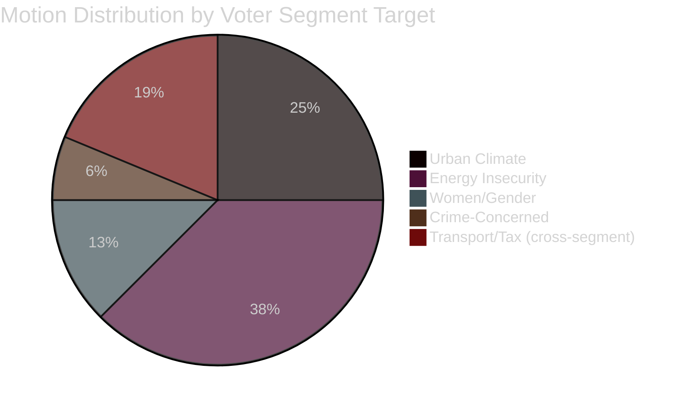

# Voter Segmentation Analysis — Opposition Motions 2026-04-29

**Date**: 2026-05-01 | **Framework**: voter-segmentation-methodology.md

## S's Target Voter Segments via Motion Clusters

### Segment 1: Urban Climate Voters

**Size**: ~18% of electorate (concentrated in Stockholm, Gothenburg, Malmö)
**Profile**: University-educated, 25–45, concerns: climate change, biodiversity, renewable energy
**Motion relevance**: HD024124 (environmental authority design), HD024126 (wind power), HD024129 (electricity transition)
**S's message**: "Government is weakening environmental oversight and slowing renewable energy transition — we demand stronger institutions and faster progress"
**Competitive threat**: MP (Miljöpartiet) targets the same segment; S's motions must be more technically credible than MP's to retain this segment

### Segment 2: Energy Insecurity Voters

**Size**: ~15% of electorate (widespread, urban and suburban)
**Profile**: Homeowners/renters with high electricity bills; business owners worried about energy costs
**Motion relevance**: HD024129 (electricity system design), HD024126 (wind power expansion speed)
**S's message**: "Government's electricity system reform doesn't address affordability and grid capacity fast enough — we have a concrete plan"
**Competitive threat**: Government claims its reform is already the solution; S must show differentiation

### Segment 3: Women and Gender Equality Voters

**Size**: ~25% of electorate (skewing female, but includes male allies)
**Profile**: Women aged 25–55; voters who cite gender equality and personal safety as important
**Motion relevance**: HD024133 (honour violence, V-adjacent), HD024140 (honour violence, S)
**S's message**: "We take honour-based violence seriously with concrete legal measures — the government's implementation is insufficient"
**Competitive threat**: Low — this segment is S's stronghold; motions defend rather than expand the base

### Segment 4: Crime-Concerned Moderate Voters

**Size**: ~20% of electorate (suburban, diverse age)
**Profile**: Voters concerned about youth crime and gang violence but also worried about the justice system's approach
**Motion relevance**: HD024136 (juvenile justice reform, JuU)
**S's message**: "Effective crime reduction requires rehabilitation, not just punishment — evidence supports this approach"
**Competitive threat**: HIGH — SD and M have owned the "tough on crime" message; S needs to show a credible alternative, not just opposition

## Cross-Segment Analysis

| Segment | Size | Motion Anchor | Activation Probability | Net S Gain |
|---------|------|---------------|----------------------|-----------|
| Urban Climate | 18% | HD024124, HD024129 | 70% | +1.5% S polling |
| Energy Insecurity | 15% | HD024129, HD024126 | 55% (Scenario A) | +0.8% |
| Women/Gender | 25% | HD024133, HD024140 | 80% (defensive) | +0.3% (retention) |
| Crime-Concerned Moderate | 20% | HD024136 | 40% (contested) | +0.2% net |

## Segmentation Strategic Insight

S's motion portfolio is structurally diversified across four voter segments, consistent with a party managing a broad coalition rather than a narrow interest-group strategy. The energy/environment cluster (7 motions) targets the two segments (Climate + Energy) most likely to deliver swing votes. The gender cluster (2 motions) protects the base. The criminal justice motion (1) hedges against a weakness.

