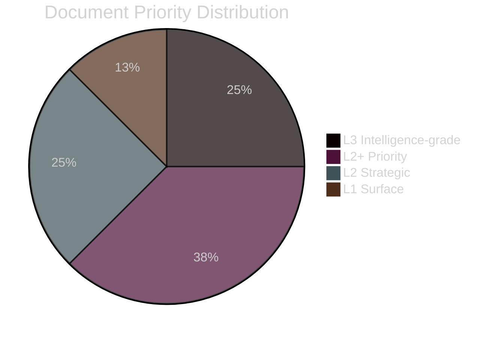

# Political Classification — Government Propositions 2026-05-01

**Author**: James Pether Sörling
**Date**: 2026-05-01

## Classification Framework

7-dimension classification per document: Policy Domain, Ideological Vector, Urgency, Conflict Level, Stakeholder Breadth, Temporal Horizon, GDPR Sensitivity.

## Document Classifications

### HD03262 — Utmönstring av permanent uppehållstillstånd (https://data.riksdagen.se/dokument/HD03262)

| Dimension | Classification | Notes |
|-----------|---------------|-------|
| Policy Domain | Migration/Asylum, EU Affairs | SfU committee; DG HOME interface |
| Ideological Vector | Restrictive-nationalist | Aligns with SD platform; M accommodation |
| Urgency | HIGH | EU pact implementation timeline binding |
| Conflict Level | VERY HIGH | Opposition: MP, V block opposition; S divided |
| Stakeholder Breadth | NATIONAL + EU | 100,000+ annual applicants affected |
| Temporal Horizon | Structural/Permanent | Repeals Alien Act category permanently |
| GDPR Sensitivity | Art.9(e,g) | Individual permit data; public interest basis |
| Priority | L3 Intelligence-grade | |

### HD03263 — Stärkt återvändandeverksamhet (https://data.riksdagen.se/dokument/HD03263)

| Dimension | Classification | Notes |
|-----------|---------------|-------|
| Policy Domain | Migration enforcement, Administrative law | SfU committee |
| Ideological Vector | Law-and-order restrictive | Tidöavtalet enforcement arm |
| Urgency | HIGH | Deportation backlog is acute (55,000+) |
| Conflict Level | HIGH | UNHCR, civil society opposition |
| Stakeholder Breadth | NATIONAL + INTERNATIONAL | Bilateral readmission treaties implicated |
| Temporal Horizon | Medium-term (2–3 years implementation) | Agency capacity constraint |
| GDPR Sensitivity | Art.9(e,g) | Biometric enforcement data |
| Priority | L3 Intelligence-grade | |

### HD03264 — Skärpta krav på vandel (https://data.riksdagen.se/dokument/HD03264)

| Dimension | Classification | Notes |
|-----------|---------------|-------|
| Policy Domain | Migration, Criminal law | SfU committee |
| Ideological Vector | Law-and-order restrictive | |
| Urgency | MEDIUM | No EU deadline binding |
| Conflict Level | HIGH | ECHR Art.8 (family life) challenge risk |
| Stakeholder Breadth | NATIONAL | ~500,000 permit holders at risk |
| Temporal Horizon | Immediate | Applies on enactment date |
| GDPR Sensitivity | Art.9(e,g) | Criminal record data processing |
| Priority | L2+ Priority | |

### HD03265 — Skärpta regler om förvar (https://data.riksdagen.se/dokument/HD03265)

| Dimension | Classification | Notes |
|-----------|---------------|-------|
| Policy Domain | Administrative detention, Human rights | SfU committee |
| Ideological Vector | Security/enforcement | |
| Urgency | MEDIUM | |
| Conflict Level | VERY HIGH | ECHR Art.5 (liberty) challenge certain |
| Stakeholder Breadth | NATIONAL + ECHR | ~8,000 annual detainees affected |
| Temporal Horizon | Immediate (post-enactment) | |
| GDPR Sensitivity | Art.9(e,g) | Detention biometric data |
| Priority | L2+ Priority | |

### HD03254 — Operativt militärt samarbete (https://data.riksdagen.se/dokument/HD03254)

| Dimension | Classification | Notes |
|-----------|---------------|-------|
| Policy Domain | Defence, International security | FöU committee |
| Ideological Vector | NATO-integration | Broad cross-party support expected |
| Urgency | HIGH | NATO Article 5 readiness |
| Conflict Level | LOW | Only V likely to oppose |
| Stakeholder Breadth | NATIONAL + NORDIC + NATO | NORDEFCO framework |
| Temporal Horizon | Structural | Permanent framework change |
| GDPR Sensitivity | LOW | No personal data primary |
| Priority | L2+ Priority | |

### HD03258, HD03251, HD03260

| dok_id | Domain | Ideological Vector | Conflict Level | Priority |
|--------|--------|-------------------|----------------|----------|
| HD03258 (https://data.riksdagen.se/dokument/HD03258) | Democracy/Transparency | Cross-party | LOW | L2 Strategic |
| HD03251 (https://data.riksdagen.se/dokument/HD03251) | Health/Addiction | Welfare state | LOW | L2 Strategic |
| HD03260 (https://data.riksdagen.se/dokument/HD03260) | Research ethics | Technical | VERY LOW | L1 Surface |

## Priority Tier Summary

