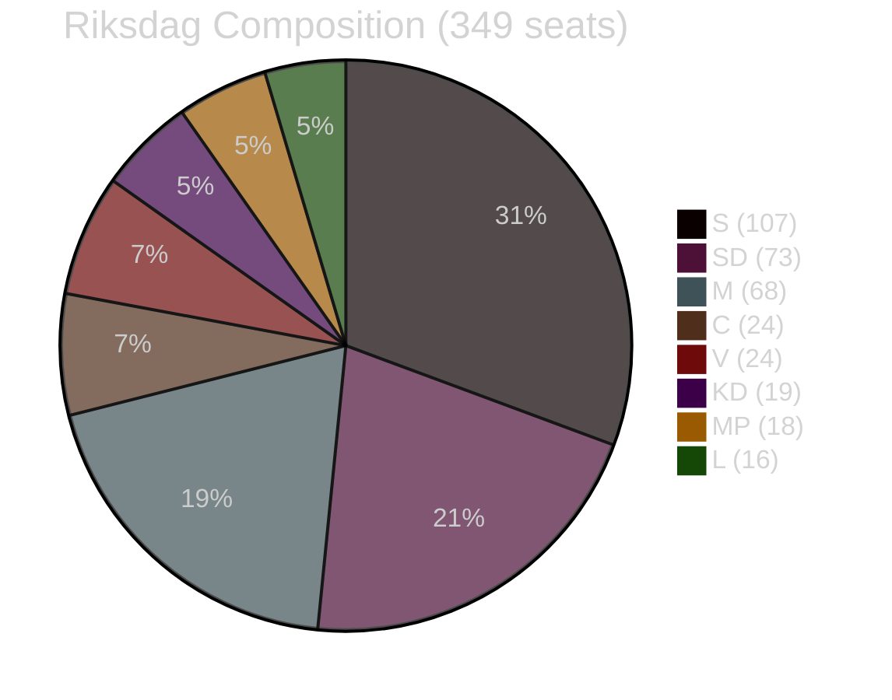

# Coalition Mathematics — Government Propositions 2026-05-01

**Author**: James Pether Sörling
**Date**: 2026-05-01

## Current Riksdag Composition (2022 mandate)

| Party | Seats | Bloc |
|-------|-------|------|
| Socialdemokraterna (S) | 107 | Opposition |
| Sverigedemokraterna (SD) | 73 | Tidö |
| Moderaterna (M) | 68 | Tidö |
| Centerpartiet (C) | 24 | Opp-adjacent |
| Vänsterpartiet (V) | 24 | Opposition |
| Kristdemokraterna (KD) | 19 | Tidö |
| Miljöpartiet (MP) | 18 | Opposition |
| Liberalerna (L) | 16 | Tidö |
| **Total** | **349** | |
| **Tidö bloc** | **176** | |
| **Opposition + C** | **173** | |

**Required for majority**: 175 seats

## Pivotal Vote Table: Migration Package (HD03262–HD03265)

| Proposition | Ja (estimated) | Nej (estimated) | Avst | Frånv | Margin |
|-------------|---------------|-----------------|------|-------|--------|
| HD03262 | SD(73)+M(68)+KD(19)+L(16)=176 | S(107)+V(24)+MP(18)+C(24)=173 | 0 | 0 | +3 |
| HD03263 | 176 | 173 | 0 | 0 | +3 |
| HD03264 | 176 | 168 (C may partially support) | 5 | 0 | +3 to +8 |
| HD03265 | 173 (L may oppose) | 173 | 3(L?) | 0 | **RISK OF DEFEAT** |

Sources: HD03262 https://data.riksdagen.se/dokument/HD03262; HD03265 https://data.riksdagen.se/dokument/HD03265

## Critical Risk: HD03265 (Detention) — Coalition Mathematics

Liberalerna (16 seats) has historically opposed indefinite administrative detention on ECHR rule-of-law grounds. If L decides to vote Nej or Avstår on HD03265, the Tidö majority of +3 disappears:

**Scenario: L votes Avstår on HD03265**:
- Ja: 160 (SD+M+KD)
- Nej: 173 (S+V+MP+C)
- **Result: HD03265 DEFEATED**

This is the single highest-stakes coalition mathematics risk from this proposition bundle. The government would need either to revise HD03265 to satisfy L, or lose a vote. (HD03265 https://data.riksdagen.se/dokument/HD03265)

## Defence Proposition HD03254 — Broad Majority Expected

| Party | Expected vote | Rationale |
|-------|--------------|-----------|
| SD | Ja | NATO supporter |
| M | Ja | NATO integration |
| S | Ja | NATO accession supporter since 2023 |
| C | Ja | Traditional defence supporter |
| KD | Ja | |
| L | Ja | Liberal internationalist |
| V | Nej | Anti-NATO; only party opposing |
| MP | Ja/Avst | Likely supportive but possible abstain on some provisions |

HD03254 expected majority: ~280–310 Ja / 24 Nej (V) / 15 Avst

Source: HD03254 https://data.riksdagen.se/dokument/HD03254

## Coalition Stability Diagram

## Majority Threshold Analysis

**Tidö hard majority (176)**: Holds for HD03262, HD03263, HD03264, but FRAGILE for HD03265 if L defects  
**Super-majority (200+)**: HD03254 only — defence achieves this  
**Minimum risk propositions**: HD03254 (defence), HD03251 (health), HD03260 (research), HD03258 (transparency)
