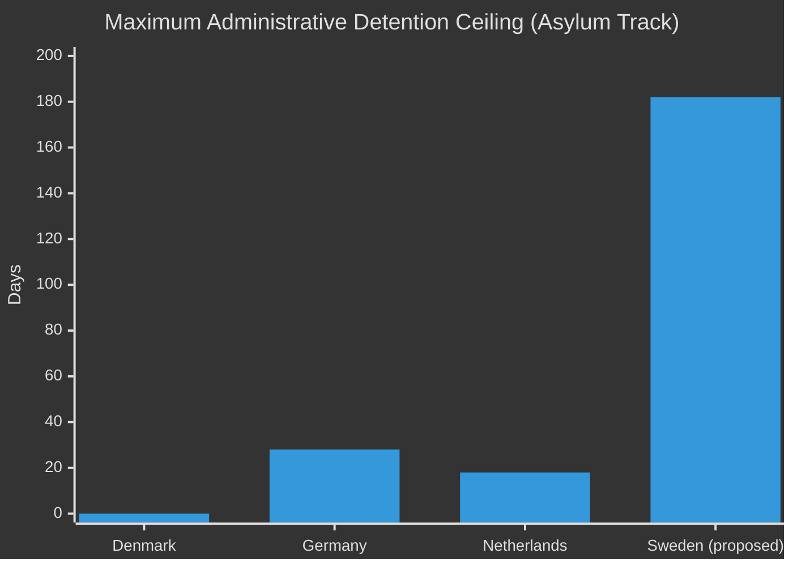

# Comparative International Analysis — Government Propositions 2026-05-01

**Author**: James Pether Sörling
**Date**: 2026-05-01

## Methodology: Outside-In Comparative Framework

Two primary comparators selected: Denmark (closest Nordic analog) and Germany (largest EU peer). EU-level pact context also assessed.

---

## Comparator 1: Denmark

**Relevant legislation**: Udlændingelov §7c (2022 amendment) — abolition of standard permanent residence; Danish model now only grants "permanent residence pending departure" for some categories.

**Similarity to HD03262** (https://data.riksdagen.se/dokument/HD03262): HIGH  
Denmark abolished permanent permits for refugees in 2022 via Mette Frederiksen's S government — same structural reform, different political authorship.

**Key differences**:
- Danish reform was proposed by Social Democrats (centre-left), not right-wing coalition; broader electoral consensus
- Denmark had pre-existing "ghetto law" framework providing legal infrastructure
- Swedish HD03262 goes further: no permanent permits for ANY category, including work/family migrants

**Outcome in Denmark**:
- No successful ECHR challenge on permit structure (yet)
- Deportation volumes did not significantly increase (same bilateral treaty constraint)
- SD (Socialdemokraterne DK) maintained governing position through 2024 election

**Lesson for Sweden**: The structural abolition is legally defensible if framed correctly; the risk lies in enforcement mechanisms (detention, returns) not the permit structure itself. (HD03262 https://data.riksdagen.se/dokument/HD03262)

---

## Comparator 2: Germany

**Relevant legislation**: Rückführungsverbesserungsgesetz (2024) — expanded detention and accelerated deportation; Sicherheitspaket (2024) — border controls.

**Similarity to HD03263** (https://data.riksdagen.se/dokument/HD03263), HD03265 (https://data.riksdagen.se/dokument/HD03265): MEDIUM  
Germany's 2024 deportation law expanded pre-deportation detention to 28 days and introduced "Abschiebehaft light." Swedish HD03265 goes to 6 months — significantly further.

**Key differences**:
- German Grundgesetz Art.2(2) (liberty) provides similar protection to ECHR Art.5; German constitutional court has previously struck down detention extensions
- German political context: CDU/CSU leading after Scholz collapse; deportation is SPD-CDU consensus, not purely right-wing
- German deportation volumes increased marginally post-2024 reform — capacity constraint confirmed

**Lesson for Sweden**: Detention extension beyond 3 months without judicial oversight is legally fragile in both German and ECHR context; German reform stopped at 28 days precisely to avoid BVerfG challenge. Swedish HD03265's 6-month target is constitutionally exposed. (HD03265 https://data.riksdagen.se/dokument/HD03265)

---

## EU Pact Context

The EU Migration and Asylum Pact (2024) entered into force March 2024; member states have until mid-2026 to implement. HD03262 explicitly references pact implementation — but the abolition of permanent permits is a national-law addition beyond pact requirements. The pact requires faster processing; it does not require removing permanent permit status.

**Risk**: Swedish implementation goes beyond pact minimum, creating CJEU referral surface. (HD03262 https://data.riksdagen.se/dokument/HD03262)

## Comparative Risk Matrix

| Country | Comparator Reform | Detention Ceiling | ECHR Challenge | Deportation Outcome |
|---------|-------------------|------------------|----------------|---------------------|
| Denmark | Permit abolition (2022) | None changed | None successful | Modest increase |
| Germany | Deportation law (2024) | 28 days | BVerfG review pending | Marginal increase |
| **Sweden** | HD03262–HD03265 (2026) | **6 months** | **HIGH risk** | Unknown |

## International Comparison Diagram

