# Cross-Reference Map — Government Propositions 2026-05-01

**Author**: James Pether Sörling
**Date**: 2026-05-01

## Policy Clusters

### Cluster A: Migration Restriction Package (HD03262–HD03265)

All four propositions from Justitiedepartementet under Johan Forssell form a coordinated legislative package:

| dok_id | Title | Legislative Link | Committee |
|--------|-------|-----------------|-----------|
| HD03262 | Abolish permanent residence permits | Implements EU Asylum and Migration Pact | SfU |
| HD03263 | Strengthened deportation/return | Procedural enforcement of HD03262 | SfU |
| HD03264 | Stricter character requirements | Substantive eligibility gate for permits | SfU |
| HD03265 | Stricter detention rules | Enforcement mechanism for HD03263 | SfU |

**Legislative Chain**: HD03262 (structural) → HD03264 (eligibility) → HD03263 (enforcement) → HD03265 (detention escalation)

Sources: HD03262 https://data.riksdagen.se/dokument/HD03262; HD03263 https://data.riksdagen.se/dokument/HD03263; HD03264 https://data.riksdagen.se/dokument/HD03264; HD03265 https://data.riksdagen.se/dokument/HD03265

### Cluster B: Defence Sovereignty (HD03254)

Single proposition, standalone:

| dok_id | Title | Links | Committee |
|--------|-------|-------|-----------|
| HD03254 | Operational military cooperation framework | NORDEFCO; NATO SACEUR bilateral agreements | FöU |

Source: HD03254 https://data.riksdagen.se/dokument/HD03254

### Cluster C: Democratic Infrastructure (HD03258)

| dok_id | Title | Links | Committee |
|--------|-------|-------|-----------|
| HD03258 | Transparency in political processes | 2025 KU inquiry; GRECO recommendation | JuU |

Source: HD03258 https://data.riksdagen.se/dokument/HD03258

### Cluster D: Health & Research (HD03251, HD03260)

| dok_id | Title | Committee |
|--------|-------|-----------|
| HD03251 | Integrated substance abuse/mental health | SoU |
| HD03260 | Research ethics regulation | UbU |

## EU/International Treaty Cross-References

| Proposition | EU/International Instrument | Compliance Risk |
|-------------|------------------------------|----------------|
| HD03262 (https://data.riksdagen.se/dokument/HD03262) | EU Migration and Asylum Pact 2024; EU Return Directive | HIGH — permanent permit abolition goes beyond pact requirements |
| HD03265 (https://data.riksdagen.se/dokument/HD03265) | ECHR Article 5; EU Reception Conditions Directive | CRITICAL — 6-month administrative detention |
| HD03254 (https://data.riksdagen.se/dokument/HD03254) | NATO Status of Forces Agreement; NORDEFCO MOU | LOW — framework aligns with existing treaties |
| HD03263 (https://data.riksdagen.se/dokument/HD03263) | EU Return Directive; readmission agreements | MEDIUM — depends on bilateral readmission treaty status |

## Legislative Chain Diagram

```mermaid
%%{init: {"theme": "dark"}}%%
graph LR
    EU[EU Migration &<br/>Asylum Pact 2024] -->|Implements| HD03262[HD03262<br/>Abolish permanent permits]
    HD03262 -->|Procedural enforcement| HD03263[HD03263<br/>Deportation operations]
    HD03262 -->|Eligibility gate| HD03264[HD03264<br/>Character requirements]
    HD03263 -->|Detention escalation| HD03265[HD03265<br/>Förvar/detention rules]
    NATO[NATO framework] -->|Enables| HD03254[HD03254<br/>Military cooperation]
    GRECO[GRECO recommendation] -->|Implements| HD03258[HD03258<br/>Transparency]
    style HD03262 fill:#1a1e3d,stroke:#ff006e
    style HD03263 fill:#1a1e3d,stroke:#ff006e
    style HD03264 fill:#1a1e3d,stroke:#ff006e
    style HD03265 fill:#1a1e3d,stroke:#ff006e
    style HD03254 fill:#1a1e3d,stroke:#00d9ff
```

