# Devil's Advocate Analysis — Government Propositions 2026-05-01

**Author**: James Pether Sörling
**Date**: 2026-05-01

## ACH Matrix (Analysis of Competing Hypotheses)

Per ICD 203 Standard 9, three competing hypotheses tested against evidence.

---

## H1: "The migration package is primarily electoral theatre, not policy"

**Hypothesis**: The Tidöalliansen submits all four migration propositions simultaneously in April 2026 primarily to dominate pre-election news cycle, with limited expectation of operational impact.

**Evidence FOR H1**:
- Timing: 5 months before September 2026 election — maximum electoral impact window
- Implementation capacity absent: Migrationsverket budget not pre-increased to match ambition of HD03263 (https://data.riksdagen.se/dokument/HD03263)
- Bilateral readmission treaty gaps unchanged: legal powers (HD03263) cannot compel third countries to receive deportees
- Danish parallel: Denmark's 2022 similar reform produced minimal deportation volume increase

**Evidence AGAINST H1**:
- HD03262 (https://data.riksdagen.se/dokument/HD03262) structurally abolishes permanent permits — this is irreversible structural change, not symbolic
- EU pact deadline forces implementation regardless of political cycle
- Government has commissioned multiple remisser and agency impact assessments (procedural depth suggests genuine implementation intent)

**H1 Credibility**: MEDIUM. Package is genuine policy AND electoral strategy simultaneously.

---

## H2: "Sweden's permanent permit abolition will be overturned by CJEU, not ECHR"

**Hypothesis**: The primary legal threat to HD03262 is not ECHR Article 5 (which relates to detention, not permit structure) but CJEU on non-refoulement and EU Return Directive compatibility.

**Evidence FOR H2**:
- EU Return Directive requires member states to grant voluntary departure periods and establish return decisions — permanent permit abolition may create compliance gap
- Long-stay residence directive (2003/109/EC) confers rights after 5 years legal residence — HD03262 may conflict
- Swedish administrative courts have precedent of CJEU referrals on migration questions
- Sources: HD03262 https://data.riksdagen.se/dokument/HD03262

**Evidence AGAINST H2**:
- HD03262 explicitly cites EU pact compatibility — legal team has anticipated CJEU risk
- CJEU referral timeline is 18+ months — no impact before September 2026 election
- EU pact itself creates space for stricter national rules within non-refoulement constraints

**H2 Credibility**: HIGH. CJEU threat is underweighted in media coverage; focuses on ECHR but the EU law challenge via administrative court is more structurally threatening long-term.

---

## H3: "SD benefits more from package FAILURE than success"

**Hypothesis**: Sverigedemokraterna's optimal electoral position is for the migration package to face obstacles (Lagrådet, ECHR), allowing SD to claim M is too weak on migration.

**Evidence FOR H3**:
- SD historically performs best when migration is framed as urgent crisis requiring more radical action
- If HD03265 is revised down due to Lagrådet adverse opinion, SD can say "M capitulated" (HD03265 https://data.riksdagen.se/dokument/HD03265)
- SD's 2022 campaign was stronger when in opposition criticising policy than in government delivering it
- Historical pattern: V4 (Orbán) shows governing populist parties often lose electoral edge once they must deliver

**Evidence AGAINST H3**:
- SD's short-term interest is passage: their base expects delivery
- SD can claim credit for forcing M to adopt the policies SD demanded since 2010
- Failure risks S outflanking SD with partial adoption of "firm but fair" deportation

**H3 Credibility**: MEDIUM. SD faces a credibility paradox: too much success means government gets credit; too much failure means they look weak.

---

## ACH Summary Table

| | H1 (Theatre) | H2 (CJEU primary) | H3 (SD benefits from failure) |
|--|-------------|-------------------|-------------------------------|
| Electoral timing evidence | CONSISTENT | NEUTRAL | CONSISTENT |
| EU law compatibility evidence | INCONSISTENT | STRONGLY CONSISTENT | NEUTRAL |
| Implementation capacity evidence | STRONGLY CONSISTENT | NEUTRAL | NEUTRAL |
| SD party strategy evidence | NEUTRAL | NEUTRAL | CONSISTENT |
| **Overall credibility** | **MEDIUM** | **HIGH** | **MEDIUM** |

**Lead hypothesis**: H2 — the CJEU threat via EU long-stay residence directive is the underweighted risk that could structurally undo HD03262 post-election regardless of near-term passage.

```mermaid
%%{init: {"theme": "dark"}}%%
graph LR
    H1[H1: Electoral Theatre<br/>MEDIUM] -->|Disproved by| EV1[Structural permit abolition<br/>irreversible change]
    H2[H2: CJEU Primary Risk<br/>HIGH] -->|Supported by| EV2[EU long-stay directive<br/>5-year right conflict]
    H3[H3: SD paradox<br/>MEDIUM] -->|Supported by| EV3[SD outrage machine<br/>works on failure]
    style H2 fill:#1a1e3d,stroke:#ff006e
    style H1 fill:#1a1e3d,stroke:#ffbe0b
    style H3 fill:#1a1e3d,stroke:#00d9ff
```

