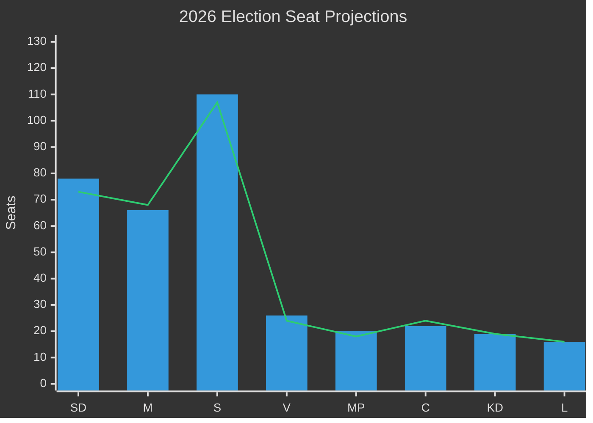

# Election 2026 Analysis — Government Propositions 2026-05-01

**Author**: James Pether Sörling
**Date**: 2026-05-01

## Overview

Swedish general election scheduled September 2026. These propositions are submitted 5 months before the election. Analysis assesses how HD03262–HD03265 (migration package) and HD03254 (defence) reshape electoral dynamics.

## Current Mandate Baseline (post-2022 election)

| Party | 2022 seats (349 total) | Bloc |
|-------|----------------------|------|
| Sverigedemokraterna (SD) | 73 | Tidö |
| Moderaterna (M) | 68 | Tidö |
| Socialdemokraterna (S) | 107 | Opposition |
| Vänsterpartiet (V) | 24 | Opposition |
| Miljöpartiet (MP) | 18 | Opposition |
| Centerpartiet (C) | 24 | Opp-adjacent |
| Kristdemokraterna (KD) | 19 | Tidö |
| Liberalerna (L) | 16 | Tidö |
| **Tidö total** | **176** | |
| **Opposition + C** | **173** | |

**Government majority**: 176 vs 173 — minimum majority +3

## Migration Package Electoral Impact Assessment

### Group A: Firm-base retention (SD, KD)
Migration package LOCKS IN SD+KD base. Risk: SD base disappointed if HD03265 is revised downward by Lagrådet adverse opinion. Estimate: +2 SD seats, neutral KD. (HD03265 https://data.riksdagen.se/dokument/HD03265)

### Group B: Swing voters (urban M, C-leaning)
Urban moderate voters accept controlled migration but may be alienated by 6-month detention provisions. HD03265 is the swing voter risk. Estimate: M -3 to -5 in urban constituencies if detention becomes key frame. (HD03265 https://data.riksdagen.se/dokument/HD03265)

### Group C: Mobilised opposition (S, MP, V)
Package energises left-liberal voter base. S likely to run "rule of law" campaign. MP+V benefit from anti-migration-law mobilisation. Estimate: +5 S seats, +2 MP, +2 V. (HD03262 https://data.riksdagen.se/dokument/HD03262)

### Group D: C Dilemma
Centerpartiet faces "support reasonable migration firm but oppose ECHR violations" split. HD03254 (defence) aligns C+Government, softening the migration confrontation. C may lose 2–3 seats from liberal wing; gain 1–2 from rural base. (HD03254 https://data.riksdagen.se/dokument/HD03254)

## Projected Seat Ranges (September 2026)

| Party | Low | Base | High | Direction |
|-------|-----|------|------|-----------|
| SD | 75 | 78 | 82 | ↑ |
| M | 63 | 66 | 70 | → |
| KD | 18 | 19 | 21 | → |
| L | 15 | 16 | 17 | → |
| **Tidö total** | **171** | **179** | **190** | **→/↑** |
| S | 105 | 110 | 115 | ↑ |
| V | 22 | 26 | 28 | ↑ |
| MP | 18 | 20 | 22 | ↑ |
| C | 18 | 22 | 25 | ↓ |
| **Opp+C total** | **163** | **178** | **190** | **→** |

## Coalition Viability Assessment

Under base scenario, Tidö bloc (179) retains majority. Under adverse ECHR scenario (S-3 from scenario analysis), urban M seat losses + S surge could produce hung parliament. HD03254 passing with S support does not change coalition arithmetic but demonstrates government foreign policy competence.

## Electoral Dynamics Diagram

