# Sweden's Most Radical Migration Overhaul in Decades: Tidöalliansen Files Four-Bill Asylum Package

**Author**: James Pether Sörling
**Date**: 2026-05-01
**Classification**: PUBLIC
**Confidence**: HIGH [B2] — Multiple primary sources (8 government propositions, riksdag-regering MCP)

## BLUF

The Tidöalliansen government submitted four simultaneous propositions on 30 April 2026 that together constitute Sweden's most sweeping restriction of asylum and migration rights since the temporary 2016 Aliens Act: abolishing permanent residence permits entirely (HD03262), expanding forced deportation powers (HD03263), applying stricter criminal-record character tests to all permit holders (HD03264), and tightening administrative detention and surveillance (HD03265). Timed six months before the September 2026 election, the package signals a deliberate electoral escalation on immigration, betting that S and MP opposition will be isolated while SD and the coalition bloc consolidate. The government also filed propositions on operational military cooperation (HD03254), integrated substance-abuse care (HD03251), political transparency (HD03258), and research ethics (HD03260).

## Decisions This Brief Supports

1. **Swedish parliament (Riksdag) SfU committee** — Four migration propositions require sequential committee review and chamber votes; the coalition needs all four votes to pass, likely autumn 2026.
2. **Opposition parties (S, MP, V, C)** — Decide whether to mount constitutional challenge at Lagrådet or accept defeat; S faces an acute positioning dilemma given prior 2022 cooperation signals.
3. **EU/Brussels level** — HD03262 directly implements the EU Migration and Asylum Pact; its compliance posture will signal Sweden's enforcement intent to DG HOME.
4. **Civil society / UNHCR** — Assess litigation risk under ECHR Article 5 (detention, HD03265) and Article 8 (family unity, HD03262).

## 60-Second Briefing

- **4-proposition migration cluster** is the lead story: permanent residence abolished → all migrants on rolling temporary permits
- **HD03263**: deportation capacity expansion — new powers for Migrationsverket, Polismyndigheten; linked to Statskontoret agency-capacity risk
- **HD03264**: character test broadened — conviction in any country can trigger revocation
- **HD03265**: expanded administrative detention (förvar) without court order for up to 6 months
- **HD03254** (defence): NORDEFCO + bilateral framework upgrades enabling pre-authorised joint exercises on Swedish soil — HIGH strategic significance
- **HD03251**: integrates addiction care into regional health structures — non-controversial cross-party support expected
- **HD03258**: new transparency rules for political party finance and lobby registers — KU referral expected
- **Confidence**: HIGH that migration package passes; MEDIUM on election impact — polls narrowed

## Top Forward Trigger

**By 2026-06-01**: SfU committee hearings schedule for HD03262–HD03265; Lagrådet referral status for HD03265 (detention); and first Eurostat reaction to Sweden's pact-implementation posture.

## Key Intelligence Summary

```mermaid
%%{init: {"theme": "dark", "themeVariables": {"primaryColor": "#1a1e3d", "edgeLabelBackground": "#0a0e27"}}}%%
graph TD
    A[Tidöalliansen Migration Package<br/>4 props, 30 Apr 2026] --> B[HD03262: Abolish permanent permits<br/>L3 Intelligence-grade]
    A --> C[HD03263: Deportation expansion<br/>L3 Intelligence-grade]
    A --> D[HD03264: Character tests<br/>L2+ Priority]
    A --> E[HD03265: Detention expansion<br/>L2+ Priority]
    B --> F[EU Asylum Pact compliance<br/>SfU committee review]
    C --> G[Migrationsverket/Polis capacity<br/>Statskontoret risk HIGH]
    D --> H[ECHR Art.8 litigation risk<br/>Lagrådet review required]
    E --> I[ECHR Art.5 detention risk<br/>VERY HIGH litigation exposure]
    style A fill:#ff006e,color:#fff
    style B fill:#1a1e3d,stroke:#ff006e
    style F fill:#1a1e3d,stroke:#00d9ff
    style I fill:#1a1e3d,stroke:#ffbe0b
```

