‏# أكثر إصلاح جذري للهجرة في السويد منذ عقود: تيدوألليانسن يقدم حزمة تشريعية من أربعة قوانين للجوء

**المؤلف**: James Pether Sörling  
**التاريخ**: 2026-05-01  
**التصنيف**: عام  
**الثقة**: عالية [B2] — مصادر أولية متعددة (8 مقترحات حكومية، MCP riksdag-regering)

## الملخص التنفيذي

قدّمت حكومة تيدوألليانسن أربعة مقترحات متزامنة في 30 أبريل 2026 تشكّل معاً أشمل تقييد لحقوق اللجوء والهجرة في السويد منذ قانون الأجانب المؤقت لعام 2016: الإلغاء الكامل لتصاريح الإقامة الدائمة (HD03262)، وتوسيع صلاحيات الترحيل القسري (HD03263)، واشتراطات سلوكية أكثر صرامة لجميع حاملي التصاريح (HD03264)، وتشديد الاحتجاز الإداري والمراقبة (HD03265). أُودعت الحزمة قبل ستة أشهر من انتخابات سبتمبر 2026، وتُشير إلى تصعيد انتخابي مقصود في ملف الهجرة، راهناً على عزل معارضة حزب S وحزب MP بينما يتوطد حزب SD وكتلة الائتلاف. كما قدّمت الحكومة مقترحات حول التعاون العسكري العملياتي (HD03254)، والرعاية المتكاملة لإدمان المخدرات (HD03251)، والشفافية السياسية (HD03258)، وأخلاقيات البحث العلمي (HD03260).

## القرارات التي يدعمها هذا التقرير

1. **لجنة SfU في ريكسداجن** — تستلزم أربعة مقترحات هجرة مراجعة تسلسلية في اللجنة وتصويتات في الغرفة؛ يحتاج الائتلاف إلى اجتياز التصويتات الأربعة، على الأرجح في خريف 2026.
2. **أحزاب المعارضة (S, MP, V, C)** — البت فيما إذا كانت ستطعن دستورياً أمام لاجراديت أم تقبل الهزيمة؛ يواجه حزب S معضلة تموضع حادة في ضوء إشارات التعاون السابقة عام 2022.
3. **المستوى الأوروبي/بروكسل** — يُنفّذ HD03262 مباشرةً ميثاق الهجرة واللجوء في الاتحاد الأوروبي؛ موقفه من الامتثال سيُشير إلى نية السويد في التطبيق لمديرية GD HOME.
4. **المجتمع المدني/المفوضية السامية للأمم المتحدة لشؤون اللاجئين** — تقييم مخاطر التقاضي بموجب المادة 5 من الاتفاقية الأوروبية لحقوق الإنسان (الاحتجاز، HD03265) والمادة 8 (وحدة الأسرة، HD03262).

## إحاطة 60 ثانية

- **مجموعة مقترحات الهجرة الأربعة** هي القصة الرئيسية: إلغاء الإقامة الدائمة → جميع المهاجرين يحملون تصاريح مؤقتة متجددة
- **HD03263**: توسيع طاقة الترحيل — صلاحيات جديدة لـ Migrationsverket وPolismyndigheten؛ مرتبط بمخاطر قدرة وكالة Statskontoret
- **HD03264**: توسيع اختبار الشخصية — الإدانة في أي دولة يمكن أن تؤدي إلى الإلغاء
- **HD03265**: احتجاز إداري موسّع دون أمر قضائي لمدة تصل إلى 6 أشهر
- **HD03254** (دفاع): NORDEFCO + ترقيات الإطار الثنائي التي تُمكّن من تمارين مشتركة مُفوَّضة مسبقاً على الأراضي السويدية — أهمية استراتيجية عالية
- **HD03251**: يدمج رعاية الإدمان في الهياكل الصحية الإقليمية — دعم عابر للأحزاب غير مثير للجدل متوقع
- **HD03258**: قواعد شفافية جديدة لتمويل الأحزاب السياسية وسجلات الضغط — إحالة إلى KU متوقعة
- **الثقة**: عالية بأن حزمة الهجرة ستُقر؛ متوسطة حول التأثير الانتخابي — استطلاعات الرأي تقاربت

## أبرز محفزات المستقبل

**بحلول 2026-06-01**: جدول جلسات الاستماع للجنة SfU للمقترحات HD03262–HD03265؛ حالة إحالة Lagrådet للمقترح HD03265 (الاحتجاز)؛ وأول رد فعل من Eurostat على موقف السويد في تنفيذ الميثاق.

## ملخص الاستخبارات الرئيسية

```mermaid
%%{init: {"theme": "dark", "themeVariables": {"primaryColor": "#1a1e3d", "edgeLabelBackground": "#0a0e27"}}}%%
graph TD
    A[Tidöalliansen Migration Package<br/>4 props, 30 Apr 2026] --> B[HD03262: Abolish permanent permits<br/>L3 Intelligence-grade]
    A --> C[HD03263: Deportation expansion<br/>L3 Intelligence-grade]
    A --> D[HD03264: Character tests<br/>L2+ Priority]
    A --> E[HD03265: Detention expansion<br/>L2+ Priority]
    B --> F[EU Asylum Pact compliance<br/>SfU committee review]
    C --> G[Migrationsverket/Polis capacity<br/>Statskontoret risk HIGH]
    D --> H[ECHR Art.8 litigation risk<br/>Lagrådet review required]
    E --> I[ECHR Art.5 detention risk<br/>VERY HIGH litigation exposure]
    style A fill:#ff006e,color:#fff
    style B fill:#1a1e3d,stroke:#ff006e
    style F fill:#1a1e3d,stroke:#00d9ff
    style I fill:#1a1e3d,stroke:#ffbe0b
```

<!-- source-sha: 8bc6777dbaae351e4328c07645b52c7979dc2a68 -->
