# Sveriges mest radikale migrationsreform i årtier: Tidöalliansen fremlægger en fire-lovspakke for asyl

**Forfatter**: James Pether Sörling  
**Dato**: 2026-05-01  
**Klassificering**: OFFENTLIG  
**Tillid**: HØJ [B2] — Flere primærkilder (8 regeringspropositioner, riksdag-regering MCP)

## BLUF

Tidöalliansen-regeringen indsendte fire samtidige propositioner den 30. april 2026, som tilsammen udgør Sveriges mest vidtgående indskrænkning af asyl- og migrationsrettigheder siden den midlertidige udlændingelov fra 2016: fuldstændig afskaffelse af permanent opholdstilladelse (HD03262), udvidelse af beføjelserne til tvangsudvisning (HD03263), strammere vandelskrav for alle tilladelseshavere (HD03264) og stramning af administrativ tilbageholdelse og overvågning (HD03265). Pakken, der er indsendt seks måneder før valget i september 2026, signalerer en bevidst valgstrategisk eskalering på indvandringsområdet og satser på, at S's og MP's modstand vil blive isoleret, mens SD og koalitionsblokken konsolideres. Regeringen indsendte også propositioner om operativt militært samarbejde (HD03254), integreret misbrugsbehandling (HD03251), politisk gennemsigtighed (HD03258) og forskningsetik (HD03260).

## Beslutninger dette notat understøtter

1. **Riksdagens SfU-udvalg** — Fire migrationspropositioner kræver sekventiel udvalgsbehandling og afstemninger i kammeret; koalitionen har brug for alle fire afstemninger til at gå igennem, sandsynligvis efterår 2026.
2. **Oppositionspartier (S, MP, V, C)** — Beslutte om at rejse en forfatningsretlig udfordring ved Lagrådet eller acceptere nederlaget; S befinder sig i et akut positioneringsdilemma i lyset af tidligere 2022-samarbejdssignaler.
3. **EU/Bruxelles-niveau** — HD03262 implementerer direkte EU's migrations- og asylpagt; dens efterlevelsesposition signalerer Sveriges håndhævelsesintention til GD HOME.
4. **Civilsamfund/UNHCR** — Vurder sagsrisiko i henhold til EMRK artikel 5 (tilbageholdelse, HD03265) og artikel 8 (familiens enhed, HD03262).

## 60-sekunders briefing

- **4-propositions-migrationsklynge** er hovedhistorien: permanent opholdstilladelse afskaffet → alle migranter på rullende midlertidige tilladelser
- **HD03263**: udvidelse af udvisningskapacitet — nye beføjelser for Migrationsverket, Polismyndigheten; knyttet til Statskontorets myndighedskapacitetsrisiko
- **HD03264**: vandelstesten udvides — domfældelse i ethvert land kan udløse tilbagekaldelse
- **HD03265**: udvidet administrativ tilbageholdelse uden domstolskendelse i op til 6 måneder
- **HD03254** (forsvar): NORDEFCO + bilaterale rammeudvidelser, der muliggør forudgodkendte fælles øvelser på svensk territorium — HØJ strategisk betydning
- **HD03251**: integrerer misbrugsbehandling i regionale sundhedsstrukturer — ukontroversiell tværpolitisk støtte forventet
- **HD03258**: nye gennemsigtighedsregler for politisk partifinansering og lobbyregistre — KU-henvisning forventet
- **Tillid**: HØJ til at migrationspakken vedtages; MIDDEL om valgeffekt — meningsmålinger er jævnet ud

## Vigtigste fremadrettet trigger

**Inden 2026-06-01**: SfU-udvalgets høringsskema for HD03262–HD03265; Lagrådets høringsstatus for HD03265 (tilbageholdelse); og Eurostats første reaktion på Sveriges pagt-implementeringsposition.

## Vigtig efterretningsoversigt

```mermaid
%%{init: {"theme": "dark", "themeVariables": {"primaryColor": "#1a1e3d", "edgeLabelBackground": "#0a0e27"}}}%%
graph TD
    A[Tidöalliansen Migration Package<br/>4 props, 30 Apr 2026] --> B[HD03262: Abolish permanent permits<br/>L3 Intelligence-grade]
    A --> C[HD03263: Deportation expansion<br/>L3 Intelligence-grade]
    A --> D[HD03264: Character tests<br/>L2+ Priority]
    A --> E[HD03265: Detention expansion<br/>L2+ Priority]
    B --> F[EU Asylum Pact compliance<br/>SfU committee review]
    C --> G[Migrationsverket/Polis capacity<br/>Statskontoret risk HIGH]
    D --> H[ECHR Art.8 litigation risk<br/>Lagrådet review required]
    E --> I[ECHR Art.5 detention risk<br/>VERY HIGH litigation exposure]
    style A fill:#ff006e,color:#fff
    style B fill:#1a1e3d,stroke:#ff006e
    style F fill:#1a1e3d,stroke:#00d9ff
    style I fill:#1a1e3d,stroke:#ffbe0b
```

<!-- source-sha: 8bc6777dbaae351e4328c07645b52c7979dc2a68 -->
