# Schwedens radikalste Migrationsreform seit Jahrzehnten: Tidöalliansen legt Vier-Gesetze-Asylpaket vor

**Autor**: James Pether Sörling  
**Datum**: 2026-05-01  
**Klassifizierung**: ÖFFENTLICH  
**Vertrauen**: HOCH [B2] — Mehrere Primärquellen (8 Regierungspropositioner, riksdag-regering MCP)

## BLUF

Die Tidöalliansen-Regierung reichte am 30. April 2026 vier gleichzeitige Propositioner ein, die zusammen Schwedens weitreichendste Einschränkung von Asyl- und Migrationsrechten seit dem befristeten Ausländergesetz von 2016 darstellen: vollständige Abschaffung unbefristeter Aufenthaltserlaubnisse (HD03262), Ausweitung von Abschiebungsbefugnissen (HD03263), strengere Charaktertests für alle Erlaubnisinhaber (HD03264) und Verschärfung der administrativen Abschiebehaft und Überwachung (HD03265). Das sechs Monate vor der Wahl im September 2026 eingereichte Paket signalisiert eine bewusste wahlkampfstrategische Eskalation beim Thema Einwanderung und setzt darauf, dass der Widerstand von S und MP isoliert wird, während SD und der Koalitionsblock sich konsolidieren. Die Regierung reichte auch Propositioner zum operativen militärischen Zusammenwirken (HD03254), zur integrierten Suchtbehandlung (HD03251), zur politischen Transparenz (HD03258) und zur Forschungsethik (HD03260) ein.

## Entscheidungen, die dieser Bericht unterstützt

1. **SfU-Ausschuss des Riksdag** — Vier Migrationspropositioner erfordern sequenzielle Ausschussbehandlung und Kammerabstimmungen; die Koalition benötigt alle vier Abstimmungen, voraussichtlich Herbst 2026.
2. **Oppositionsparteien (S, MP, V, C)** — Entscheidung, ob eine verfassungsrechtliche Anfechtung beim Lagrådet angestrengt oder die Niederlage akzeptiert wird; S befindet sich angesichts früherer Kooperationssignale von 2022 in einem akuten Positionierungsdilemma.
3. **EU/Brüssel-Ebene** — HD03262 setzt das EU-Migrations- und Asylabkommen direkt um; seine Compliance-Position signalisiert Schwedens Durchsetzungsabsicht gegenüber GD HOME.
4. **Zivilgesellschaft/UNHCR** — Bewertung des Prozessrisikos gemäß EMRK Artikel 5 (Abschiebehaft, HD03265) und Artikel 8 (Familieneinheit, HD03262).

## 60-Sekunden-Briefing

- **4-Propositioner-Migrationscluster** ist die Hauptmeldung: unbefristeter Aufenthalt abgeschafft → alle Migranten mit rollierenden Aufenthaltserlaubnissen
- **HD03263**: Ausweitung der Abschiebungskapazität — neue Befugnisse für Migrationsverket, Polismyndigheten; verknüpft mit dem Kapazitätsrisiko der Behörde Statskontoret
- **HD03264**: Charaktertest wird ausgeweitet — Verurteilung in einem beliebigen Land kann zum Widerruf führen
- **HD03265**: erweiterte administrative Abschiebehaft ohne Gerichtsbeschluss für bis zu 6 Monate
- **HD03254** (Verteidigung): NORDEFCO + bilaterale Rahmenaufrüstungen, die vorautorisierte gemeinsame Übungen auf schwedischem Boden ermöglichen — HOHE strategische Bedeutung
- **HD03251**: integriert Suchtbehandlung in regionale Gesundheitsstrukturen — unkontroverser parteiübergreifender Zuspruch erwartet
- **HD03258**: neue Transparenzregeln für politische Parteienfinanzierung und Lobbyregister — KU-Überweisung erwartet
- **Vertrauen**: HOCH, dass Migrationspaket verabschiedet wird; MITTEL zum Wahleffekt — Umfragen haben sich angenähert

## Wichtigster Zukunftsauslöser

**Bis 2026-06-01**: SfU-Ausschuss-Anhörungskalender für HD03262–HD03265; Lagrådets Stellungnahme-Status für HD03265 (Abschiebehaft); und erste Reaktion von Eurostat auf Schwedens Pakt-Umsetzungsposition.

## Wichtige Geheimdienstzusammenfassung

```mermaid
%%{init: {"theme": "dark", "themeVariables": {"primaryColor": "#1a1e3d", "edgeLabelBackground": "#0a0e27"}}}%%
graph TD
    A[Tidöalliansen Migration Package<br/>4 props, 30 Apr 2026] --> B[HD03262: Abolish permanent permits<br/>L3 Intelligence-grade]
    A --> C[HD03263: Deportation expansion<br/>L3 Intelligence-grade]
    A --> D[HD03264: Character tests<br/>L2+ Priority]
    A --> E[HD03265: Detention expansion<br/>L2+ Priority]
    B --> F[EU Asylum Pact compliance<br/>SfU committee review]
    C --> G[Migrationsverket/Polis capacity<br/>Statskontoret risk HIGH]
    D --> H[ECHR Art.8 litigation risk<br/>Lagrådet review required]
    E --> I[ECHR Art.5 detention risk<br/>VERY HIGH litigation exposure]
    style A fill:#ff006e,color:#fff
    style B fill:#1a1e3d,stroke:#ff006e
    style F fill:#1a1e3d,stroke:#00d9ff
    style I fill:#1a1e3d,stroke:#ffbe0b
```

<!-- source-sha: 8bc6777dbaae351e4328c07645b52c7979dc2a68 -->
