# La reforma migratoria más radical de Suecia en décadas: Tidöalliansen presenta un paquete legislativo de asilo de cuatro leyes

**Autor**: James Pether Sörling  
**Fecha**: 2026-05-01  
**Clasificación**: PÚBLICO  
**Confianza**: ALTA [B2] — Múltiples fuentes primarias (8 proposiciones gubernamentales, MCP riksdag-regering)

## BLUF

El gobierno Tidöalliansen presentó cuatro proposiciones simultáneas el 30 de abril de 2026 que juntas constituyen la restricción más amplia de los derechos de asilo y migración en Suecia desde la Ley temporal de extranjería de 2016: abolición total de los permisos de residencia permanente (HD03262), ampliación de los poderes de deportación forzada (HD03263), pruebas de conducta más estrictas para todos los titulares de permisos (HD03264) y endurecimiento de la detención administrativa y la vigilancia (HD03265). Presentado seis meses antes de las elecciones de septiembre de 2026, el paquete señala una escalada estratégica deliberada en materia electoral sobre inmigración, apostando a que la oposición de S y MP quedará aislada mientras SD y el bloque de coalición se consolidan. El gobierno también presentó proposiciones sobre cooperación militar operativa (HD03254), atención integrada a las adicciones (HD03251), transparencia política (HD03258) y ética de la investigación (HD03260).

## Decisiones que este informe apoya

1. **Comisión SfU del Riksdag** — Cuatro proposiciones migratorias requieren revisión secuencial en comisión y votaciones en cámara; la coalición necesita que pasen las cuatro votaciones, probablemente otoño de 2026.
2. **Partidos de oposición (S, MP, V, C)** — Decidir si se interpone un recurso constitucional ante el Lagrådet o se acepta la derrota; S enfrenta un agudo dilema de posicionamiento dados las señales de cooperación anteriores de 2022.
3. **Nivel UE/Bruselas** — HD03262 implementa directamente el Pacto sobre Migración y Asilo de la UE; su postura de cumplimiento indicará la intención de aplicación de Suecia ante la DG HOME.
4. **Sociedad civil/ACNUR** — Evaluar el riesgo de litigio bajo el artículo 5 del CEDH (detención, HD03265) y el artículo 8 (unidad familiar, HD03262).

## Briefing de 60 segundos

- **El cluster de 4 proposiciones de migración** es la historia principal: residencia permanente abolida → todos los migrantes con permisos temporales renovables
- **HD03263**: expansión de la capacidad de deportación — nuevos poderes para Migrationsverket, Polismyndigheten; vinculado al riesgo de capacidad de la agencia Statskontoret
- **HD03264**: la prueba de conducta se amplía — una condena en cualquier país puede desencadenar la revocación
- **HD03265**: detención administrativa ampliada sin orden judicial por hasta 6 meses
- **HD03254** (defensa): NORDEFCO + actualizaciones del marco bilateral que permiten ejercicios conjuntos preautorizados en suelo sueco — ALTA importancia estratégica
- **HD03251**: integra el cuidado de adicciones en las estructuras de salud regionales — apoyo transpartidario no controvertido esperado
- **HD03258**: nuevas reglas de transparencia para la financiación de partidos políticos y registros de lobbying — remisión a KU esperada
- **Confianza**: ALTA de que el paquete migratorio pase; MEDIA sobre el impacto electoral — las encuestas se han igualado

## Principal desencadenante prospectivo

**Para el 2026-06-01**: agenda de audiencias de la comisión SfU para HD03262–HD03265; estado del examen del Lagrådet para HD03265 (detención); y primera reacción de Eurostat ante la postura de implementación del pacto por parte de Suecia.

## Resumen de inteligencia clave

```mermaid
%%{init: {"theme": "dark", "themeVariables": {"primaryColor": "#1a1e3d", "edgeLabelBackground": "#0a0e27"}}}%%
graph TD
    A[Tidöalliansen Migration Package<br/>4 props, 30 Apr 2026] --> B[HD03262: Abolish permanent permits<br/>L3 Intelligence-grade]
    A --> C[HD03263: Deportation expansion<br/>L3 Intelligence-grade]
    A --> D[HD03264: Character tests<br/>L2+ Priority]
    A --> E[HD03265: Detention expansion<br/>L2+ Priority]
    B --> F[EU Asylum Pact compliance<br/>SfU committee review]
    C --> G[Migrationsverket/Polis capacity<br/>Statskontoret risk HIGH]
    D --> H[ECHR Art.8 litigation risk<br/>Lagrådet review required]
    E --> I[ECHR Art.5 detention risk<br/>VERY HIGH litigation exposure]
    style A fill:#ff006e,color:#fff
    style B fill:#1a1e3d,stroke:#ff006e
    style F fill:#1a1e3d,stroke:#00d9ff
    style I fill:#1a1e3d,stroke:#ffbe0b
```

<!-- source-sha: 8bc6777dbaae351e4328c07645b52c7979dc2a68 -->
