# Ruotsin radikaalein maahanmuuttouudistus vuosikymmeniin: Tidöalliansen jättää neljän lain turvapaikkopaketin

**Tekijä**: James Pether Sörling  
**Päivämäärä**: 2026-05-01  
**Luokittelu**: JULKINEN  
**Luottamus**: KORKEA [B2] — Useita primäärilähteitä (8 hallituksen esitystä, riksdag-regering MCP)

## BLUF

Tidöalliansen-hallitus jätti neljä samanaikaista esitystä 30. huhtikuuta 2026, jotka yhdessä muodostavat Ruotsin laajimman turvapaikan- ja maahanmuuttooikeuksien rajoituksen sitten vuoden 2016 tilapäisen ulkomaalaislain: pysyvien oleskelulupien täydellinen poistaminen (HD03262), pakkokarkotusvaltuuksien laajentaminen (HD03263), tiukemmat luonnekokeet kaikille luvanhaltijoille (HD03264) ja hallinnollisen säilöönoton ja valvonnan tiukentaminen (HD03265). Kuusi kuukautta ennen syyskuun 2026 vaaleja jätetty paketti viestii tahallisesta vaalitaktisesta eskaloimisesta maahanmuuttoasioissa ja lyö vetoa, että S:n ja MP:n vastustus eristyy SD:n ja koalitiolohkon lujittuessa. Hallitus jätti myös esitykset operatiivisesta sotilaallisesta yhteistyöstä (HD03254), integroidusta päihdehuollosta (HD03251), poliittisesta avoimuudesta (HD03258) ja tutkimusetiikasta (HD03260).

## Päätökset, joita tämä muistio tukee

1. **Riksdagenin SfU-valiokunta** — Neljä maahanmuuttoesitystä vaativat peräkkäistä valiokunnan käsittelyä ja täysistuntoäänestyksiä; koalitio tarvitsee kaikkien neljän äänestyksen läpäisyn, todennäköisesti syksy 2026.
2. **Oppositiopuolueet (S, MP, V, C)** — Päätettävä perustuslaillisen haasteen nostamisesta Lagrådetissa tai tappion hyväksymisestä; S on akuutissa asemointiongelmassa aiempien vuoden 2022 yhteistyösignaalien vuoksi.
3. **EU/Bryssel-taso** — HD03262 toteuttaa suoraan EU:n muutto- ja turvapaikkosopimuksen; sen noudattamisasento viestii Ruotsin täytäntöönpanotarkoituksesta DG HOME:lle.
4. **Kansalaisyhteiskunta/UNHCR** — Arvioi oikeudenkäyntiriski EIS 5 artiklan (säilöönotto, HD03265) ja 8 artiklan (perheenyhdistäminen, HD03262) nojalla.

## 60 sekunnin yhteenveto

- **4 esityksen maahanmuuttoryhmä** on päätarina: pysyvä oleskelulupa poistettu → kaikki maahanmuuttajat jatkuvilla tilapäisillä luvilla
- **HD03263**: karkotuskapasiteetin laajentaminen — uudet valtuudet Migrationsverketille, Polismyndighetenille; yhteydessä Statskontoretsin virastokapasiteettiriskiin
- **HD03264**: luonnekoe laajennetaan — tuomio missä tahansa maassa voi laukaista peruutuksen
- **HD03265**: laajennettu hallinnollinen säilöönotto ilman tuomioistuimen päätöstä enintään 6 kuukaudeksi
- **HD03254** (puolustus): NORDEFCO + kahdenväliset puitepäivitykset mahdollistamassa ennakolta hyväksyttyjä yhteisharjoituksia Ruotsin maaperällä — KORKEA strateginen merkitys
- **HD03251**: integroi päihdehuollon alueellisiin terveysrakenteisiin — kiistaton puolueiden välinen tuki odotettu
- **HD03258**: uudet avoimuussäännöt poliittiselle puoluerahoitukselle ja lobbyrekistereille — KU-siirto odotettu
- **Luottamus**: KORKEA, että maahanmuuttopaketti hyväksytään; KOHTALAINEN vaalyvaikutuksesta — mielipidemittaukset tasoittuneet

## Tärkein tuleva laukaisija

**Viimeistään 2026-06-01**: SfU-valiokunnan kuulemisaikataulu HD03262–HD03265:lle; Lagrådagin lausuntostatus HD03265:lle (säilöönotto); ja Eurostatin ensireaktio Ruotsin sopimuksen täytäntöönpanoasemaan.

## Tärkeä tiedustelun yhteenveto

```mermaid
%%{init: {"theme": "dark", "themeVariables": {"primaryColor": "#1a1e3d", "edgeLabelBackground": "#0a0e27"}}}%%
graph TD
    A[Tidöalliansen Migration Package<br/>4 props, 30 Apr 2026] --> B[HD03262: Abolish permanent permits<br/>L3 Intelligence-grade]
    A --> C[HD03263: Deportation expansion<br/>L3 Intelligence-grade]
    A --> D[HD03264: Character tests<br/>L2+ Priority]
    A --> E[HD03265: Detention expansion<br/>L2+ Priority]
    B --> F[EU Asylum Pact compliance<br/>SfU committee review]
    C --> G[Migrationsverket/Polis capacity<br/>Statskontoret risk HIGH]
    D --> H[ECHR Art.8 litigation risk<br/>Lagrådet review required]
    E --> I[ECHR Art.5 detention risk<br/>VERY HIGH litigation exposure]
    style A fill:#ff006e,color:#fff
    style B fill:#1a1e3d,stroke:#ff006e
    style F fill:#1a1e3d,stroke:#00d9ff
    style I fill:#1a1e3d,stroke:#ffbe0b
```

<!-- source-sha: 8bc6777dbaae351e4328c07645b52c7979dc2a68 -->
