# La réforme migratoire la plus radicale de Suède depuis des décennies : Tidöalliansen dépose un paquet législatif d'asile en quatre volets

**Auteur** : James Pether Sörling  
**Date** : 2026-05-01  
**Classification** : PUBLIC  
**Confiance** : ÉLEVÉE [B2] — Plusieurs sources primaires (8 propositions gouvernementales, MCP riksdag-regering)

## BLUF

Le gouvernement Tidöalliansen a soumis quatre propositions simultanées le 30 avril 2026 qui constituent ensemble la restriction la plus étendue des droits d'asile et de migration en Suède depuis la loi temporaire sur les étrangers de 2016 : abolition totale des permis de résidence permanente (HD03262), extension des pouvoirs d'expulsion forcée (HD03263), tests de moralité plus stricts pour tous les titulaires de permis (HD03264), et renforcement de la détention administrative et de la surveillance (HD03265). Déposé six mois avant les élections de septembre 2026, le paquet signale une escalade délibérément stratégique sur le plan électoral en matière d'immigration, pariant que l'opposition de S et du MP sera isolée tandis que SD et le bloc de coalition se consolident. Le gouvernement a également déposé des propositions sur la coopération militaire opérationnelle (HD03254), les soins intégrés pour les dépendances (HD03251), la transparence politique (HD03258) et l'éthique de la recherche (HD03260).

## Décisions que ce rapport soutient

1. **Commission SfU du Riksdag** — Quatre propositions migratoires nécessitent un examen séquentiel en commission et des votes en chambre ; la coalition a besoin des quatre votes pour passer, probablement à l'automne 2026.
2. **Partis d'opposition (S, MP, V, C)** — Décider d'engager un recours constitutionnel au Lagrådet ou d'accepter la défaite ; S fait face à un dilemme de positionnement aigu étant donné les signaux de coopération antérieurs de 2022.
3. **Niveau UE/Bruxelles** — HD03262 met directement en œuvre le Pacte sur la migration et l'asile de l'UE ; sa posture de conformité indiquera l'intention d'application de la Suède à la DG HOME.
4. **Société civile/HCR** — Évaluer le risque de contentieux au titre de l'article 5 CEDH (détention, HD03265) et de l'article 8 (unité familiale, HD03262).

## Briefing de 60 secondes

- **Le groupe de 4 propositions sur la migration** est l'histoire principale : résidence permanente abolie → tous les migrants avec des permis temporaires renouvelables
- **HD03263** : expansion de la capacité d'expulsion — nouveaux pouvoirs pour Migrationsverket, Polismyndigheten ; lié au risque de capacité de l'agence Statskontoret
- **HD03264** : le test de moralité est élargi — une condamnation dans n'importe quel pays peut déclencher une révocation
- **HD03265** : détention administrative étendue sans ordonnance judiciaire jusqu'à 6 mois
- **HD03254** (défense) : NORDEFCO + mises à niveau du cadre bilatéral permettant des exercices conjoints pré-autorisés sur le sol suédois — HAUTE importance stratégique
- **HD03251** : intègre les soins aux dépendances dans les structures de santé régionales — soutien transpartisan non controversé attendu
- **HD03258** : nouvelles règles de transparence pour le financement des partis politiques et les registres de lobbying — renvoi au KU attendu
- **Confiance** : ÉLEVÉE que le paquet migratoire passe ; MOYENNE sur l'impact électoral — les sondages se sont resserrés

## Principale amorce prospective

**D'ici le 2026-06-01** : calendrier d'audition de la commission SfU pour HD03262–HD03265 ; statut du renvoi au Lagrådet pour HD03265 (détention) ; et première réaction d'Eurostat à la posture de mise en œuvre du pacte par la Suède.

## Résumé du renseignement clé

```mermaid
%%{init: {"theme": "dark", "themeVariables": {"primaryColor": "#1a1e3d", "edgeLabelBackground": "#0a0e27"}}}%%
graph TD
    A[Tidöalliansen Migration Package<br/>4 props, 30 Apr 2026] --> B[HD03262: Abolish permanent permits<br/>L3 Intelligence-grade]
    A --> C[HD03263: Deportation expansion<br/>L3 Intelligence-grade]
    A --> D[HD03264: Character tests<br/>L2+ Priority]
    A --> E[HD03265: Detention expansion<br/>L2+ Priority]
    B --> F[EU Asylum Pact compliance<br/>SfU committee review]
    C --> G[Migrationsverket/Polis capacity<br/>Statskontoret risk HIGH]
    D --> H[ECHR Art.8 litigation risk<br/>Lagrådet review required]
    E --> I[ECHR Art.5 detention risk<br/>VERY HIGH litigation exposure]
    style A fill:#ff006e,color:#fff
    style B fill:#1a1e3d,stroke:#ff006e
    style F fill:#1a1e3d,stroke:#00d9ff
    style I fill:#1a1e3d,stroke:#ffbe0b
```

<!-- source-sha: 8bc6777dbaae351e4328c07645b52c7979dc2a68 -->
