‏# הרפורמה הרדיקלית ביותר להגירה בשוודיה בעשורים: טידואלליאנסן מגישה חבילת חקיקה בת ארבעה חוקים בנושא מקלט

**מחבר**: James Pether Sörling  
**תאריך**: 2026-05-01  
**סיווג**: ציבורי  
**אמינות**: גבוהה [B2] — מקורות ראשוניים מרובים (8 הצעות ממשלתיות, MCP riksdag-regering)

## תמצית מנהלים

ממשלת טידואלליאנסן הגישה ארבע הצעות חוק בו-זמניות ב-30 באפריל 2026 המהוות יחדיו את ההגבלה הנרחבת ביותר על זכויות מקלט והגירה בשוודיה מאז חוק הזרים הזמני של 2016: ביטול מוחלט של היתרי שהייה קבועים (HD03262), הרחבת סמכויות הגירוש הכפוי (HD03263), בדיקות אופי מחמירות יותר לכל מחזיקי ההיתרים (HD03264), והחמרת מעצר מינהלי ופיקוח (HD03265). החבילה, שהוגשה שישה חודשים לפני בחירות ספטמבר 2026, מסמנת הסלמה בחירותית מכוונת בנושא ההגירה, ומהמרת על כך שהתנגדות S ו-MP תבודד בעוד SD וגוש הקואליציה מתגבשים. הממשלה הגישה גם הצעות חוק בנושא שיתוף פעולה צבאי מבצעי (HD03254), טיפול משולב בהתמכרויות (HD03251), שקיפות פוליטית (HD03258) ואתיקת מחקר (HD03260).

## החלטות שדוח זה תומך בהן

1. **ועדת SfU של ריקסדאגן** — ארבע הצעות הגירה דורשות ביקורת רצופה בוועדה והצבעות בחדר; הקואליציה זקוקה לאישור ארבעת ההצבעות, ככל הנראה בסתיו 2026.
2. **מפלגות האופוזיציה (S, MP, V, C)** — להחליט אם לנקוט אתגר חוקתי בלאגרודט או לקבל את ההפסד; S מתמודדת עם דילמת מיצוב חריפה לאור אותות שיתוף הפעולה הקודמים מ-2022.
3. **רמת האיחוד האירופי/בריסל** — HD03262 מיישם ישירות את אמנת ההגירה והמקלט של האיחוד האירופי; עמדת הציות שלה תאותת על כוונת האכיפה של שוודיה ל-DG HOME.
4. **החברה האזרחית/UNHCR** — הערכת סיכון משפטי לפי סעיף 5 של ECHR (מעצר, HD03265) וסעיף 8 (אחדות המשפחה, HD03262).

## תדריך 60 שניות

- **אשכול ארבע הצעות ההגירה** הוא הסיפור המוביל: שהייה קבועה בוטלה → כל המהגרים מחזיקים ברישיונות זמניים מתחלפים
- **HD03263**: הרחבת יכולת הגירוש — סמכויות חדשות ל-Migrationsverket, Polismyndigheten; קשור לסיכון יכולת הסוכנות Statskontoret
- **HD03264**: בדיקת האופי מורחבת — הרשעה בכל מדינה יכולה להפעיל שלילה
- **HD03265**: מעצר מינהלי מורחב ללא צו בית משפט עד 6 חודשים
- **HD03254** (ביטחון): NORDEFCO + שדרוגי מסגרת דו-צדדית המאפשרים תמרינות משותפות מאושרות מראש על אדמת שוודיה — חשיבות אסטרטגית גבוהה
- **HD03251**: משלב טיפול בהתמכרויות במבנים הבריאותיים האזוריים — תמיכה חוצת מפלגות לא שנויה במחלוקת צפויה
- **HD03258**: כללי שקיפות חדשים למימון מפלגות פוליטיות ורישומי לוביסטים — הפניה ל-KU צפויה
- **אמינות**: גבוהה שחבילת ההגירה תעבור; בינונית לגבי ההשפעה הבחירותית — סקרים התאחו

## הגורם העתידי החשוב ביותר

**עד 2026-06-01**: לוח הזמנים של שימועי ועדת SfU עבור HD03262–HD03265; מצב הפניית לאגרודט עבור HD03265 (מעצר); ותגובת Eurostat הראשונה לעמדת יישום האמנה של שוודיה.

## סיכום מודיעין מפתח

```mermaid
%%{init: {"theme": "dark", "themeVariables": {"primaryColor": "#1a1e3d", "edgeLabelBackground": "#0a0e27"}}}%%
graph TD
    A[Tidöalliansen Migration Package<br/>4 props, 30 Apr 2026] --> B[HD03262: Abolish permanent permits<br/>L3 Intelligence-grade]
    A --> C[HD03263: Deportation expansion<br/>L3 Intelligence-grade]
    A --> D[HD03264: Character tests<br/>L2+ Priority]
    A --> E[HD03265: Detention expansion<br/>L2+ Priority]
    B --> F[EU Asylum Pact compliance<br/>SfU committee review]
    C --> G[Migrationsverket/Polis capacity<br/>Statskontoret risk HIGH]
    D --> H[ECHR Art.8 litigation risk<br/>Lagrådet review required]
    E --> I[ECHR Art.5 detention risk<br/>VERY HIGH litigation exposure]
    style A fill:#ff006e,color:#fff
    style B fill:#1a1e3d,stroke:#ff006e
    style F fill:#1a1e3d,stroke:#00d9ff
    style I fill:#1a1e3d,stroke:#ffbe0b
```

<!-- source-sha: 8bc6777dbaae351e4328c07645b52c7979dc2a68 -->
