# スウェーデンの数十年で最も急進的な移民制度改革：ティデーアリアンセンが4法案の亡命パッケージを提出

**著者**：James Pether Sörling  
**日付**：2026-05-01  
**分類**：公開  
**信頼度**：高 [B2] — 複数の一次情報源（8件の政府提案、riksdag-regering MCP）

## BLUF

ティデーアリアンセン政府は2026年4月30日に4つの同時提案を提出した。これらは合わせて、2016年の臨時外国人法以来スウェーデンで最も広範な亡命・移民権の制限を構成する：永住許可の完全廃止（HD03262）、強制送還権限の拡大（HD03263）、全許可証保持者に対するより厳格な品行テスト（HD03264）、そして行政的拘留と監視の強化（HD03265）。2026年9月選挙の6ヶ月前に提出されたこのパッケージは、移民問題における意図的な選挙戦略的エスカレーションを示しており、SとMPの反対が孤立する一方でSDと連立ブロックが固まるとの賭けである。政府はまた、作戦的軍事協力（HD03254）、統合的薬物依存治療（HD03251）、政治的透明性（HD03258）、研究倫理（HD03260）に関する提案も提出した。

## この報告書が支持する決定事項

1. **国会SfU委員会** — 4つの移民提案は、委員会での順次審査と本会議投票が必要。連立政権は4つの投票すべてを通過させる必要があり、おそらく2026年秋。
2. **野党（S, MP, V, C）** — ラーグロデットで憲法上の異議申立てを行うか、敗北を受け入れるかを決定。Sは2022年以前の協力シグナルを踏まえ、鋭いポジショニングジレンマに直面。
3. **EU/ブリュッセル・レベル** — HD03262はEU移住・庇護協定を直接実施する。そのコンプライアンス姿勢はDG HOMEに対するスウェーデンの執行意図を示す。
4. **市民社会/UNHCR** — ECHR第5条（拘留、HD03265）および第8条（家族統一、HD03262）に基づく訴訟リスクを評価。

## 60秒ブリーフィング

- **4提案の移民クラスター**がメインストーリー：永住権廃止 → すべての移民が更新式一時許可証を保有
- **HD03263**：送還能力の拡大 — Migrationsverket、Polismyndighetenへの新権限。Statskontoretの行政能力リスクと関連
- **HD03264**：品行テストが拡大 — いかなる国での有罪判決も許可取消しの引き金になる可能性
- **HD03265**：裁判所命令なしに最長6ヶ月の行政拘留を拡大
- **HD03254**（防衛）：NORDEFCO + スウェーデン領土上での事前承認済み共同演習を可能にする二国間枠組み強化 — 高い戦略的重要性
- **HD03251**：薬物依存治療を地域保健構造に統合 — 超党派の非論争的支持が見込まれる
- **HD03258**：政治党財務とロビー登録の新透明性規則 — KU付託が見込まれる
- **信頼度**：移民パッケージが通過する可能性は高い；選挙への影響については中程度 — 世論調査は接近

## 最も重要な将来のトリガー

**2026-06-01まで**：HD03262–HD03265に関するSfU委員会の公聴会スケジュール；HD03265（拘留）に関するラーグロデット回付状況；そしてスウェーデンの協定実施姿勢に対するユーロスタットの最初の反応。

## 主要な情報まとめ

```mermaid
%%{init: {"theme": "dark", "themeVariables": {"primaryColor": "#1a1e3d", "edgeLabelBackground": "#0a0e27"}}}%%
graph TD
    A[Tidöalliansen Migration Package<br/>4 props, 30 Apr 2026] --> B[HD03262: Abolish permanent permits<br/>L3 Intelligence-grade]
    A --> C[HD03263: Deportation expansion<br/>L3 Intelligence-grade]
    A --> D[HD03264: Character tests<br/>L2+ Priority]
    A --> E[HD03265: Detention expansion<br/>L2+ Priority]
    B --> F[EU Asylum Pact compliance<br/>SfU committee review]
    C --> G[Migrationsverket/Polis capacity<br/>Statskontoret risk HIGH]
    D --> H[ECHR Art.8 litigation risk<br/>Lagrådet review required]
    E --> I[ECHR Art.5 detention risk<br/>VERY HIGH litigation exposure]
    style A fill:#ff006e,color:#fff
    style B fill:#1a1e3d,stroke:#ff006e
    style F fill:#1a1e3d,stroke:#00d9ff
    style I fill:#1a1e3d,stroke:#ffbe0b
```

<!-- source-sha: 8bc6777dbaae351e4328c07645b52c7979dc2a68 -->
