# 수십 년 만에 스웨덴의 가장 급진적인 이민 제도 개혁: 티데알리안센, 4개 법안 망명 패키지 제출

**저자**: James Pether Sörling  
**날짜**: 2026-05-01  
**분류**: 공개  
**신뢰도**: 높음 [B2] — 복수 1차 출처 (정부 제안 8건, riksdag-regering MCP)

## BLUF

티데알리안센 정부는 2026년 4월 30일 4건의 동시 제안을 제출했으며, 이는 2016년 임시 외국인법 이후 스웨덴에서 가장 광범위한 망명 및 이민권 제한을 구성한다: 영주권 허가의 완전 폐지(HD03262), 강제 추방 권한 확대(HD03263), 모든 허가증 소지자에 대한 더 엄격한 품성 검사(HD03264), 행정적 구금 및 감시 강화(HD03265). 2026년 9월 선거 6개월 전에 제출된 이 패키지는 이민 문제에 대한 의도적인 선거 전략적 에스컬레이션을 의미하며, SD와 연립 블록이 공고화되는 동안 S와 MP의 반대가 고립될 것이라는 판단이다. 정부는 또한 작전적 군사 협력(HD03254), 통합 약물 남용 치료(HD03251), 정치적 투명성(HD03258), 연구 윤리(HD03260)에 관한 제안도 제출했다.

## 이 보고서가 지원하는 결정 사항

1. **국회 SfU 위원회** — 4건의 이민 제안은 순차적 위원회 심사와 본회의 표결이 필요; 연립은 4건의 표결 모두 통과가 필요하며, 아마도 2026년 가을.
2. **야당 (S, MP, V, C)** — 라그로데트에서 헌법적 도전 제기 여부 또는 패배 수용 결정; S는 2022년 이전 협력 신호를 고려할 때 첨예한 포지셔닝 딜레마에 직면.
3. **EU/브뤼셀 수준** — HD03262는 EU 이주 및 망명 협약을 직접 이행; 그 준수 입장은 DG HOME에 스웨덴의 집행 의도를 시사할 것.
4. **시민사회/UNHCR** — ECHR 제5조(구금, HD03265)와 제8조(가족 결합, HD03262)에 따른 소송 위험 평가.

## 60초 브리핑

- **4개 제안 이민 클러스터**가 주요 소식: 영주권 폐지 → 모든 이민자가 갱신 임시 허가증 보유
- **HD03263**: 추방 역량 확대 — Migrationsverket, Polismyndigheten에 대한 새로운 권한; Statskontoret 기관 역량 위험과 연계
- **HD03264**: 품성 검사 확대 — 어느 나라에서의 유죄 판결도 취소를 유발할 수 있음
- **HD03265**: 법원 명령 없이 최대 6개월 행정 구금 확대
- **HD03254** (방위): NORDEFCO + 스웨덴 영토에서 사전 승인된 합동 훈련을 가능하게 하는 양자 프레임워크 업그레이드 — 높은 전략적 중요성
- **HD03251**: 약물 남용 치료를 지역 보건 구조에 통합 — 비논쟁적 초당적 지지 기대
- **HD03258**: 정치 정당 재정과 로비 등록에 관한 새 투명성 규칙 — KU 회부 예상
- **신뢰도**: 이민 패키지 통과 가능성 높음; 선거 영향에 대해서는 보통 — 여론조사 격차 좁혀짐

## 가장 중요한 미래 트리거

**2026-06-01까지**: HD03262–HD03265에 대한 SfU 위원회 청문 일정; HD03265(구금)에 대한 라그로데트 회부 상태; 그리고 스웨덴의 협약 이행 입장에 대한 유로스타트의 첫 반응.

## 핵심 정보 요약

```mermaid
%%{init: {"theme": "dark", "themeVariables": {"primaryColor": "#1a1e3d", "edgeLabelBackground": "#0a0e27"}}}%%
graph TD
    A[Tidöalliansen Migration Package<br/>4 props, 30 Apr 2026] --> B[HD03262: Abolish permanent permits<br/>L3 Intelligence-grade]
    A --> C[HD03263: Deportation expansion<br/>L3 Intelligence-grade]
    A --> D[HD03264: Character tests<br/>L2+ Priority]
    A --> E[HD03265: Detention expansion<br/>L2+ Priority]
    B --> F[EU Asylum Pact compliance<br/>SfU committee review]
    C --> G[Migrationsverket/Polis capacity<br/>Statskontoret risk HIGH]
    D --> H[ECHR Art.8 litigation risk<br/>Lagrådet review required]
    E --> I[ECHR Art.5 detention risk<br/>VERY HIGH litigation exposure]
    style A fill:#ff006e,color:#fff
    style B fill:#1a1e3d,stroke:#ff006e
    style F fill:#1a1e3d,stroke:#00d9ff
    style I fill:#1a1e3d,stroke:#ffbe0b
```

<!-- source-sha: 8bc6777dbaae351e4328c07645b52c7979dc2a68 -->
