# Zweden's meest radicale migratiehervoming in decennia: Tidöalliansen dient vier-wetgevingspakket voor asiel in

**Auteur**: James Pether Sörling  
**Datum**: 2026-05-01  
**Classificatie**: OPENBAAR  
**Vertrouwen**: HOOG [B2] — Meerdere primaire bronnen (8 regeringsproposities, riksdag-regering MCP)

## BLUF

De Tidöalliansen-regering diende op 30 april 2026 vier gelijktijdige proposities in die samen de meest vergaande beperking van asiel- en migratierechten in Zweden vormen sinds de tijdelijke Vreemdelingenwet van 2016: volledige afschaffing van permanente verblijfsvergunningen (HD03262), uitbreiding van bevoegdheden voor gedwongen uitzetting (HD03263), strengere toetsing van zedelijk gedrag voor alle vergunninghouders (HD03264), en aanscherping van administratieve bewaring en toezicht (HD03265). Het pakket, ingediend zes maanden voor de verkiezingen van september 2026, signaleert een bewuste electoraal-strategische escalatie op het gebied van immigratie en wedt dat het verzet van S en MP geïsoleerd zal worden terwijl SD en het coalitieblok consolideren. De regering diende ook proposities in over operationele militaire samenwerking (HD03254), geïntegreerde verslavingszorg (HD03251), politieke transparantie (HD03258) en onderzoeksethiek (HD03260).

## Beslissingen die dit rapport ondersteunt

1. **SfU-commissie van de Riksdag** — Vier migratiepositities vereisen sequentiële commissiebehandeling en kamerafstemmingen; de coalitie heeft alle vier stemmen nodig om door te gaan, waarschijnlijk herfst 2026.
2. **Oppositiepartijen (S, MP, V, C)** — Beslissen of een constitutionele uitdaging bij de Lagrådet wordt aangevochten of de nederlaag wordt geaccepteerd; S staat voor een acuut positioneringsdilemma gezien eerdere samenwerkingssignalen uit 2022.
3. **EU/Brussel-niveau** — HD03262 implementeert direct het EU Migratie- en Asielpact; de nalevingshouding ervan geeft Zwedens handhavingsintentie aan bij DG HOME.
4. **Maatschappelijk middenveld/UNHCR** — Beoordeel het procesrisico onder artikel 5 EVRM (bewaring, HD03265) en artikel 8 (gezinseenheid, HD03262).

## 60-seconden briefing

- **4-propositie-migratiegroep** is het hoofdverhaal: permanente verblijfsvergunning afgeschaft → alle migranten met doorlopende tijdelijke vergunningen
- **HD03263**: uitbreiding van uitzettingscapaciteit — nieuwe bevoegdheden voor Migrationsverket, Polismyndigheten; gekoppeld aan het capaciteitsrisico van instantie Statskontoret
- **HD03264**: gedragstoets wordt uitgebreid — veroordeling in elk land kan leiden tot intrekking
- **HD03265**: uitgebreide administratieve bewaring zonder rechterlijk bevel voor maximaal 6 maanden
- **HD03254** (defensie): NORDEFCO + bilaterale raamwerkupgrades die vooraf goedgekeurde gezamenlijke oefeningen op Zweeds grondgebied mogelijk maken — HOGE strategische betekenis
- **HD03251**: integreert verslavingszorg in regionale gezondheidsstructuren — niet-controversiële steun over partijgrenzen heen verwacht
- **HD03258**: nieuwe transparantieregels voor politieke partijfinanciering en lobbyregisters — KU-verwijzing verwacht
- **Vertrouwen**: HOOG dat migratiepakket wordt aangenomen; MIDDEL over verkiezingseffect — peilingen zijn gelijkgetrokken

## Belangrijkste toekomstige trigger

**Voor 2026-06-01**: SfU-commissie hoorzittingsschema voor HD03262–HD03265; Lagrådets verwijzingsstatus voor HD03265 (bewaring); en eerste reactie van Eurostat op Zwedens pact-implementatiehouding.

## Samenvatting van de belangrijkste inlichtingen

```mermaid
%%{init: {"theme": "dark", "themeVariables": {"primaryColor": "#1a1e3d", "edgeLabelBackground": "#0a0e27"}}}%%
graph TD
    A[Tidöalliansen Migration Package<br/>4 props, 30 Apr 2026] --> B[HD03262: Abolish permanent permits<br/>L3 Intelligence-grade]
    A --> C[HD03263: Deportation expansion<br/>L3 Intelligence-grade]
    A --> D[HD03264: Character tests<br/>L2+ Priority]
    A --> E[HD03265: Detention expansion<br/>L2+ Priority]
    B --> F[EU Asylum Pact compliance<br/>SfU committee review]
    C --> G[Migrationsverket/Polis capacity<br/>Statskontoret risk HIGH]
    D --> H[ECHR Art.8 litigation risk<br/>Lagrådet review required]
    E --> I[ECHR Art.5 detention risk<br/>VERY HIGH litigation exposure]
    style A fill:#ff006e,color:#fff
    style B fill:#1a1e3d,stroke:#ff006e
    style F fill:#1a1e3d,stroke:#00d9ff
    style I fill:#1a1e3d,stroke:#ffbe0b
```

<!-- source-sha: 8bc6777dbaae351e4328c07645b52c7979dc2a68 -->
