# Sveriges mest radikale migrasjonsreform på tiår: Tidöalliansen legger frem en fire-lovspakke for asyl

**Forfatter**: James Pether Sörling  
**Dato**: 2026-05-01  
**Klassifisering**: OFFENTLIG  
**Tillid**: HØY [B2] — Flere primærkilder (8 regjeringsproposisjoner, riksdag-regering MCP)

## BLUF

Tidöalliansen-regjeringen sendte inn fire samtidige proposisjoner den 30. april 2026 som til sammen utgjør Sveriges mest vidtrekkende innskrenkning av asyl- og migrasjonsrettigheter siden den midlertidige utlendingsloven fra 2016: full avskaffelse av permanent oppholdstillatelse (HD03262), utvidelse av makter for tvangsutsendelse (HD03263), strengere vandelstest for alle tillatelsesinnehavere (HD03264) og innstramming av administrativ forvaring og overvåking (HD03265). Pakken, som ble sendt inn seks måneder før valget i september 2026, signaliserer en bevisst valgstrategisk eskalering på innvandringsfeltet og satser på at S's og MP's motstand vil bli isolert mens SD og koalisjonsblokken konsolideres. Regjeringen sendte også inn proposisjoner om operativt militært samarbeid (HD03254), integrert rusbehandling (HD03251), politisk åpenhet (HD03258) og forskningsetikk (HD03260).

## Beslutninger dette notatet støtter

1. **Riksdagens SfU-komité** — Fire migrasjonsproposisjoner krever sekvensiell komitébehandling og kammeravstemninger; koalisjonen trenger alle fire avstemninger til å gå igjennom, sannsynligvis høst 2026.
2. **Opposisjonspartier (S, MP, V, C)** — Bestemme om man skal reise en konstitusjonell utfordring ved Lagrådet eller akseptere nederlaget; S befinner seg i et akutt posisjonsdilemma gitt tidligere 2022-samarbeidssignaler.
3. **EU/Brussel-nivå** — HD03262 implementerer direkte EUs migrations- og asylpakt; dens etterlevelsesposisjon signaliserer Sveriges håndhevelsesintensjon til GD HOME.
4. **Sivilsamfunn/UNHCR** — Vurder rettssaksrisiko under EMK artikkel 5 (forvaring, HD03265) og artikkel 8 (familiens enhet, HD03262).

## 60-sekunders briefing

- **4-proposisjons-migrasjonsklynge** er hovedsaken: permanent oppholdstillatelse avskaffet → alle migranter på rullerende midlertidige tillatelser
- **HD03263**: utvidelse av utvisningskapasitet — nye fullmakter for Migrationsverket, Polismyndigheten; knyttet til Statskontorets myndighetkapasitetsrisiko
- **HD03264**: vandelstest breddas — domfellelse i ethvert land kan utløse tilbakekallelse
- **HD03265**: utvidet administrativ forvaring uten rettslig kjennelse i inntil 6 måneder
- **HD03254** (forsvar): NORDEFCO + bilaterale rammeoppdateringer som muliggjør forhåndsautoriserte felles øvelser på svensk territorium — HØY strategisk betydning
- **HD03251**: integrerer rusbehandling i regionale helsestrukturer — ukontroversielt tverrpolitisk støtte forventet
- **HD03258**: nye åpenhetsregler for politisk partifinansering og lobbyregistre — KU-henvisning forventet
- **Tillid**: HØY til at migrasjonspakken vedtas; MIDDELS om valgeffekt — meningsmålinger jevnet ut

## Viktigste fremtidige trigger

**Innen 2026-06-01**: SfU-komiteens høringsskjema for HD03262–HD03265; Lagrådets høringsstatus for HD03265 (forvaring); og Eurostats første reaksjon på Sveriges pakt-implementeringsposisjon.

## Viktig etterretningssammendrag

```mermaid
%%{init: {"theme": "dark", "themeVariables": {"primaryColor": "#1a1e3d", "edgeLabelBackground": "#0a0e27"}}}%%
graph TD
    A[Tidöalliansen Migration Package<br/>4 props, 30 Apr 2026] --> B[HD03262: Abolish permanent permits<br/>L3 Intelligence-grade]
    A --> C[HD03263: Deportation expansion<br/>L3 Intelligence-grade]
    A --> D[HD03264: Character tests<br/>L2+ Priority]
    A --> E[HD03265: Detention expansion<br/>L2+ Priority]
    B --> F[EU Asylum Pact compliance<br/>SfU committee review]
    C --> G[Migrationsverket/Polis capacity<br/>Statskontoret risk HIGH]
    D --> H[ECHR Art.8 litigation risk<br/>Lagrådet review required]
    E --> I[ECHR Art.5 detention risk<br/>VERY HIGH litigation exposure]
    style A fill:#ff006e,color:#fff
    style B fill:#1a1e3d,stroke:#ff006e
    style F fill:#1a1e3d,stroke:#00d9ff
    style I fill:#1a1e3d,stroke:#ffbe0b
```

<!-- source-sha: 8bc6777dbaae351e4328c07645b52c7979dc2a68 -->
