# Sveriges mest radikala migrationsomvandling på decennier: Tidöalliansen lämnar in ett fyra-lagstiftningspaket för asyl

**Författare**: James Pether Sörling  
**Datum**: 2026-05-01  
**Klassificering**: OFFENTLIG  
**Konfidens**: HÖG [B2] — Flera primärkällor (8 regeringspropositioner, riksdag-regering MCP)

## BLUF

Tidöalliansen-regeringen lämnade in fyra simultana propositioner den 30 april 2026 som tillsammans utgör Sveriges mest genomgripande inskränkning av asyl- och migrationsrättigheter sedan den tillfälliga utlänningslagen 2016: helt avskaffande av permanenta uppehållstillstånd (HD03262), utvidgning av tvångsutvisningsbefogenheter (HD03263), striktare vandelstest för alla tillståndshavare (HD03264) och åtstramning av administrativt förvar och övvakning (HD03265). Paketet, som lämnades in sex månader före valet i september 2026, signalerar en medveten valstrategisk eskalering i invandringsfrågan och satsar på att S:s och MP:s motstånd kommer att isoleras medan SD och koalitionsblocket konsolideras. Regeringen lämnade också in propositioner om operativt militärt samarbete (HD03254), integrerad beroendevård (HD03251), politisk transparens (HD03258) och forskningsetik (HD03260).

## Beslut detta PM stödjer

1. **Riksdagens SfU-utskott** — Fyra migrationspropositioner kräver sekvensiell utskottsbehandling och kammarvotningar; koalitionen behöver alla fyra voteringar att gå igenom, troligen hösten 2026.
2. **Oppositionspartier (S, MP, V, C)** — Besluta om att resa ett konstitutionellt utmanat vid Lagrådet eller acceptera nederlaget; S befinner sig i ett akut positioneringsdilemma med tanke på tidigare 2022-samarbetssignaler.
3. **EU/Bryssel-nivå** — HD03262 implementerar direkt EU:s migrations- och asylpakt; dess efterlevnadsposition signalerar Sveriges verkställighetsintention till GD HOME.
4. **Civilsamhälle/UNHCR** — Bedöm rättegångsrisk enligt EKMR artikel 5 (förvar, HD03265) och artikel 8 (familjens enhet, HD03262).

## 60-sekunders sammanfattning

- **4-propositionsmigrationsklubbor** är huvudnyheten: permanent uppehållstillstånd avskaffat → alla migranter på rullande temporära tillstånd
- **HD03263**: utvidgning av utvisningskapacitet — nya befogenheter för Migrationsverket, Polismyndigheten; kopplat till Statskontorets myndighetkapacitetsrisk
- **HD03264**: vandelstestet breddas — fällande dom i vilket land som helst kan utlösa återkallelse
- **HD03265**: utvidgat administrativt förvar utan domstolsbeslut i upp till 6 månader
- **HD03254** (försvar): NORDEFCO + bilaterala ramuppgraderingar som möjliggör förutauktoriserade gemensamma övningar på svensk mark — HÖG strategisk betydelse
- **HD03251**: integrerar beroendevård i regionala hälsostrukturer — okontroversiellt stöd över partigränser förväntat
- **HD03258**: nya transparensregler för politisk partifinansering och lobbyregister — KU-remiss förväntas
- **Konfidens**: HÖG att migrationspaket passerar; MEDEL om valeffekt — opinionsmätningar har jämnats ut

## Viktigaste framåtindikatorn

**Senast 2026-06-01**: SfU-utskottets hörandeschema för HD03262–HD03265; Lagrådets remissstatus för HD03265 (förvar); och Eurostats första reaktion på Sveriges pakt-implementeringsposition.

## Viktig underrättelsesammanfattning

```mermaid
%%{init: {"theme": "dark", "themeVariables": {"primaryColor": "#1a1e3d", "edgeLabelBackground": "#0a0e27"}}}%%
graph TD
    A[Tidöalliansen Migration Package<br/>4 props, 30 Apr 2026] --> B[HD03262: Abolish permanent permits<br/>L3 Intelligence-grade]
    A --> C[HD03263: Deportation expansion<br/>L3 Intelligence-grade]
    A --> D[HD03264: Character tests<br/>L2+ Priority]
    A --> E[HD03265: Detention expansion<br/>L2+ Priority]
    B --> F[EU Asylum Pact compliance<br/>SfU committee review]
    C --> G[Migrationsverket/Polis capacity<br/>Statskontoret risk HIGH]
    D --> H[ECHR Art.8 litigation risk<br/>Lagrådet review required]
    E --> I[ECHR Art.5 detention risk<br/>VERY HIGH litigation exposure]
    style A fill:#ff006e,color:#fff
    style B fill:#1a1e3d,stroke:#ff006e
    style F fill:#1a1e3d,stroke:#00d9ff
    style I fill:#1a1e3d,stroke:#ffbe0b
```

<!-- source-sha: 8bc6777dbaae351e4328c07645b52c7979dc2a68 -->
