# 数十年来瑞典最激进的移民制度改革：蒂德联盟提交四项法案庇护套餐

**作者**：James Pether Sörling  
**日期**：2026-05-01  
**分类**：公开  
**可信度**：高 [B2] — 多个一次信息来源（8项政府提案，riksdag-regering MCP）

## BLUF

蒂德联盟政府于2026年4月30日同时提交了四项提案，这些提案共同构成自2016年临时外国人法以来瑞典对庇护和移民权利最广泛的限制：完全废除永久居留许可（HD03262）、扩大强制驱逐权力（HD03263）、对所有许可证持有者实施更严格的品行测试（HD03264），以及收紧行政拘留和监控（HD03265）。该套餐在2026年9月大选前六个月提交，显示出在移民问题上刻意的选举战略升级，赌的是S党和MP党的反对会被孤立，同时SD党和执政联盟巩固。政府还提交了关于作战军事合作（HD03254）、综合药物滥用治疗（HD03251）、政治透明度（HD03258）和研究伦理（HD03260）的提案。

## 本报告支持的决策

1. **国会SfU委员会** — 四项移民提案需要依次进行委员会审查和议院投票；联合政府需要四项投票全部通过，可能在2026年秋季。
2. **反对党（S、MP、V、C）** — 决定是否在Lagrådet提出宪法质疑，或接受失败；S党鉴于2022年先前的合作信号，面临紧迫的定位困境。
3. **欧盟/布鲁塞尔层面** — HD03262直接实施欧盟移民和庇护公约；其合规立场将向GD HOME表明瑞典的执法意图。
4. **公民社会/联合国难民署** — 根据《欧洲人权公约》第5条（拘留，HD03265）和第8条（家庭团聚，HD03262）评估诉讼风险。

## 60秒摘要

- **四项提案移民集群**是主要新闻：永久居留废除 → 所有移民持有滚动式临时许可证
- **HD03263**：扩大驱逐能力 — 赋予Migrationsverket、Polismyndigheten新权力；与Statskontoret机构能力风险挂钩
- **HD03264**：品行测试扩大 — 在任何国家的定罪都可能触发撤销
- **HD03265**：无需法院命令，最长6个月的行政拘留扩大
- **HD03254**（防务）：NORDEFCO + 双边框架升级，使在瑞典领土上进行预授权联合演习成为可能 — 高度战略意义
- **HD03251**：将药物依赖治疗整合到区域卫生结构中 — 预计各党派均无争议支持
- **HD03258**：政治党派财务和游说注册的新透明度规则 — 预计KU转交
- **可信度**：移民套餐通过可能性高；选举影响方面为中等 — 民调差距收窄

## 最重要的未来触发因素

**2026-06-01前**：SfU委员会关于HD03262–HD03265的听证日程；Lagrådet关于HD03265（拘留）的转交状态；以及欧统局对瑞典公约实施立场的首次反应。

## 重要情报摘要

```mermaid
%%{init: {"theme": "dark", "themeVariables": {"primaryColor": "#1a1e3d", "edgeLabelBackground": "#0a0e27"}}}%%
graph TD
    A[Tidöalliansen Migration Package<br/>4 props, 30 Apr 2026] --> B[HD03262: Abolish permanent permits<br/>L3 Intelligence-grade]
    A --> C[HD03263: Deportation expansion<br/>L3 Intelligence-grade]
    A --> D[HD03264: Character tests<br/>L2+ Priority]
    A --> E[HD03265: Detention expansion<br/>L2+ Priority]
    B --> F[EU Asylum Pact compliance<br/>SfU committee review]
    C --> G[Migrationsverket/Polis capacity<br/>Statskontoret risk HIGH]
    D --> H[ECHR Art.8 litigation risk<br/>Lagrådet review required]
    E --> I[ECHR Art.5 detention risk<br/>VERY HIGH litigation exposure]
    style A fill:#ff006e,color:#fff
    style B fill:#1a1e3d,stroke:#ff006e
    style F fill:#1a1e3d,stroke:#00d9ff
    style I fill:#1a1e3d,stroke:#ffbe0b
```

<!-- source-sha: 8bc6777dbaae351e4328c07645b52c7979dc2a68 -->
