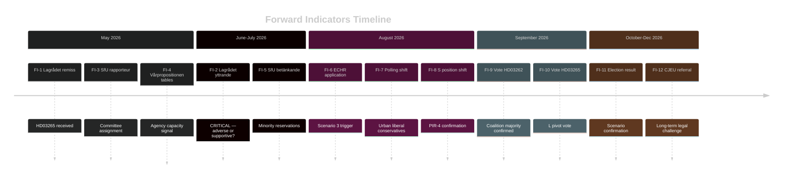

# Forward Indicators — Government Propositions 2026-05-01

**Author**: James Pether Sörling
**Date**: 2026-05-01

## Forward Intelligence Indicators

12 dated indicators across 4 time horizons. Monitoring these indicators will determine which scenario (S-1, S-2, S-3) materialises.

---

## Horizon 1: Immediate (May–June 2026)

**FI-1** [2026-05-15] — **Lagrådet remiss received for HD03265**  
*Monitor*: lagradet.se publication feed  
*Signal value*: Lagrådet appointment signals government is proceeding with ECHR-risk provision  
*Trigger*: Lagrådet announces review  

**FI-2** [2026-06-01] — **Lagrådet yttrande published for HD03265**  
*Monitor*: lagradet.se/sv/yttranden-och-remisser/  
*Signal value*: HIGH — adverse yttrande triggers Scenario 2; supportive yttrande triggers Scenario 1  
*Trigger*: "HD03265 lagrådsremiss" search  
Sources: HD03265 https://data.riksdagen.se/dokument/HD03265

**FI-3** [2026-05-20] — **SfU committee assigns rapporteur (föredragande) for HD03262–HD03265**  
*Monitor*: riksdagen.se committee calendar  
*Signal value*: MEDIUM — opposition rapporteur requesting extended hearing signals resistance  

**FI-4** [2026-05-31] — **Vårpropositionen 2026 detailed agency tables published**  
*Monitor*: regeringen.se/propositioner  
*Signal value*: HIGH — presence/absence of Migrationsverket capacity budget is KJ-3 confirmation trigger  

---

## Horizon 2: Short-term (July–August 2026)

**FI-5** [2026-07-01] — **SfU committee report (betänkande) published**  
*Monitor*: riksdagen.se/sv/utskott-och-namnd/socialforsakringsutskottet/  
*Signal value*: HIGH — minority reservations count and content determine opposition unity  

**FI-6** [2026-07-15] — **First ECHR Article 5 application filed for HD03265 applicant**  
*Monitor*: ECtHR case registry (echr.coe.int); NGO press releases (UNHCR, Amnesty SE)  
*Signal value*: CRITICAL — triggers Scenario 3 trajectory  
Sources: HD03265 https://data.riksdagen.se/dokument/HD03265

**FI-7** [2026-08-01] — **Opinion polling: migration policy approval**  
*Monitor*: Sifo/Ipsos/Demoskop migration satisfaction tracking  
*Signal value*: HIGH — if government approval on migration falls below 40%, S-3 scenario strengthens  

**FI-8** [2026-08-15] — **S party position shift on HD03263 deportation**  
*Monitor*: Socialdemokraternas pressmeddelandearkiv; Aftonbladet editorial; party congress statement  
*Signal value*: HIGH — S partial support for deportation would confirm PIR-4 (S fracture)  
Sources: HD03263 https://data.riksdagen.se/dokument/HD03263

---

## Horizon 3: Election (September 2026)

**FI-9** [2026-09-01] — **Riksdag plenary vote on HD03262 (permanent permits)**  
*Monitor*: riksdagen.se voteringsresultat  
*Signal value*: CRITICAL — if Ja < 175, entire coalition mathematics scenario requires revision  
Sources: HD03262 https://data.riksdagen.se/dokument/HD03262

**FI-10** [2026-09-01] — **Riksdag plenary vote on HD03265 (detention)**  
*Monitor*: riksdagen.se voteringsresultat  
*Signal value*: CRITICAL — L vote is the pivot indicator  
Sources: HD03265 https://data.riksdagen.se/dokument/HD03265

---

## Horizon 4: Post-Election (October 2026+)

**FI-11** [2026-10-01] — **Election result: Tidö bloc seat total**  
*Monitor*: Valmyndigheten election results  
*Signal value*: DEFINITIVE — confirms or refutes electoral scenario projections  

**FI-12** [2026-12-01] — **Administrative court referral to CJEU on HD03262**  
*Monitor*: Migrationsöverdomstolen case list  
*Signal value*: HIGH — long-term structural challenge to the permanent permit abolition framework  
Sources: HD03262 https://data.riksdagen.se/dokument/HD03262

---

## Indicator Priority Matrix

| Indicator | Horizon | Signal Value | Ease of Monitoring |
|-----------|---------|-------------|-------------------|
| FI-2 Lagrådet yttrande | Immediate | CRITICAL | HIGH |
| FI-4 Vårpropositionen capacity | Immediate | HIGH | HIGH |
| FI-6 ECHR application | Short-term | CRITICAL | MEDIUM |
| FI-9 Riksdag vote HD03262 | Election | CRITICAL | HIGH |
| FI-10 Riksdag vote HD03265 | Election | CRITICAL | HIGH |

