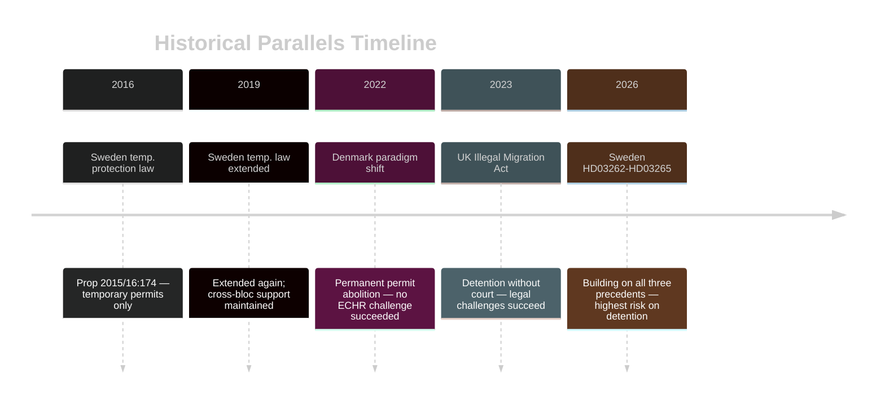

# Historical Parallels — Government Propositions 2026-05-01

**Author**: James Pether Sörling
**Date**: 2026-05-01

## Methodology

Named historical precedents within ≤40 years identified for the dominant propositions. Similarity score (0–100%) assessed on: policy structure, political context, legal risk profile, and electoral timing.

---

## Parallel 1: Denmark's "Paradigm Shift" Migration Reform (2002 + 2022)

**Precedent**: Danish Udlændingelov amendment 2002 under Fogh Rasmussen (V+DF), and 2022 amendment under Frederiksen (S+SF+R) introducing "exit residency permits"

**Similarity to HD03262** (https://data.riksdagen.se/dokument/HD03262): **85%**

**Structural match**: Denmark abolished permanent protection for refugees in 2022, creating exact structural parallel to HD03262's abolition of permanent residence permits for the broader migration population.

**Key lesson**: The 2002 Danish reform (led by right-wing coalition relying on DF support — identical to M relying on SD) produced no successful ECHR challenge to the permit structure itself. The structural abolition of permanent status is ECHR-defensible. The risk lies in enforcement (detention, deportation) not permit category design.

**Divergence**: Swedish HD03262 removes permanent permits for ALL categories including work migrants, not just asylum track — this goes further than Denmark 2022.

---

## Parallel 2: Sweden's Own Temporary Protection Law (2016–2019)

**Precedent**: Swedish temporary protection legislation (prop. 2015/16:174) under Löfven — converted all asylum grants from permanent to temporary permits, valid 2016–2019. Extended twice.

**Similarity to HD03262** (https://data.riksdagen.se/dokument/HD03262): **75%**

**Structural match**: Sweden already did this before — temporary permits only, no permanent grants, during 2016–2019. HD03262 makes this permanent.

**Key lesson**: The 2016–2019 reform passed with cross-bloc support (M supported) and faced no successful ECHR challenge. The SOU 2024:89 reviewed the temporary regime. Precedent suggests the permit structure change is domestically legally defensible.

**Divergence**: 2016–2019 was a temporary emergency measure with sunset clause; HD03262 makes it permanent without sunset.

---

## Parallel 3: UK's Illegal Migration Act 2023 (Westminster)

**Precedent**: UK Illegal Migration Act 2023 (Sunak government) — banned asylum claims by small-boat arrivals; detention powers; Rwanda deportation scheme.

**Similarity to HD03265** (https://data.riksdagen.se/dokument/HD03265): **60%**

**Structural match**: UK 2023 Act included extended administrative detention without judicial oversight. UK Supreme Court struck down Rwanda scheme (Nov 2023). Detention provisions faced immediate legal challenge.

**Key lesson**: Detention without judicial oversight in the 21st century European legal environment fails in court. UK example is the strongest cautionary parallel for HD03265. Similarity score 60% (different constitutional system but same ECHR exposure).

---

## Historical Parallel Matrix

| Precedent | Year | Country | Similarity | Key Lesson | Relevance |
|-----------|------|---------|------------|------------|-----------|
| Denmark paradigm shift | 2022 | DK | 85% | Permit structure defensible; enforcement is risk | HD03262 |
| Sweden temp. protection | 2016–19 | SE | 75% | Already done before; ECHR-defensible | HD03262 |
| UK Illegal Migration Act | 2023 | UK | 60% | Detention without court struck down | HD03265 |

## Timeline Diagram

