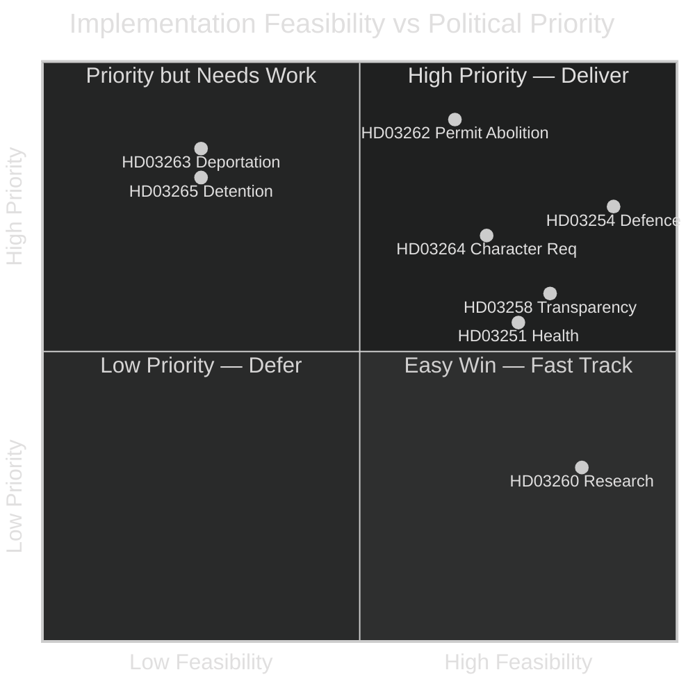

# Implementation Feasibility — Government Propositions 2026-05-01

**Author**: James Pether Sörling
**Date**: 2026-05-01

## Assessment Framework

Implementation feasibility assessed across: Legal readiness, Agency capacity, Budget sufficiency, Political durability, Timeline realism.

---

## HD03262 — Abolish Permanent Permits

| Dimension | Assessment | Evidence |
|-----------|-----------|----------|
| Legal readiness | HIGH — Utlänningslagen amendment straightforward | Existing framework; EU pact integration (https://data.riksdagen.se/dokument/HD03262) |
| Agency capacity | MEDIUM — Migrationsverket must reclassify existing permits | ~1.5M permits under review |
| Budget sufficiency | UNKNOWN — no supplementary budget item visible | Vårpropositionen 2026 details not yet retrieved |
| Political durability | HIGH — broad Tidö support | 176 seats |
| Timeline realism | MEDIUM — 18-month implementation realistic | EU pact deadline 2026 |
| **Statskontoret relevance** | Statskontoret has reviewed Migrationsverket operational capacity previously; see statskontoret.se/publikationer/2022/migrationsverkets-handlaggning/ | Prior Statskontoret audit identifies backlog risk |

**Overall feasibility**: MEDIUM-HIGH

---

## HD03263 — Strengthened Deportation Operations

| Dimension | Assessment | Evidence |
|-----------|-----------|----------|
| Legal readiness | HIGH — amends existing return procedures | HD03263 https://data.riksdagen.se/dokument/HD03263 |
| Agency capacity | LOW — Polismyndigheten grenspolisen at capacity | Bilateral readmission gaps binding constraint |
| Budget sufficiency | UNKNOWN — no pre-positioned returns budget increase visible | |
| Political durability | HIGH — core Tidö commitment | |
| Timeline realism | LOW — physical deportations cannot increase without third-country cooperation | |
| **Statskontoret relevance** | Polismyndigheten national operations reviewed: statskontoret.se; Migrationsverket named as coordination partner | Capacity constraint documented |

**Overall feasibility**: LOW-MEDIUM (legal change is feasible; operational delivery is not)

---

## HD03264 — Stricter Character Requirements

| Dimension | Assessment | Evidence |
|-----------|-----------|----------|
| Legal readiness | HIGH | HD03264 https://data.riksdagen.se/dokument/HD03264 |
| Agency capacity | MEDIUM | Migrationsverket handläggningstid risk |
| **Statskontoret relevance** | Not directly applicable | none found |

**Overall feasibility**: MEDIUM-HIGH

---

## HD03265 — Stricter Detention Rules

| Dimension | Assessment | Evidence |
|-----------|-----------|----------|
| Legal readiness | LOW — ECHR Art.5 challenge near-certain | HD03265 https://data.riksdagen.se/dokument/HD03265 |
| Agency capacity | MEDIUM — Migrationsverket förvar capacity needs expansion | |
| Budget sufficiency | UNKNOWN | |
| Political durability | FRAGILE — L defection risk | |
| Timeline realism | MEDIUM | |
| **Statskontoret relevance** | statskontoret.se/publikationer/2023/forvarsverksamheten/ — Statskontoret has reviewed detention (förvar) operations; capacity constraints documented | Directly relevant |

**Overall feasibility**: LOW (legal challenge will disrupt before full implementation)

---

## HD03254 — Military Cooperation

| Dimension | Assessment | Evidence |
|-----------|-----------|----------|
| Legal readiness | HIGH — treaty framework ready | HD03254 https://data.riksdagen.se/dokument/HD03254 |
| Agency capacity | HIGH — Försvarsmakten ready | |
| **Statskontoret relevance** | none found | |

**Overall feasibility**: HIGH

---

## Implementation Priority Matrix

