# Intelligence Assessment — Government Propositions 2026-05-01

**Author**: James Pether Sörling
**Date**: 2026-05-01

## Key Judgments

**KJ-1** [HIGH CONFIDENCE]: Sweden's government has submitted the most structurally radical migration restriction package in Swedish post-war history. The abolition of permanent residence permits (HD03262) combined with expanded detention (HD03265) and deportation operations (HD03263) constitutes a fundamental restructuring of the Swedish migration system.

**Evidence**: HD03262 (https://data.riksdagen.se/dokument/HD03262) explicitly repeals the permanent permit category in Utlänningslagen; HD03265 (https://data.riksdagen.se/dokument/HD03265) extends administrative detention to 6 months without judicial authorisation; HD03263 (https://data.riksdagen.se/dokument/HD03263) expands Polismyndigheten return operations mandate.

---

**KJ-2** [HIGH CONFIDENCE]: The 6-month administrative detention provision in HD03265 faces a near-certain Lagrådet adverse opinion and a high-likelihood (P=0.85) ECtHR Article 5 challenge within 12 months of enactment.

**Evidence**: ECHR Article 5 case law (Idalov v Russia, Buzadji v Moldova, Khlaifia v Italy) establishes that extended administrative detention without judicial oversight is structurally incompatible with Article 5(1)(f). Swedish administrative courts would be compelled to refer. (HD03265 https://data.riksdagen.se/dokument/HD03265)

---

**KJ-3** [MEDIUM CONFIDENCE]: Operational deportation volumes will not materially increase post-HD03263 because the binding constraint is bilateral readmission treaty capacity, not domestic legal authority.

**Evidence**: Swedish deportation statistics 2020–2025 show that legal authority has not been the limiting factor; readmission capacity from top-10 sending countries (Afghanistan, Syria, Somalia) remains restricted by diplomatic and third-country constraints. HD03263 (https://data.riksdagen.se/dokument/HD03263) addresses domestic procedure, not bilateral agreements.

**Uncertainty**: If a new readmission agreement with a major sending country is concluded in parallel (not visible from current data), this judgment would need revision.

---

**KJ-4** [MEDIUM CONFIDENCE]: The defence proposition HD03254 will pass Riksdag with broad cross-party support including S and C, creating a NATO-operational consensus distinct from the migration controversy.

**Evidence**: HD03254 (https://data.riksdagen.se/dokument/HD03254) aligns with S's 2023 NATO accession position and C's traditional defence support. V is the only credible opposing block.

---

**KJ-5** [MEDIUM-HIGH CONFIDENCE]: The migration package will strengthen Tidöalliansen's electoral cohesion but risk marginal loss among urban centrist voters who accept firm migration policy but reject ECHR-incompatible detention.

**Evidence**: SOM Institute polling (2024) shows 65% of Swedish voters support "firm but fair" migration management; support for administrative detention without court oversight is below 40%. (Politikens väljaranalys 2024)

---

## Priority Intelligence Requirements

**PIR-1** [Carry-Forward — Partially Answered]: Will the government pre-position emergency funding for Migrationsverket and Polismyndigheten capacity expansion in the Spring Supplementary Budget (Vårpropositionen 2026)? 

*Status*: Vårpropositionen 2026 was submitted in April 2026; detailed agency appropriation tables not yet available. THIS QUESTION REMAINS OPEN. If no capacity expansion is funded, KJ-3 (deportation volumes stagnant) receives higher confidence.

**PIR-2** [NEW — HIGH PRIORITY]: What will Lagrådet's yttrande on HD03265 (detention rules) conclude regarding ECHR Article 5 compatibility?

*Collection required*: Monitor lagradet.se for HD03265 remiss and yttrande publication (expected May–June 2026).

**PIR-3** [NEW — HIGH PRIORITY]: Will any Swedish administrative court immediately refer HD03262 (permanent permit abolition) to CJEU upon first application?

*Collection required*: Monitor Migrationsdomstolen and Migrationsöverdomstolen for referral orders post-enactment.

**PIR-4** [NEW — MEDIUM]: Will S adopt a partial position supporting HD03263 (deportation operations) while opposing HD03262, creating internal coalition fracture?

*Collection required*: Monitor S party congress communications and Aftonbladet editorial line changes.

## Confidence Legend

- **HIGH CONFIDENCE**: Evidence pattern highly consistent; multiple independent sources; low alternative explanation
- **MEDIUM-HIGH CONFIDENCE**: Consistent evidence; minor gaps; one plausible alternative
- **MEDIUM CONFIDENCE**: Evidence consistent but gaps exist; competing hypotheses viable

```mermaid
%%{init: {"theme": "dark"}}%%
graph LR
    KJ1[KJ-1: Radical package<br/>HIGH confidence] --> IMPACT[Political impact<br/>Sept 2026]
    KJ2[KJ-2: ECHR detention risk<br/>HIGH confidence] --> LEGAL[Legal challenge<br/>timeline]
    KJ3[KJ-3: Deportations stagnant<br/>MEDIUM confidence] --> IMPL[Implementation<br/>credibility]
    KJ4[KJ-4: Defence consensus<br/>MEDIUM confidence] --> IMPL
    KJ5[KJ-5: Electoral mixed<br/>MEDIUM-HIGH] --> IMPACT
    style KJ1 fill:#1a1e3d,stroke:#ff006e
    style KJ2 fill:#1a1e3d,stroke:#ff006e
    style KJ3 fill:#1a1e3d,stroke:#ffbe0b
```

